# 3. Luxury Kit Creative Builds

## 3.1 Smart Gesture-Controlled Light

### 3.1.1 Project Overview

This is a smart gesture-controlled light that changes color with a wave. Each time the ultrasonic sensor detects a waving motion, the light switches to the next color. It cycles through four states: red, green, blue, and off, like a little light magician that responds to simple gestures.

### 3.1.2 Learning Objectives

1. Practice the basic detection function of the ultrasonic sensor in this project, and understand the logic between gesture triggering and color switching.
2. Master the mechanical assembly of the smart gesture-controlled light.
3. Learn how to write a program for ultrasonic detection and color switching, and understand the principle of state switching.
4. Strengthen hands-on skills and interaction-design ability, and experience the appeal of gesture-controlled technology.

### 3.1.3 Materials Needed

1. **Materials**: controller, ultrasonic sensor, module cable, and building block parts.
2. **Module Overview**:

**Ultrasonic Sensor**

| Item | Description 1 | Description 2 |
| :---: | :---: | --- |
| Function | Detects waving gestures and triggers color switching for the light. | Outputs red, green, and blue light. |
| Application Position | Mounted on the frame of the smart gesture-controlled light. | Mounted on the frame of the smart gesture-controlled light. |
| Result | Each detected wave sends one color-switch command to the controller. | After receiving the command, the light cycles through red, green, blue, and off. |

### 3.1.4 Assembly Guide

 <iframe
    src="../_static/pdf/01_Color_Scanner.pdf#view=FitH"
    title="Assembly Guide PDF"
    width="100%"
    height="850"
    style="border: 1px solid #ddd;"
    loading="lazy">
 </iframe>

### 3.1.5 Coding Steps

1. **Open the software**: Start the programming software and create a new project.

2. **Add the extension**

- Click the icon in the lower-left corner of the software to enter the extension interface.

- In the interface **Choose an Extension**, choose **Controller**, and add **K12 ESP32**.

- In the interface **Choose an Extension**, choose **Sensor**, and add **Glowy ultrasonic sensor**.

3. **Reference Program**

- At startup, initialize the glowy ultrasonic sensor on P1, turn off all ultrasonic indicator lights, define the variables `distance` and `color`, and initialize both variables to 0.

- In the main program, detect the obstacle distance in real time through the ultrasonic sensor and store the result in the `distance` variable. When the detected distance is less than 15 cm, increase the `color` variable by 1 to switch colors.

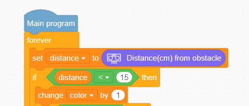

- In the lighting control logic, `color` determines the color of the ultrasonic light. A value of 1 shows red, 2 shows green, 3 shows blue, and 4 turns the light off. When the value reaches 5, reset it to 0 to start the color cycle again. Wait 0.5 seconds after each color change, and refresh the main loop every 0.1 seconds.

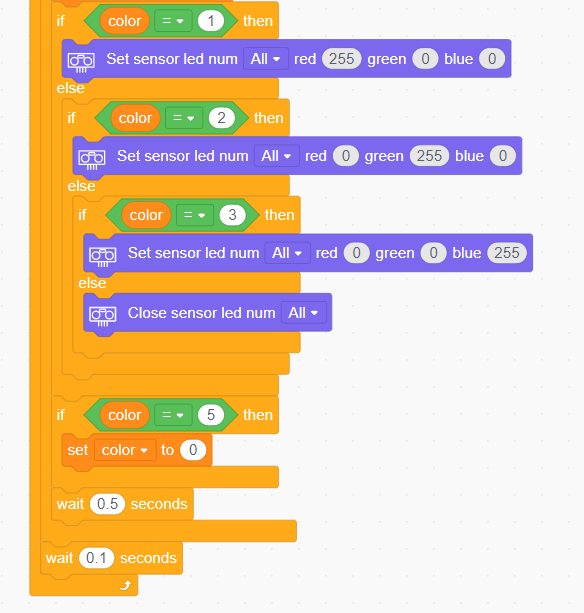

### 3.1.6 Program Upload Steps

1. Click **Connect** and select the corresponding port.
   
2. Click the **Download** button in the upper-right corner to download the program to the controller.

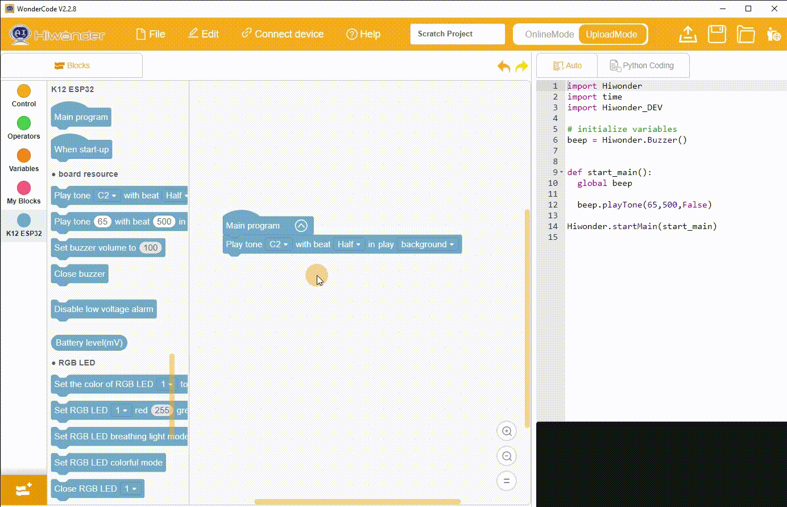

## 3.2 Motorized Windmill

### 3.2.1 Project Overview

This is a motorized windmill that rotates automatically once powered on. Once powered on, the motor continuously drives the windmill blades, recreating the lively motion of a small windmill turning in the breeze.

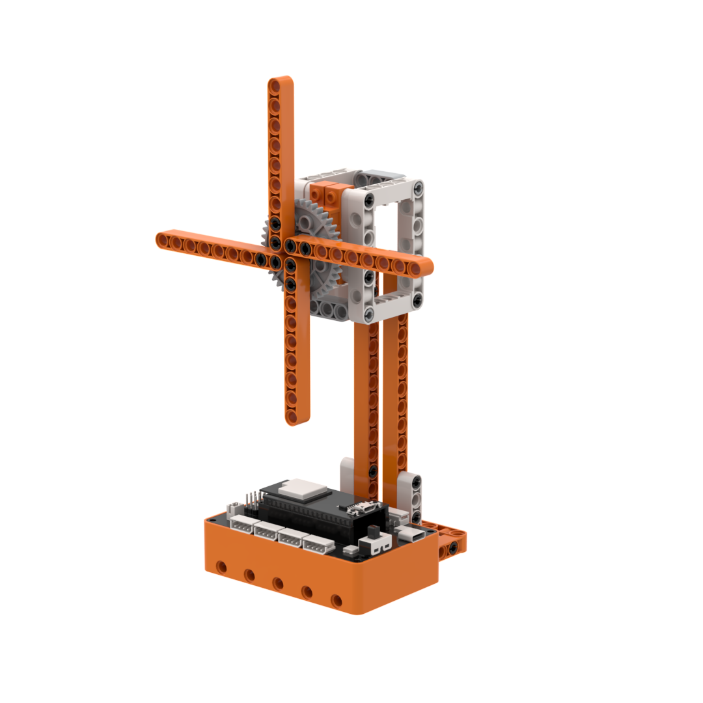

### 3.2.2 Learning Objectives

1. Practice the basic control function of the motor and understand the logic of power-on startup and continuous rotation.
2. Master the mechanical assembly of the motorized windmill.
3. Learn how to write a program for automatic startup and continuous rotation, and understand the basic control principle of the motor.
4. Strengthen hands-on skills and understanding of mechanical structures, and experience the fun of simple power-driven devices.

### 3.2.3 Materials Needed

1. **Materials**: controller, motor, module cable, and building block parts.
2. **Module Overview**:

**Motor**

| Item | Description |
| :-: | :-: |
| Function | Provides the driving force for windmill rotation. |
| Application Position | Mounted on the axle of the motorized windmill. |
| Result | After receiving the controller signal, the motor keeps the blades rotating continuously. |

### 3.2.4 Assembly Guide

 <iframe
    src="../_static/pdf/02_Smart_Desk_Lamp.pdf#view=FitH"
    title="Assembly Guide PDF"
    width="100%"
    height="850"
    style="border: 1px solid #ddd;"
    loading="lazy">
 </iframe>

### 3.2.5 Coding Steps

1. **Open the software**: Start the programming software and create a new project.

2. **Add the extension**

- Click the icon in the lower-left corner of the software to enter the extension interface.

- In the interface **Choose an Extension**, choose **Controller**, and add **K12 ESP32**.

3. **Reference Program**

- In the main program, control motor S1 to rotate the windmill continuously at a speed of 60. Refresh the control command every 0.1 seconds to keep the motor running steadily.

### 3.2.6 Program Upload Steps

1. Click **Connect** and select the corresponding port.
   
2. Click the **Download** button in the upper-right corner to download the program to the controller.

## 3.3 Sound-Activated Ferris Wheel

### 3.3.1 Project Overview

This is a sound-activated Ferris wheel that changes speed according to the number of sounds detected by the sound sensor. While it rotates, the controller RGB light keeps flashing, creating the lively atmosphere of an amusement park ride.

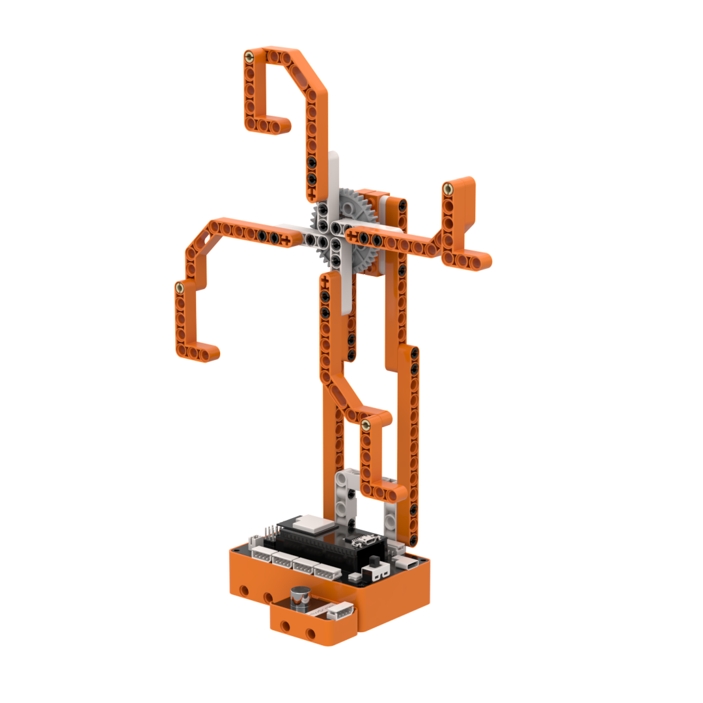

### 3.3.2 Learning Objectives

1. Practice the basic functions of the motor, sound sensor, and controller RGB light, and understand the linked logic of sound detection, speed control, and light flashing.
2. Master the mechanical assembly of the sound-activated Ferris wheel.
3. Learn how to write a program for sound counting, speed switching, and light flashing, and understand how multiple devices work together.
4. Strengthen hands-on skills and interaction-design ability, and experience the fun of sound-controlled interaction.

### 3.3.3 Materials Needed

1. **Materials**: controller, motor, sound sensor, module cable, and building block parts.
2. **Module Overview**:

**Sound Sensor**

| Item | Description |
| :---: | :---: |
| Function | Detects sound events and triggers speed changes or stopping for the Ferris wheel. |
| Application Position | Mounted on the side of the base of the sound-activated Ferris wheel. |
| Result | Each detected sound increases the count by 1 and sends a speed-switching command to the controller. |

**Motor**

| Item | Description |
| :---: | :---: |
| Function | Provides the driving force for the Ferris wheel. |
| Application Position | Mounted on the axle of the sound-activated Ferris wheel. |
| Result | After receiving the controller command, the motor switches among different rotation speeds based on the number of detected sounds. |

### 3.3.4 Assembly Guide

 <iframe
    src="../_static/pdf/03_Smart_Desk_Clock.pdf#view=FitH"
    title="Assembly Guide PDF"
    width="100%"
    height="850"
    style="border: 1px solid #ddd;"
    loading="lazy">
 </iframe>

### 3.3.5 Coding Steps

1. **Open the software**: Start the programming software and create a new project.

2. **Add the extension**

- Click the icon in the lower-left corner of the software to enter the extension interface.

- In the interface **Choose an Extension**, choose **Controller**, and add **K12 ESP32**.

- In the interface **Choose an Extension**, choose **Sensor**, and add **Glowy ultrasonic sensor**.

3. **Reference Program**

- At startup, define the variables `sound_count` and `status`, initialize `sounds_count` to 0 and `status` to 1, and enter the sound-detection waiting stage.

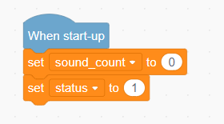

- In the main program, when `status = 1` and the sound sensor on P5 detects a volume value greater than 35, increase `sound_count` by 1, record the current system time in the `time` variable, and wait 0.1 seconds for debouncing. After a 3000 ms collection window, set `status` to 0 and move to the motor-control stage, that is, the Ferris wheel rotation stage.

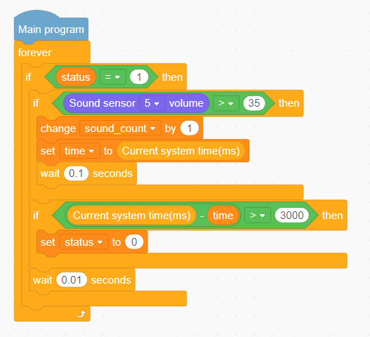

- In the main program, when `status = 0`, control the motor based on `sound_count`. If `sound_count = 1`, motor S1 runs the Ferris wheel at speed 20 for 5 seconds and then stops. If `sound_count = 2`, motor S1 runs at speed 35 for 5 seconds and then stops. If `sound_count >= 3`, motor S1 runs at speed 50 for 5 seconds and then stops. During each run, the controller RGB light cycles through different colors in a breathing-light effect to simulate amusement-park lighting. After the action is complete, set the `status` back to 1, reset `sound_count` to 0, record the system time again, wait for the next sound trigger, and refresh the control loop every 0.01 seconds so the system can respond promptly.

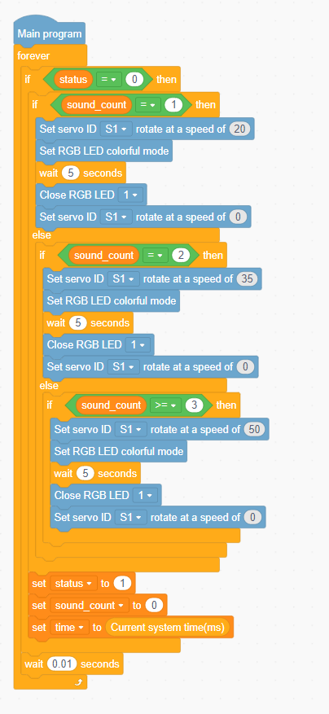

### 3.3.6 Program Upload Steps

1. Click **Connect** and select the corresponding port.
   
2. Click the **Download** button in the upper-right corner to download the program to the controller.

## 3.4 Rotating Swing Ride

### 3.4.1 Project Overview

This is a rotating swing ride that starts and stops with a button press. Press once to start the spinning motion, and press again to stop, recreating the fun of an amusement-park swing ride with simple control.

### 3.4.2 Learning Objectives

1. Practice the basic functions of the motor and button sensor, and understand the logic of button triggering and start-stop control.

2. Master the mechanical assembly of the rotating swing ride.

3. Learn how to write a program for button triggering and motor start-stop control, and understand the principle of state switching.

4. Strengthen hands-on skills and interaction-design ability, and experience the fun of button-controlled programming.

### 3.4.3 Materials Needed

1. **Materials**: controller, motor, button sensor, module cable, and building block parts.

2. **Module Overview**:

**Button Sensor**

| Item | Description |
| :---: | :---: |
| Function | Detects button presses and triggers the start or stop action. |
| Application Position | Mounted next to the base of the rotating swing ride. |
| Result | Each detected press sends a state-switching command to the controller. |

**Motor**

| Item | Description |
| :---: | :---: |
| Function | Provides the power for rotation. |
| Application Position | Mounted on the axle of the rotating swing ride. |
| Result | After receiving the controller command, the ride starts or stops rotating. |

### 3.4.4 Assembly Guide

 <iframe
    src="../_static/pdf/04_Adjustable_Mixer.pdf#view=FitH"
    title="Assembly Guide PDF"
    width="100%"
    height="850"
    style="border: 1px solid #ddd;"
    loading="lazy">
 </iframe>

### 3.4.5 Coding Steps

1. **Open the software**: Start the programming software and create a new project.

2. **Add the extension**

- Click the icon in the lower-left corner of the software to enter the extension interface.

- In the interface **Choose an Extension**, choose **Controller**, and add **K12 ESP32**.

- In the interface **Choose an Extension**, choose **Sensor**, and add **Button sensor**.

3. **Reference Program**

- At startup, define the variable `run_status` and initialize it to -1, where -1 means stopped and 1 means running.

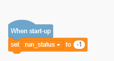

- In the main program, when the button on P5 is pressed, set `run_status` to `run_status` to flip the state, then wait 0.5 seconds for debouncing. When `run_status = 1`, run motor S1 at speed 50. Otherwise, stop the motor.

### 3.4.6 Program Upload Steps

1. Click **Connect** and select the corresponding port.
   
2. Click the **Download** button in the upper-right corner to download the program to the controller.

## 3.5 Rotary Cutter

### 3.5.1 Project Overview

This is a touch-controlled rotary cutter. When the touch sensor detects contact, the motor starts and drives the blade to rotate. When the touch stops, the motor stops immediately, like a safety-minded cutting tool that runs only during operation.

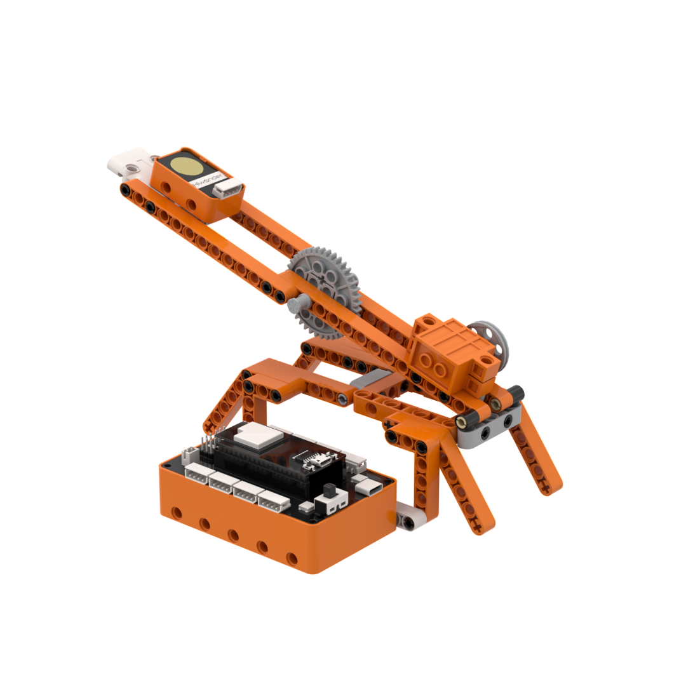

### 3.5.2 Learning Objectives

1. Practice the basic functions of the motor and touch sensor, and understand the logic of touch detection and start-stop control.

2. Master the mechanical assembly of the rotary cutter.

3. Learn how to write a program for touch triggering and motor start-stop control, and understand the principle of safety control.

4. Strengthen hands-on skills and safety-design awareness, and experience the intelligent safety features of industrial tools.

### 3.5.3 Materials Needed

1. **Materials**: controller, motor, touch sensor, module cable, and building block parts.

2. **Module Overview**:

**Touch Sensor**

| Item | Description |
| :---: | :---: |
| Function | Detects touch and triggers the cutter to start or stop. |
| Application Position | Mounted next to the handle of the rotary cutter. |
| Result | When touch is detected, the controller starts the cutter. When touch ends, the cutter stops immediately. |

**Motor**

| Item | Description |
| :---: | :---: |
| Function | Provides the driving force for the cutter blade. |
| Application Position | Mounted on the blade axle of the rotary cutter. |
| Result | After receiving the controller command, the cutter starts or stops rotating. |

### 3.5.4 Assembly Guide

 <iframe
    src="../_static/pdf/05_Smart_Windmill.pdf#view=FitH"
    title="Assembly Guide PDF"
    width="100%"
    height="850"
    style="border: 1px solid #ddd;"
    loading="lazy">
 </iframe>

### 3.5.5 Coding Steps

1. **Open the software**: Start the programming software and create a new project.

2. **Add the extension**

- Click the icon in the lower-left corner of the software to enter the extension interface.

- In the interface **Choose an Extension**, choose **Controller**, and add **K12 ESP32**.

- In the interface **Choose an Extension**, choose **Sensor**, and add **Touch sensor**.

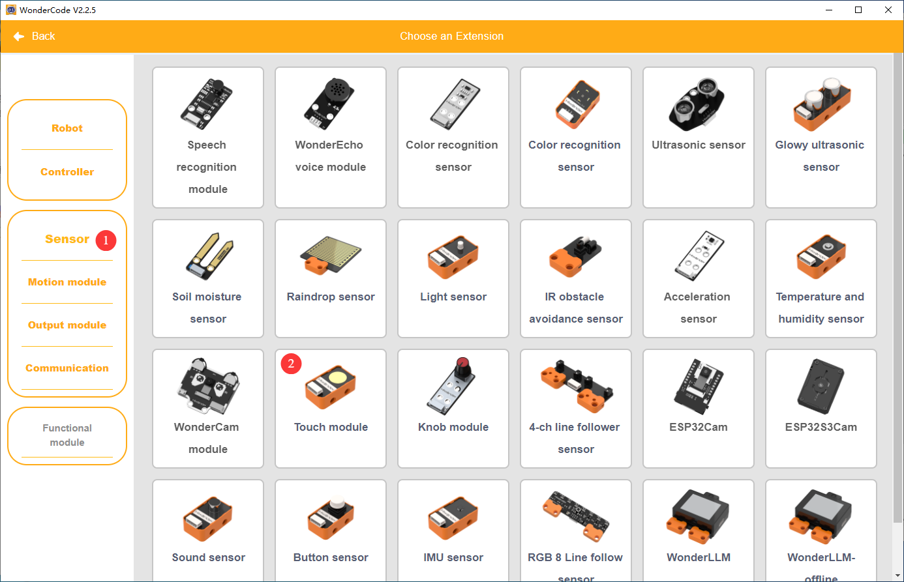

3. **Reference Program**

- At startup, initialize the touch sensor on P5.

- In the main program, when the touch sensor detects contact, run motor S1 continuously at speed 50 to simulate the cutting motion. When touch is released, stop the motor.

### 3.5.6 Program Upload Steps

1. Click **Connect** and select the corresponding port.
   
2. Click the **Download** button in the upper-right corner to download the program to the controller.

## 3.6 Dual-Control Fishing Rod

### 3.6.1 Project Overview

This is a dual-control fishing rod. The button releases the bait, and the touch sensor reels it back in. With two simple controls, the build demonstrates the fun of letting out bait and reeling it back in.

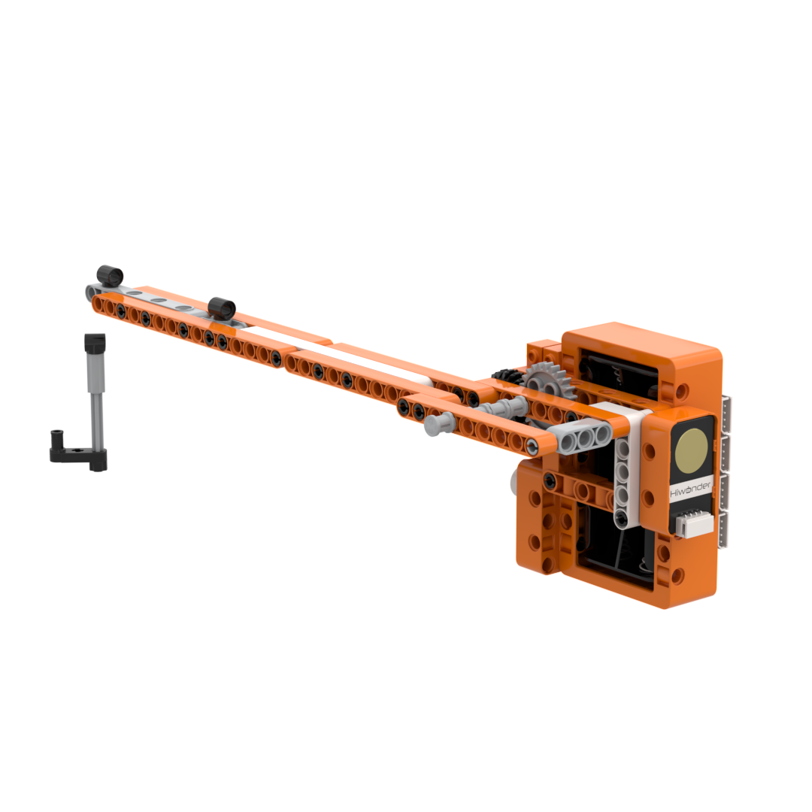

### 3.6.2 Learning Objectives

1. Practice the basic functions of the motor, button sensor, and touch sensor, and understand the logic of dual-control operation and bait release and retrieval.

2. Master the mechanical assembly of the dual-control fishing rod.

3. Learn how to write a program for button-controlled release and touch-controlled retrieval, and understand coordinated multi-command control.

4. Strengthen hands-on skills and interaction-design ability, and experience the fun of dual-control programming.

### 3.6.3 Materials Needed

1. **Materials**: controller, motor, button sensor, touch sensor, module cable, and building block parts.

2. **Module Overview**:

**Button Sensor**

| Item | Description |
| :---: | :---: |
| Function | Detects button presses and triggers bait release. |
| Application Position | Mounted on the support of the dual-control fishing rod. |
| Result | When a press is detected, the controller receives the bait-release command. |

**Touch Sensor**

| Item | Description |
| :---: | :---: |
| Function | Detects touch input and triggers bait retrieval. |
| Application Position | Mounted on the support of the dual-control fishing rod. |
| Result | When touch is detected, the controller receives the bait-retrieval command. |

**Motor**

| Item | Description |
| :---: | :---: |
| Function | Provides the winding force for the fishing reel. |
| Application Position | Mounted on the axle of the fishing line reel. |
| Result | After receiving the controller command, the reel rotates forward or in reverse to release or retrieve the bait. |

### 3.6.4 Assembly Guide

 <iframe
    src="../_static/pdf/06_Greeter_Bot.pdf#view=FitH"
    title="Assembly Guide PDF"
    width="100%"
    height="850"
    style="border: 1px solid #ddd;"
    loading="lazy">
 </iframe>

### 3.6.5 Coding Steps

1. **Open the software**: Start the programming software and create a new project.

2. **Add the extension**

- Click the icon in the lower-left corner of the software to enter the extension interface.

- In the interface **Choose an Extension**, choose **Controller**, and add **K12 ESP32**.

- In the interface **Choose an Extension**, choose **Sensor**, and add **Button sensor** and **Touch sensor**.

3. **Reference Program**

- At startup, initialize the touch sensor on P6.

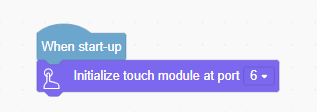

- In the main program, if the button on P5 is pressed, run motor S1 at speed 80 to release the bait. If the touch sensor is activated, run motor S1 in the opposite direction at speed 80 to retrieve the bait. If neither input is active, stop the motor. Refresh the detection and control state every 0.1 seconds.

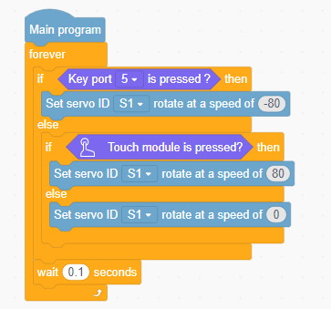

### 3.6.6 Program Upload Steps

1. Click **Connect** and select the corresponding port.
   
2. Click the **Download** button in the upper-right corner to download the program to the controller.

## 3.7 Sentinel Radar

### 3.7.1 Project Overview

This is a sentinel radar with automatic alert mode. Once powered on, the radar begins rotating automatically. When the ultrasonic sensor detects an object, the rotation stops immediately, the red light flashes, and an alarm sounds, like a vigilant guard protecting the area at all times.

### 3.7.2 Learning Objectives

1. Practice the basic functions of the motor and ultrasonic sensor in this project, and understand the linked logic of rotation, detection, and alarm.

2. Master the mechanical assembly of the sentinel radar.

3. Learn how to write a program for rotation + detection + stop + alarm, and understand how multiple devices work together.

4. Strengthen hands-on skills and safety-monitoring design awareness, and experience the appeal of intelligent alert systems.

### 3.7.3 Materials Needed

1. **Materials**: controller, motor, ultrasonic sensor, module cable, and building block parts.

2. **Module Overview**:

**Ultrasonic Sensor**

| Item | Description 1 | Description 2 |
| :---: | :---: | --- |
| Function | Measures the distance to objects ahead and triggers the alert signal. | Outputs red light alerts. |
| Application Position | Mounted at the front of the sentinel radar. | Mounted at the front of the sentinel radar. |
| Result | Whenever an object is detected within 15 cm, a stop and alarm command is sent to the controller. | After receiving the controller command, the RGB light flashes red three times. |

**Motor**

| Item | Description |
| :---: | :---: |
| Function | Provides the driving force for radar rotation. |
| Application Position | Mounted on the rotating axle of the sentinel radar. |
| Result | It rotates continuously once powered on and stops after receiving a command from the controller. |

### 3.7.4 Assembly Guide

 <iframe
    src="../_static/pdf/07_Welcome_Barrier_Gate.pdf#view=FitH"
    title="Assembly Guide PDF"
    width="100%"
    height="850"
    style="border: 1px solid #ddd;"
    loading="lazy">
 </iframe>

### 3.7.5 Coding Steps

1. **Open the software**: Start the programming software and create a new project.

2. **Add the extension**

- Click the icon in the lower-left corner of the software to enter the extension interface.

- In the interface **Choose an Extension**, choose **Controller**, and add **K12 ESP32**.

- In the interface **Choose an Extension**, choose **Sensor**, and add **Glowy ultrasonic sensor**.

3. **Reference Program**

- At startup, initialize the ultrasonic sensor on P1, turn off all RGB lights, define the variable `distance`, and set it to 0.

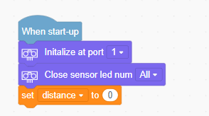

- In the main program, perform distance detection, motor control, and sound-and-light alerts. Use the ultrasonic sensor to measure the obstacle distance in real time and store the result in `distance`. If the distance is less than 15 cm, stop motor S1, flash the red light and sound the alarm three times, wait 0.2 seconds, then run motor S1 at speed 15 to resume radar rotation. Refresh the detection and control state every 0.1 seconds.

### 3.7.6 Program Upload Steps

1. Click **Connect** and select the corresponding port.
   
2. Click the **Download** button in the upper-right corner to download the program to the controller.

## 3.8 Vintage Waterwheel

### 3.8.1 Project Overview

This is a vintage waterwheel with three-speed switching. The button cycles through three speed levels, and the fourth press stops the rotation. It works like a traditional countryside waterwheel, gradually bringing the mechanism to life with a classic feel.

### 3.8.2 Learning Objectives

1. Practice the basic functions of the motor and button in this project, and understand the logic of button-triggered multi-speed control.

2. Master the mechanical assembly of the three-speed vintage waterwheel.

3. Learn how to write a program for button trigger + speed switching + stop, and understand state switching and motor speed control.

4. Strengthen hands-on skills and logical thinking, and experience the fun of giving traditional tools a technology upgrade.

### 3.8.3 Materials Needed

1. **Materials**: controller, motor, button sensor, module cable, and building block parts.

2. **Module Overview**:

**Button Sensor**

| Item | Description |
| :---: | :---: |
| Function | Detects button presses and triggers waterwheel speed changes and stop control. |
| Application Position | Mounted on the support of the vintage waterwheel. |
| Result | Each detected press increases the count by 1 and sends a speed-switching command to the controller. The fourth press stops the rotation. |

**Motor**

| Item | Description |
| :---: | :---: |
| Function | Provides the driving force for the waterwheel blades. |
| Application Position | Mounted on the rotating axle of the vintage waterwheel. |
| Result | After receiving the controller command, it switches the waterwheel between speeds 30, 60, 90, and stop. |

### 3.8.4 Assembly Guide

 <iframe
    src="../_static/pdf/08_Smart_Beckoning_Cat.pdf#view=FitH"
    title="Assembly Guide PDF"
    width="100%"
    height="850"
    style="border: 1px solid #ddd;"
    loading="lazy">
 </iframe>

### 3.8.5 Coding Steps

1. **Open the software**: Start the programming software and create a new project.

2. **Add the extension**

- Click the icon in the lower-left corner of the software to enter the extension interface.

- In the interface **Choose an Extension**, choose **Controller**, and add **K12 ESP32**.

- In the interface **Choose an Extension**, choose **Sensor**, and add **Button sensor**.

3. **Reference Program**

- At startup, define the variable `key_count` and initialize it to 0.

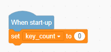

- In the main program, detect button input and control the motor. When the button on P8 is pressed, wait 0.1 seconds for debouncing, confirm that the button is still pressed, then increase `key_count` by 1 and wait until the button is released. When `key_count` reaches 4, reset it to 0. Finally, set motor S1 speed to `30 x key_count`, which produces speeds of 30, 60, or 90, so the number of button presses controls the waterwheel speed.

### 3.8.6 Program Upload Steps

1. Click **Connect** and select the corresponding port.
   
2. Click the **Download** button in the upper-right corner to download the program to the controller.

## 3.9 Unicycle Rider

### 3.9.1 Project Overview

This is a unicycle rider with button-controlled motion. A button starts and stops the rider, creating the feeling of a brave unicyclist in action with simple interactive control.

### 3.9.2 Learning Objectives

1. Practice the basic functions of the motor and button in this project, and understand the logic of button-triggered riding start and stop.

2. Master the mechanical assembly of the unicycle rider.

3. Learn how to write a program for button trigger + motor start/stop, and understand the principle of state switching.

4. Strengthen hands-on skills and interactive design awareness, and experience the fun of biomimetic riding control.

### 3.9.3 Materials Needed

1. **Materials**: controller, motor, button sensor, module cable, and building block parts.

2. **Module Overview**:

**Button Sensor**

| Item | Description |
| :---: | :---: |
| Function | Detects button presses and triggers the riding action to start or stop. |
| Application Position | Mounted on the base of the unicycle rider. |
| Result | Each detected press sends a state-switching command to the controller. |

**Motor**

| Item | Description |
| :---: | :---: |
| Function | Provides the driving force for the riding mechanism. |
| Application Position | Mounted on the rotating axle of the unicycle rider. |
| Result | After receiving the controller command, it starts or stops the riding motion. |

### 3.9.4 Assembly Guide

 <iframe
    src="../_static/pdf/09_Pumpjack_Bot.pdf#view=FitH"
    title="Assembly Guide PDF"
    width="100%"
    height="850"
    style="border: 1px solid #ddd;"
    loading="lazy">
 </iframe>

### 3.9.5 Coding Steps

1. **Open the software**: Start the programming software and create a new project.

2. **Add the extension**

- Click the icon in the lower-left corner of the software to enter the extension interface.

- In the interface **Choose an Extension**, choose **Controller**, and add **K12 ESP32**.

- In the interface **Choose an Extension**, choose **Sensor**, and add **Button sensor**.

3. **Reference Program**

- At startup, define the variable `run_status` and initialize it to -1. A value of -1 means not riding, and a value of 1 means riding.

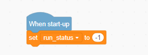

- In the main program, detect the button and control the motor. When the button on P5 is pressed, set `run_status` to `0 - run_status` to invert the state, then wait 0.5 seconds for debouncing. If `run_status` is 1, run motor S1 at speed 50 to drive the rider. Otherwise, stop the motion.

### 3.9.6 Program Upload Steps

1. Click **Connect** and select the corresponding port.
   
2. Click the **Download** button in the upper-right corner to download the program to the controller.

## 3.10 Twist Dancer

### 3.10.1 Project Overview

This is a twist dancer with sound-controlled motion. Once the sound sensor detects a sound, the figure starts twisting, like a party dancer moving to the rhythm with lively energy.

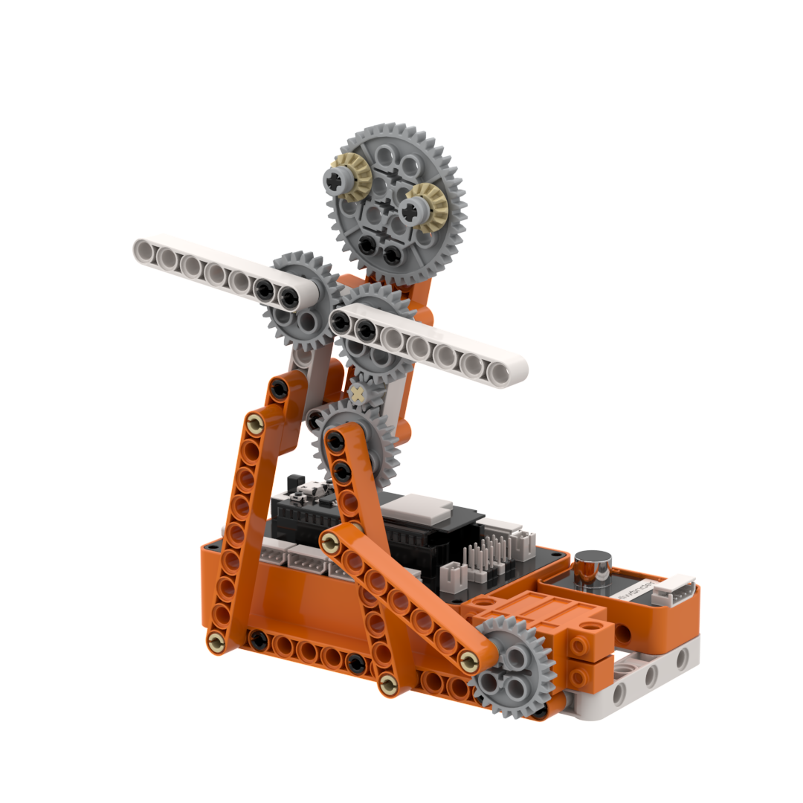

### 3.10.2 Learning Objectives

1. Practice the basic functions of the motor and sound sensor in this project, and understand the logic of sound detection and motion control.

2. Master the mechanical assembly of the twist dancer.

3. Learn how to write a program for sound trigger + twisting motion, and understand state switching and motor speed control.

4. Strengthen hands-on skills and creative expression, and experience the fun of sound-controlled interaction.

### 3.10.3 Materials Needed

1. **Materials**: controller, motor, sound sensor, module cable, and building block parts.

2. **Module Overview**:

**Sound Sensor**

| Item | Description |
| :---: | :---: |
| Function | Detects sound signals and triggers the twisting motion. |
| Application Position | Mounted on the support of the twist dancer. |
| Result | When a sound value greater than 40 is detected, a twisting command is sent to the controller. |

**Motor**

| Item | Description |
| :---: | :---: |
| Function | Provides the driving force for the twisting motion. |
| Application Position | Mounted on the rotating wheel of the twist dancer. |
| Result | After receiving the controller command, it drives the twist dancer to move. |

### 3.10.4 Assembly Guide

 <iframe
    src="../_static/pdf/10_Smart_Cradle.pdf#view=FitH"
    title="Assembly Guide PDF"
    width="100%"
    height="850"
    style="border: 1px solid #ddd;"
    loading="lazy">
 </iframe>

### 3.10.5 Coding Steps

1. **Open the software**: Start the programming software and create a new project.

2. **Add the extension**

- Click the icon in the lower-left corner of the software to enter the extension interface.

- In the interface **Choose an Extension**, choose **Controller**, and add **K12 ESP32**.

- In the interface **Choose an Extension**, choose **Sensor** and add **Sound Sensor**.

3. **Reference Program**

- At startup, define the variable `run_status` and initialize it to 0. A value of 0 means not twisting, and a value of 1 means twisting.

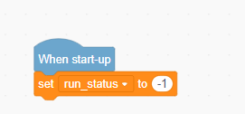

- In the main program loop, detect sound and control the motor. When the sound sensor on P5 detects a volume value greater than 40, toggle `run_status` and wait 0.2 seconds for debouncing to avoid repeated triggers. If `run_status` is 1, run motor S1 at speed 50 to drive the twisting motion. Otherwise, stop the motor.

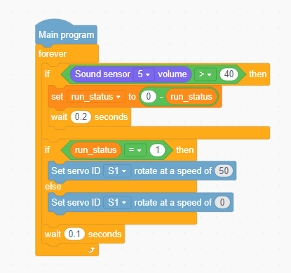

### 3.10.6 Program Upload Steps

1. Click **Connect** and select the corresponding port.
   
2. Click the **Download** button in the upper-right corner to download the program to the controller.

## 3.11 Parkour Runner

### 3.11.1 Project Overview

This is a parkour runner with button-controlled motion. A button starts and stops the figure's running action, creating the feel of a brave parkour athlete in motion through simple control.

### 3.11.2 Learning Objectives

1. Practice the basic functions of the motor and button in this project, and understand the logic of button-triggered running start and stop.

2. Master the mechanical assembly of the parkour runner.

3. Learn how to write a program for button trigger + motor start/stop, and understand the principle of state switching.

4. Strengthen hands-on skills and understanding of biomimetic structures, and experience the fun of programming running motion.

### 3.11.3 Materials Needed

1. **Materials**: controller, motor, button sensor, module cable, and building block parts.

2. **Module Overview**:

**Button Sensor**

| Item | Description |
| :---: | :---: |
| Function | Detects button presses and triggers the running action to start or stop. |
| Application Position | Mounted on the base of the parkour runner. |
| Result | Each detected press sends a state-switching command to the controller. |

**Motor**

| Item | Description |
| :---: | :---: |
| Function | Provides the driving force for running motion. |
| Application Position | Mounted on the rotating wheel of the parkour runner. |
| Result | After receiving the controller command, it starts or stops the running action. |

### 3.11.4 Assembly Guide

 <iframe
    src="../_static/pdf/11_Smart_Catapult.pdf#view=FitH"
    title="Assembly Guide PDF"
    width="100%"
    height="850"
    style="border: 1px solid #ddd;"
    loading="lazy">
 </iframe>

### 3.11.5 Coding Steps

1. **Open the software**: Start the programming software and create a new project.

2. **Add the extension**

- Click the icon in the lower-left corner of the software to enter the extension interface.

- In the interface **Choose an Extension**, choose **Controllers** and add **K12 ESP32**.

- In the interface **Choose an Extension**, choose **Sensor**, and add **Button sensor**.

3. **Reference Program**

- At startup, define the variable `run_status` and initialize it to -1. A value of -1 means not running, and a value of 1 means running.

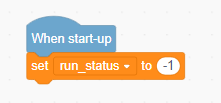

- In the main program, detect the button and control the motor. When the button on P5 is pressed, set `run_status` to `0 - run_status` to invert the state, then wait 0.5 seconds for debouncing. If `run_status` is 1, run motor S1 at speed 30 to drive the runner. Otherwise, stop the motion.

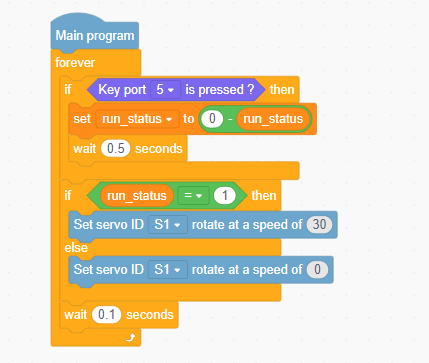

### 3.11.6 Program Upload Steps

1. Click **Connect** and select the corresponding port.
   
2. Click the **Download** button in the upper-right corner to download the program to the controller.

## 3.12 Dual-Control Crossbow

### 3.12.1 Project Overview

This is a dual-control crossbow with separate launch and reset controls. The button triggers the launch, and the touch sensor resets the mechanism, creating a simple interactive experience similar to operating a precision launcher.

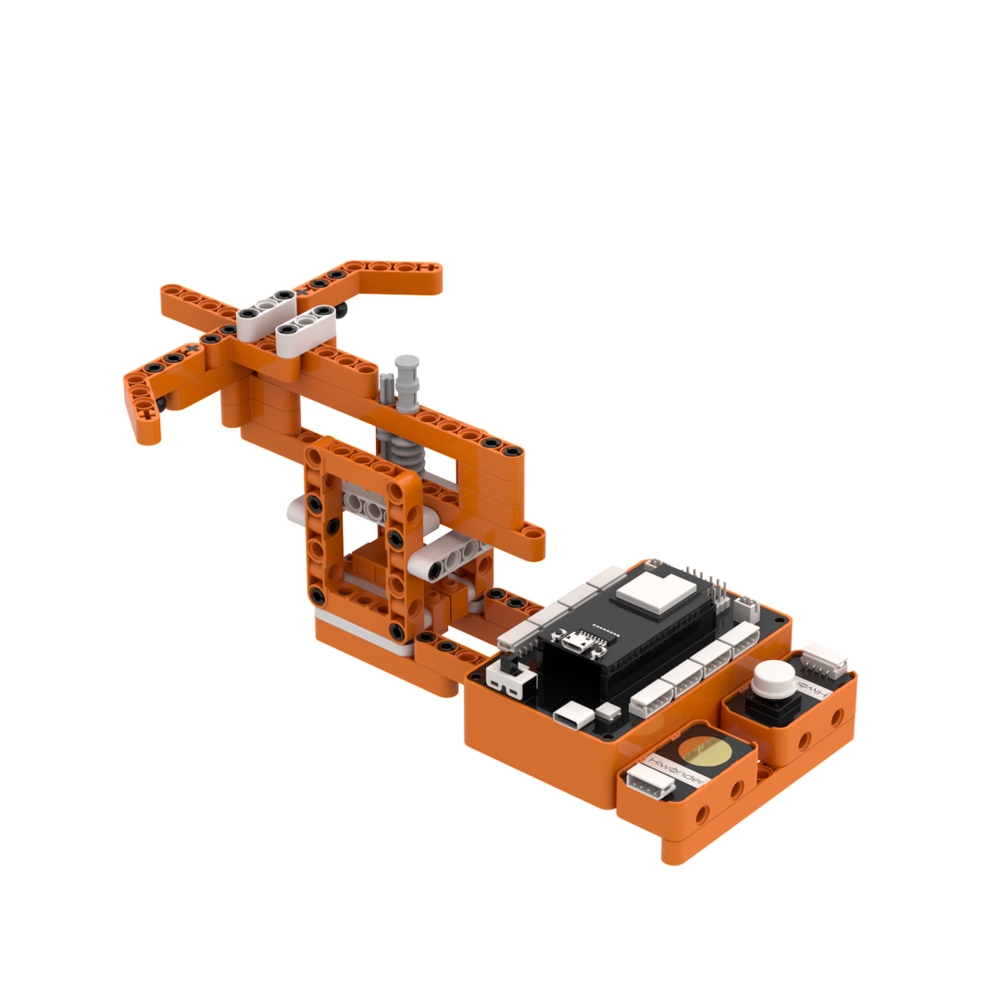

### 3.12.2 Learning Objectives

1. Practice the basic functions of the motor, button sensor, and touch sensor in this project, and understand the logic of dual-control operation for launch and reset.

2. Master the mechanical assembly of the dual-control crossbow.
   
3. Learn how to write a program for button launch + touch reset, and understand how multiple commands work together in one control flow.

4. Strengthen hands-on skills and safety-design awareness, and experience the fun of programming a mechanical launcher.

### 3.12.3 Materials Needed

1. **Materials**: controller, motor, button sensor, touch sensor, module cable, and building block parts.

2. **Module Overview**:

**Button Sensor**

| Item | Description |
| :---: | :---: |
| Function | Detects button presses and triggers the launch action. |
| Application Position | Mounted on the base of the dual-control crossbow. |
| Result | Each detected press sends a launch command to the controller. |

**Touch Sensor**

| Item | Description |
| :---: | :---: |
| Function | Detects touch input and triggers the crossbow reset action. |
| Application Position | Mounted on the base of the dual-control crossbow. |
| Result | When touch is detected, a crossbow reset command is sent to the controller. |

**Motor**

| Item | Description |
| :---: | :---: |
| Function | Provides the driving force for crossbow launch and reset. |
| Application Position | Mounted on the rotating wheel of the dual-control crossbow. |
| Result | After receiving the controller command, it controls the crossbow launch and reset. |

### 3.12.4 Assembly Guide

 <iframe
    src="../_static/pdf/12_Smart_Swing.pdf#view=FitH"
    title="Assembly Guide PDF"
    width="100%"
    height="850"
    style="border: 1px solid #ddd;"
    loading="lazy">
 </iframe>

### 3.12.5 Coding Steps

1. **Open the software**: Start the programming software and create a new project.

2. **Add the extension**

- Click the icon in the lower-left corner of the software to enter the extension interface.

- In the interface **Choose an Extension**, choose **Controller**, and add **K12 ESP32**.

- In the interface **Choose an Extension**, choose **Sensor** and add **Keys** and **Touch module**.

3. **Reference Program**

- At startup, initialize the touch sensor on P6.

- In the main program, detect the button and control the motor. If the button on P5 is pressed, run motor S1 at speed 50 to launch the crossbow. If the touch sensor is activated, run motor S1 at speed 50 to reset the crossbow. If neither input is active, stop the motor. Refresh the detection and control state every 0.1 seconds to keep the response timely.

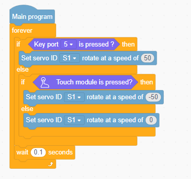

### 3.12.6 Program Upload Steps

1. Click **Connect** and select the corresponding port.
   
2. Click the **Download** button in the upper-right corner to download the program to the controller.

## 3.13 Smart Distance Meter

### 3.13.1 Project Overview

This is a smart distance meter with real-time measurement. When an object is placed between the two stoppers, the dot matrix display shows the distance measured by the ultrasonic sensor in real time, like a precise measuring assistant that makes length checks simple and efficient.

### 3.13.2 Learning Objectives

1. Practice the basic functions of the ultrasonic sensor and dot matrix display in this project, and understand the linked logic of distance detection and data display.

2. Master the mechanical assembly of the smart distance meter.

3. Learn how to write a program for ultrasonic ranging + dot matrix display, and understand the principles of sensor data processing and visualization.

4. Strengthen hands-on skills and data application awareness, and experience the appeal of intelligent measurement.

### 3.13.3 Materials Needed

1. **Materials**: controller, ultrasonic sensor, dot matrix module, module cable, and building block parts.

2. **Module Overview**:

**Ultrasonic Sensor**

| Item | Description |
| :---: | :---: |
| Function | Measures the length of an object. |
| Application Position | Mounted on the fixed stopper of the smart distance meter. |
| Result | Measures the distance between the object and the stopper, then sends the data to the controller. |

**Dot Matrix Module**

| Item | Description |
| :---: | :---: |
| Function | Displays the object's length. |
| Application Position | Mounted on the left side of the fixed stopper of the smart distance meter. |
| Result | After receiving data from the controller, it displays the measurement in real time. |

### 3.13.4 Assembly Guide

 <iframe
    src="../_static/pdf/13_Rhythm_Drummer.pdf#view=FitH"
    title="Assembly Guide PDF"
    width="100%"
    height="850"
    style="border: 1px solid #ddd;"
    loading="lazy">
 </iframe>

### 3.13.5 Coding Steps

1. **Open the software**: Start the programming software and create a new project.

2. **Add the extension**

- Click the icon in the lower-left corner of the software to enter the extension interface.

- In the interface **Choose an Extension**, select **Controller**, and add **K12 ESP32**.

- In the interface **Choose an Extension**, select **Sensor**, and add **Glowy ultrasonic sensor**.

- In the interface **Choose an Extension**, select **Output module**, and add **Dot matrix module**.

3. **Reference Program**

- Place the object between the fixed stopper and the movable stopper. At startup, initialize the ultrasonic sensor on P1 and the dot matrix module on P5, define the variable `length`, and set it to 0.

- In the main program, detect distance and control the display. Use the ultrasonic sensor to measure the obstacle distance in real time, subtract 4, which is the minimum distance between the ultrasonic sensor and the movable stopper, and store the result in `length`. When `length` is greater than 0, display the current value on the dot matrix. Refresh the detection and display state every 0.2 seconds to keep the reading stable.

### 3.13.6 Program Download Steps

1. Click **Connect** and select the corresponding port.
   
2. Click the **Download** button in the upper-right corner to download the program to the controller.

## 3.14 Golf Robot

### 3.14.1 Project Overview

This is a precision golf robot. When the infrared sensor detects a ball, the servo drives the club to swing and strike it, like a skilled golfer making a clean shot toward the target.

### 3.14.2 Learning Objectives

1. Practice the basic functions of the servo and infrared sensor in this project, and understand the linked logic of infrared detection and club-swing action.

2. Master the mechanical assembly of the golf robot.

3. Learn how to write a program for infrared detection + servo swing, and understand the principle of trigger-based action control.
   
4. Strengthen hands-on skills and precision-control awareness, and experience the appeal of technology in sports.

### 3.14.3 Materials Needed

1. **Materials**: controller, servo, infrared obstacle avoidance sensor, module cable, and building block parts.

2. **Module Overview**:

**Infrared Obstacle Avoidance Sensor**

| Item | Description |
| :---: | :---: |
| Function | Detects the distance to an object in front. |
| Application Position | Mounted in front of the golf club on the golf robot. |
| Result | When a ball is detected, it sends a swing command to the controller. |

**Servo**

| Item | Description |
| :---: | :---: |
| Function | Provides the driving force for the golf swing. |
| Application Position | Mounted at the waist of the golf robot. |
| Result | After receiving the controller command, it drives the club to swing and strike the ball. |

### 3.14.4 Assembly Guide

 <iframe
    src="../_static/pdf/14_Sawing_Bot.pdf#view=FitH"
    title="Assembly Guide PDF"
    width="100%"
    height="850"
    style="border: 1px solid #ddd;"
    loading="lazy">
 </iframe>

### 3.14.5 Coding Steps

1. **Open the software**: Start the programming software and create a new project.

2. **Add the extension**

- Click the icon in the lower-left corner of the software to enter the extension interface.

- In the interface **Choose an Extension**, select **Controllers**, and add **K12 ESP32**.

- In the interface **Choose an Extension**, select **Sensor**, and add **Infrared obstacle avoidance sensor**.

3. **Reference Program**

- At startup, set the initial servo position to 140°. At this point, the club is beside the ball-detection area and ready to swing at any time.

- In the main program, detect the ball and control the servo. When the infrared sensor detects a ball, servo S1 first moves slowly to 170° to swing the club, then quickly moves to 105° to strike the ball, and finally returns to the starting position to complete one golf shot.

### 3.14.6 Program Download Steps

1. Click **Connect** and select the corresponding port.
   
2. Click the **Download** button in the upper-right corner to download the program to the controller.

## 3.15 Reaction Speed Challenge

### 3.15.1 Project Overview

This is a reaction speed challenge machine designed to test tapping speed. On power-up, the dot matrix displays **prep**. After the button is pressed, the display shows a 10-second countdown and the buzzer plays a prompt tone. During the countdown, faster touch input keeps the hand from being hit. The round ends if the claw catches up or when the countdown finishes, turning the project into a tense reaction game.

### 3.15.2 Learning Objectives

1. Practice the basic functions of the servo, touch sensor, button sensor, dot matrix display, and onboard buzzer in this project, and understand the linked logic of countdown timing, tapping-speed detection, and failure judgment.

2. Master the mechanical assembly of the reaction speed challenge machine.

3. Learn how to write a complete program for button start + touch speed detection + success/failure judgment, and understand how multiple devices work together.

4. Strengthen hands-on skills and interactive game-design ability, and experience the fun of programming reaction-based challenges.

### 3.15.3 Materials Needed

1. **Materials**: controller, servo, button sensor, touch sensor, dot matrix module, module cable, and building block parts.

2. **Module Overview**:

**Button Sensor**

| Item | Description |
| :---: | :---: |
| Function | Detects button presses and starts the challenge. |
| Application Position | Mounted on the base of the reaction speed challenge machine. |
| Result | Each detected press sends a start-challenge command to the controller. |

**Touch Sensor**

| Item | Description |
| :---: | :---: |
| Function | Detects touch input for reaction-speed measurement. |
| Application Position | Mounted on the base of the reaction speed challenge machine. |
| Result | Each detected touch sends a tapping-speed signal to the controller. Faster taps make the challenge safer. |

**Dot Matrix Module**

| Item | Description |
| :---: | :---: |
| Function | Displays the countdown and status. |
| Application Position | Mounted on the head of the reaction speed challenge machine. |
| Result | It initially displays Prep. After receiving the start command from the controller, it displays the 10-second countdown. |

**Servo**

| Item | Description |
| :---: | :---: |
| Function | Provides the driving force for the striking claw. |
| Application Position | Mounted on the rotating axle of the reaction speed challenge machine. |
| Result | After receiving the controller command, it drives the claw downward toward the challenger. Faster touch input slows the downward strike. |

### 3.15.4 Assembly Guide

 <iframe
    src="../_static/pdf/15_Smart_Exercise_Bike.pdf#view=FitH"
    title="Assembly Guide PDF"
    width="100%"
    height="850"
    style="border: 1px solid #ddd;"
    loading="lazy">
 </iframe>

### 3.15.5 Coding Steps

1. **Open the software**: Start the programming software and create a new project.

2. **Add the extension**

- Click the icon in the lower-left corner of the software to enter the extension interface.

- In the interface **Choose an Extension**, select **Controller**, and add **K12 ESP32**.

- In the interface **Choose an Extension**, select **Sensor**, and add **Button sensor** and **Touch sensor**.

- In the interface **Choose an Extension**, select **Output module**, and add **Dot matrix module**.

3. **Reference Program**

- At startup, initialize the touch sensor on P5 and the dot matrix module on P6. Define the variables `times`, `timer_status`, `challenge`, and `time`, and initialize them to 0, 0, 0, and 10. At the same time, reset 270° servo S1 to 135°, so the claw is raised, and display Prep on the dot matrix to prepare for the game.

- In the main program, detect touch input. After the touch sensor is pressed and released, increase the variable `times` by 1 automatically to count rapid taps.

- In the main program, control the countdown and display. While `timer_status` is active, reduce `time` by 0.1 every 0.1 seconds and display the remaining time on the dot matrix in real time. When `time` is less than or equal to 0, stop timing and play tone C8 to indicate that time is up and the challenge is successful.

- In the main program, handle button start and reset. When the button on P7 is pressed, if `timer_status` is `1`, meaning the program is already in timing mode, stop timing, reset the variables, and return the dot matrix to Prep. If `timer_status` is `0`, meaning the program is not timing, reset the variables, return the servo to 135°, display 10 on the dot matrix, play tone C5, and enter timing mode after 2 seconds.

- In the main program, control the servo. While `timer_status` is active, increase `challenge` by 1 and calculate the difference `challenge - times`. If the difference is less than or equal to 20, map it from `[-20,20]` to `[45,255]` and use that result to control servo S1, creating the feedback effect that faster tapping keeps the servo angle closer to the center position at 135°. If the difference is greater than 20, stop timing and play tone C7 twice to indicate challenge failure.

### 3.15.6 Program Download Steps

1. Click **Connect** and select the corresponding port.
   
2. Click the **Download** button in the upper-right corner to download the program to the controller.

## 3.16 Automatic Barrier Bot

### 3.16.1 Project Overview

This is an automatic barrier bot with patrol behavior. Once powered on, it moves forward at speed 50, places one barrier every 1 second, and stops after placing a total of 3 barriers. While moving, the dot matrix displays go. While placing a barrier, it displays stop, like a diligent patrol assistant placing road barriers one by one.

### 3.16.2 Learning Objectives

1. Practice the basic functions of the motor, servo, and dot matrix display in this project, and understand the linked logic of forward movement, barrier placement, and status display.

2. Master the mechanical assembly of the automatic barrier bot.
   
3. Learn how to write a program for motor movement + servo placement + dot matrix display, and understand how multiple devices work together.

4. Strengthen hands-on skills and task-planning ability, and experience the fun of programming intelligent patrol behavior.

### 3.16.3 Materials Needed

1. **Materials**: controller, motor, servo, dot matrix module, module cable, and building block parts.

2. **Module Overview**:

**Dot Matrix Module**

| Item | Description |
| :---: | :---: |
| Function | Displays status information. |
| Application Position | Mounted on the head of the automatic barrier bot. |
| Result | Displays go while moving and stop while placing barriers. |

**Motor Module**

| Item | Description |
| :---: | :---: |
| Function | Provides the driving force for forward movement. |
| Application Position | Mounted on the rear wheels of the automatic barrier bot. |
| Result | Drives the robot forward at speed 50. |

**Servo**

| Item | Description |
| :---: | :---: |
| Function | Provides the driving force for barrier placement. |
| Application Position | Mounted on the rotating axle of the automatic barrier bot. |
| Result | Controls the automatic barrier bot to place road barriers. |

### 3.16.4 Assembly Guide

 <iframe
    src="../_static/pdf/16_Face-Changing_Bot.pdf#view=FitH"
    title="Assembly Guide PDF"
    width="100%"
    height="850"
    style="border: 1px solid #ddd;"
    loading="lazy">
 </iframe>

### 3.16.5 Coding Steps

1. **Open the software**: Start the programming software and create a new project.

2. **Add the extension**

- Click the icon in the lower-left corner of the software to enter the extension interface.

- In the interface **Choose an Extension**, select **Controller**, and add **K12 ESP32**.

- In the interface **Choose an Extension**, select **Output module**, and add **Dot matrix module**.

3. **Reference Program**

- At startup, initialize the dot matrix on P7 and set 270° servo S1 to 0°. At this point, the bot is in the state before any barrier has been placed.

- In the main program, execute the full barrier-placement routine 3 times. Motor S2 drives the automatic barrier bot forward at speed 50 for 1 second and then stops. Servo S1 then turns to 270° to place a barrier and returns to its initial position. At the same time, the dot matrix displays the go pattern while moving and switches to the stop pattern while placing the barrier.

### 3.16.6 Program Download Steps

1. Click **Connect** and select the corresponding port.
   
2. Click the **Download** button in the upper-right corner to download the program to the controller.

## 3.17 Smart Catapult

### 3.17.1 Project Overview

This is a smart catapult with button-triggered launching. Pressing the button throws the ball, creating the feel of an ancient siege machine with simple, precise control.

### 3.17.2 Learning Objectives

1. Practice the basic functions of the servo and button in this project, and understand the logic of button-triggered launching.

2. Master the mechanical assembly of the smart catapult.

3. Learn how to write a program for button trigger + servo launch, and understand the principle of trigger-based action control.

4. Strengthen hands-on skills and understanding of mechanical structures, and experience the fun of programming launching devices.

### 3.17.3 Materials Needed

1. **Materials**: controller, servo, button sensor, module cable, and building block parts.

2. **Module Overview**:

**Button Sensor**

| Item | Description |
| :---: | :---: |
| Function | Detects button presses and triggers the launching action. |
| Application Position | Mounted beside the base of the smart catapult. |
| Result | Each detected press sends a launch command to the controller. |

**Servo**

| Item | Description |
| :---: | :---: |
| Function | Provides the launching force. |
| Application Position | Mounted on the rotating axle of the smart catapult. |
| Result | After receiving the controller command, it drives the throwing arm to rotate quickly and launch the ball. |

### 3.17.4 Assembly Guide

 <iframe
    src="../_static/pdf/17_Smart_Catapult.pdf#view=FitH"
    title="Assembly Guide PDF"
    width="100%"
    height="850"
    style="border: 1px solid #ddd;"
    loading="lazy">
 </iframe>

### 3.17.5 Coding Steps

1. **Open the software**: Start the programming software and create a new project.

2. **Add the extension**

- Click the icon in the lower-left corner of the software to enter the extension interface.

- In the interface **Choose an Extension**, select **Controllers**, and add **K12 ESP32**.

- In the interface **Choose an Extension**, select **Sensor**, and add **Button sensor**.

3. **Reference Program**

- At startup, initialize 270° servo S1 to 180°. At this point, the catapult is in the ready-to-launch position.

- In the main program, detect the button and control the servo. When the button on P5 is pressed, servo S1 quickly turns to 100° to perform the launch. After 1 second, servo S1 slowly returns to 180°, and the detection state is refreshed every 0.1 seconds.

### 3.17.6 Program Download Steps

1. Click **Connect** and select the corresponding port.
   
2. Click the **Download** button in the upper-right corner to download the program to the controller.

## 3.18 Motion-Activated Storage Box

### 3.18.1 Project Overview

This is a motion-activated storage box with automatic lid opening. When the ultrasonic sensor detects an approaching object, the servo opens the lid, like a thoughtful assistant automatically opening the storage space.

### 3.18.2 Learning Objectives

1. Practice the basic functions of the servo and ultrasonic sensor in this project, and understand the linked logic of object detection and lid opening.

2. Master the mechanical assembly of the motion-activated storage box.

3. Learn how to write a program for ultrasonic detection + servo lid opening, and understand the principle of trigger-based action control.

4. Strengthen hands-on skills and intelligent storage-design awareness, and experience the appeal of motion-based interaction.

### 3.18.3 Materials Needed

1. **Materials**: controller, servo, ultrasonic sensor, module cable, and building block parts.

2. **Module Overview**:

**Ultrasonic Sensor**

| Item | Description |
| :---: | :---: |
| Function | Detects object distance and triggers the storage box to open. |
| Application Position | Mounted on the front of the motion-activated storage box. |
| Result | When an object is detected within 10 cm, it sends an open-box command to the controller. |

**Servo**

| Item | Description |
| :---: | :---: |
| Function | Provides the driving force for opening and closing the lid. |
| Application Position | Mounted on the rotating axle of the motion-activated storage box. |
| Result | After receiving the controller command, it opens the lid and closes it automatically after 5 seconds. |

### 3.18.4 Assembly Guide

 <iframe
    src="../_static/pdf/18_Motion_Activated_Storage_Box.pdf#view=FitH"
    title="Assembly Guide PDF"
    width="100%"
    height="850"
    style="border: 1px solid #ddd;"
    loading="lazy">
 </iframe>

### 3.18.5 Coding Steps

1. **Open the software**: Start the programming software and create a new project.

2. **Add the extension**

- Click the icon in the lower-left corner of the software to enter the extension interface.

- In the interface **Choose an Extension**, select **Controller**, and add **K12 ESP32**.

- In the interface **Choose an Extension**, select **Sensor**, and add **Glowy ultrasonic sensor**.

3. **Reference Program**

- At startup, initialize the glowy ultrasonic sensor on P1, set 270° servo S1 to 30°, and define the variable `distance` as 0. At this point, the storage box lid is closed.

- In the main program, detect distance and control the servo. Use the ultrasonic sensor to measure the obstacle distance in real time and store the result in `distance`. When the measured distance is less than 10 cm, servo S1 quickly turns to 60° to open the lid. After 5 seconds, servo S1 slowly returns to 30° to close the lid. Refresh the detection state every 0.1 seconds.

### 3.18.6 Program Download Steps

1. Click **Connect** and select the corresponding port.
   
2. Click the **Download** button in the upper-right corner to download the program to the controller.

## 3.19 Light-Responsive Sunshade

### 3.19.1 Project Overview

This is a light-responsive sunshade with automatic opening and closing. Once powered on, the sunshade stays closed. When the light sensor detects a light level greater than 70, the sunshade opens automatically, like a helpful assistant that adjusts to the lighting conditions.

### 3.19.2 Learning Objectives

1. Practice the basic functions of the servo and light sensor in this project, and understand the linked logic of light detection and sunshade opening/closing.

2. Master the mechanical assembly of the light-responsive sunshade.

3. Learn how to write a program for light detection + servo opening/closing, and understand the principles of environment sensing and motion control.

4. Strengthen hands-on skills and smart-shading design awareness, and experience the appeal of light-controlled interaction.

### 3.19.3 Materials Needed

1. **Materials**: controller, servo, light sensor, module cable, and building block parts.

2. **Module Overview**:

**Light sensor**

| Item | Description |
| :---: | :---: |
| Function | Detects light intensity and triggers the sunshade to open or close. |
| Application Position | Mounted beside the base of the light-responsive sunshade. |
| Result | Whenever a light level greater than 70 is detected, it sends an open-sunshade command to the controller. |

**Servo**

| Item | Description |
| :---: | :---: |
| Function | Provides the driving force for opening and closing the sunshade. |
| Application Position | Mounted on the rotating axle of the light-responsive sunshade. |
| Result | After receiving the controller command, it controls the sunshade to open and close. |

### 3.19.4 Assembly Guide

 <iframe
    src="../_static/pdf/19_Light_Responsive_Sunshade.pdf#view=FitH"
    title="Assembly Guide PDF"
    width="100%"
    height="850"
    style="border: 1px solid #ddd;"
    loading="lazy">
 </iframe>

### 3.19.5 Coding Steps

1. **Open the software**: Start the programming software and create a new project.

2. **Add the extension**

- Click the icon in the lower-left corner of the software to enter the extension interface.

- In the interface **Choose an Extension**, select **Controller**, and add **K12 ESP32**.

- In the interface **Choose an Extension**, select **Sensor**, and add the **Light sensor**.

3. **Reference Program**

- At startup, initialize 270° servo S1 to 185°. At this point, the sunshade is in the closed position.

- In the main program, detect the light level and control the servo. Use the light sensor on P5 to measure the ambient light in real time. When the light value is greater than 70, turn servo S1 to 0° to open the sunshade. Otherwise, close the sunshade. Refresh the detection and control state every 0.5 seconds to keep the response stable.

### 3.19.6 Program Download Steps

1. Click **Connect** and select the corresponding port.
   
2. Click the **Download** button in the upper-right corner to download the program to the controller.

## 3.20 Password Safe

### 3.20.1 Project Overview

This is a password safe with code verification. The button represents 1, and the touch sensor represents 0. After the correct password is entered in sequence, the servo opens the safe door and the dot matrix displays the entered code, like a security guard that unlocks only when the correct password is provided.

### 3.20.2 Learning Objectives

1. Practice the basic functions of the servo, button sensor, touch sensor, and dot matrix display in this project, and understand the linked logic of password input, verification, and unlocking.

2. Master the mechanical assembly of the password safe.

3. Learn how to write a program for button/touch password input + password verification + servo-controlled safe-door opening, and understand the principles of security verification and state control.

4. Strengthen hands-on skills and safety-design awareness, and experience the fun of programming password verification.

### 3.20.3 Materials Needed

1. **Materials**: controller, servo, button sensor, touch sensor, dot matrix module, module cable, and building block parts.

2. **Module Overview**:

**Button Sensor**

| Item | Description |
| :---: | :---: |
| Function | Detects button presses. |
| Application Position | Mounted beside the base of the password safe. |
| Result | Each detected press sends an input command for digit 1 to the controller. |

**Touch Sensor**

| Item | Description |
| :---: | :---: |
| Function | Detects touch input. |
| Application Position | Mounted beside the base of the password safe. |
| Result | Each detected touch sends an input command for digit 0 to the controller. |

**Dot Matrix Module**

| Item | Description |
| :---: | :---: |
| Function | Displays the entered password and verification result. |
| Application Position | Mounted on the front of the password safe. |
| Result | After receiving instructions from the controller, it displays the entered code in real time. It displays OK when verification succeeds and NO when it fails. |

**Servo**

| Item | Description |
| :---: | :---: |
| Function | Provides the driving force for opening and closing the safe door. |
| Application Position | Mounted on the rotating axle of the password safe. |
| Result | After receiving a correct-password command from the controller, it opens the safe door and closes it automatically after 5 seconds. |

### 3.20.4 Assembly Guide

 <iframe
    src="../_static/pdf/20_Password_Safe.pdf#view=FitH"
    title="Assembly Guide PDF"
    width="100%"
    height="850"
    style="border: 1px solid #ddd;"
    loading="lazy">
 </iframe>

### 3.20.5 Coding Steps

1. **Open the software**: Start the programming software and create a new project.

2. **Add the extension**

- Click the icon in the lower-left corner of the software to enter the extension interface.

- In the interface **Choose an Extension**, select **Controller**, and add **K12 ESP32**.

- In the interface **Choose an Extension**, select **Sensor**, and add **Button sensor** and **Touch sensor**.

- In the interface **Choose an Extension**, select **Output module**, and add **Dot matrix module**.

3. **Reference Program**

- At startup, initialize the touch sensor on P6 and the dot matrix on P7. Set 270° servo S1 to 135°, so the safe door starts in the closed position. Set the variable `pwd` to 101, and initialize the variables `pwd_digit1`, `pwd_digit2`, `pwd_digit3`, and `input_digit` to 2, 2, 2, and 1.

- In the main program, process the button input. When the button on P5 is pressed, enter digit 1. Store the digit in `pwd_digit1`, `pwd_digit2`, or `pwd_digit3` according to `input_digit`, and display the entered combination on the dot matrix in real time. After each digit is entered, increase `input_digit` by 1. A maximum of 3 digits can be entered.

- In the main program, process the touch input. When the touch sensor is pressed, enter digit 0. Store the digit in `pwd_digit1`, `pwd_digit2`, or `pwd_digit3` according to `input_digit`, and display the entered combination on the dot matrix in real time. After each digit is entered, increase `input_digit` by 1. A maximum of 3 digits can be entered.

- In the main program, verify the password and control the servo. When `input_digit` reaches 4, start verification by comparing the string made from `pwd_digit1/2/3` with the preset password 101. If the result matches, display OK on the dot matrix, play tone C5, and turn servo S1 to 225° to open the safe door. After 5 seconds, return to 135° to close it. If the password is incorrect, display NO on the dot matrix and play tone A2 twice to indicate an error. After verification, reset `input_digit` to 1 and wait for the next input.

### 3.20.6 Program Download Steps

1. Click **Connect** and select the corresponding port.
   
2. Click the **Download** button in the upper-right corner to download the program to the controller.

## 3.21 Moving Basketball Hoop

### 3.21.1 Project Overview

This is a moving basketball hoop challenge with increasing difficulty. The hoop offers three difficulty levels. The touch sensor selects the level, and the button starts the game. Each scored shot detected by the infrared sensor increases the dot matrix score by 1, creating an arcade-style basketball game with smart scoring and adjustable challenge levels.

### 3.21.2 Learning Objectives

1. Practice the basic functions of the servo, infrared sensor, dot matrix display, touch sensor, and button sensor in this project, and understand the linked logic of movement, score detection, and display.

2. Master the mechanical assembly of the moving basketball hoop challenge.

3. Learn how to write a program for touch difficulty selection + button start + servo movement + infrared detection + dot matrix scoring, and understand how multiple devices work together.

4. Strengthen multi-sensor programming ability and interactive game-design skills.

### 3.21.3 Materials Needed

1. **Materials**: controller, servo, button sensor, touch sensor, infrared obstacle avoidance sensor, dot matrix module, module cable, and building block parts.

2. **Module Overview**:

**Button Sensor**

| Item | Description |
| :---: | :---: |
| Function | Detects button presses and triggers game start or reset. |
| Application Position | Mounted on the bottom support of the moving basketball hoop challenge. |
| Result | Each detected press sends a start or reset command to the controller. |

**Touch Sensor**

| Item | Description |
| :---: | :---: |
| Function | Detects touch input and switches the difficulty level. |
| Application Position | Mounted on the bottom support of the moving basketball hoop challenge. |
| Result | Each detected touch sends a difficulty-switch command to the controller. |

**Infrared Obstacle Avoidance Sensor**

| Item | Description |
| :---: | :---: |
| Function | Detects successful basketball shots. |
| Application Position | Mounted at the bottom of the backboard on the moving basketball hoop challenge. |
| Result | When a scored shot is detected, it sends a scoring signal to the controller. |

**Dot Matrix Module**

| Item | Description |
| :---: | :---: |
| Function | Displays the difficulty level and score in real time. |
| Application Position | Mounted on the top of the moving basketball hoop challenge. |
| Result | After receiving instructions from the controller, it displays the difficulty level and score in real time. |

**Servo**

| Item | Description |
| :---: | :---: |
| Function | Provides the driving force for left-right hoop movement. |
| Application Position | Mounted near the backboard of the moving basketball hoop challenge. |
| Result | After receiving the controller command, it moves the hoop left and right at the corresponding speed of 30, 60, or 90. |

### 3.21.4 Assembly Guide

 <iframe
    src="../_static/pdf/21_Moving_Basketball_Hoop.pdf#view=FitH"
    title="Assembly Guide PDF"
    width="100%"
    height="850"
    style="border: 1px solid #ddd;"
    loading="lazy">
 </iframe>

### 3.21.5 Coding Steps

1. **Open the software**: Start the programming software and create a new project.

2. **Add the extension**

- Click the icon in the lower-left corner of the software to enter the extension interface.

- In the interface **Choose an Extension**, select **Controller**, and add **K12 ESP32**.

- In the interface **Choose an Extension**, select **Sensor**, and add **Button sensor**, **Touch sensor**, and **Infrared obstacle avoidance sensor**.

3. **Reference Program**

- At startup, initialize the dot matrix on P5 and the touch sensor on P8. Initialize variables such as `goal_count`, `difficulty_level`, `hoop_status`, `angle`, and `var`. Set 270° servo S1 to 135°, placing the hoop in the center position, and display NO:1 on the dot matrix to prepare for the game.

- In the main program, execute the full basketball-game logic in stages according to `hoop_status`. In standby mode, where `hoop_status = 0`, pressing the button on P7 sets `hoop_status` to 1 and enters game mode. In the same standby state, when the touch sensor is pressed, increase `difficulty_level` by 1. If it reaches 4, reset it to 1. Update the difficulty display on the dot matrix at the same time.

- In game mode, where `hoop_status = 1`, if the infrared sensor on P6 detects an obstacle, meaning the ball has scored, increase `goal_count` by 1 and display the updated score on the dot matrix in real time. If the button is pressed again, set `hoop_status` to 2 to end the game.

- In game mode, where `hoop_status = 1`, use `var`, which changes by `+/-20`, together with `angle`, using 135° as the base position, so that servo S1 drives the hoop back and forth between 15° and 270°. A higher difficulty level shortens the servo movement interval, which makes the hoop move faster.

- In game-end mode, where `hoop_status = 2`, wait 2 seconds, then reset `score` to 0, `difficulty_level` to 1, `angle` to 135°, and `var` to 20. Reset servo S1, display the difficulty level again on the dot matrix, set `hoop_status` back to 0, and return to standby mode.

### 3.21.6 Program Download Steps

1. Click **Connect** and select the corresponding port.
   
2. Click the **Download** button in the upper-right corner to download the program to the controller.

## 3.22 Automatic Clothes Rack

### 3.22.1 Project Overview

This is an automatic clothes rack with a light-controlled extension. Once powered on, the clothes rack stays retracted. When the light sensor detects a light level greater than 80, the clothes rack extends automatically, like a helpful drying assistant that adjusts to the lighting conditions.

### 3.22.2 Learning Objectives

1. Practice the basic functions of the servo and light sensor in this project, and understand the linked logic of light detection and clothes-rack extension.

2. Master the mechanical assembly of the automatic clothes rack.

3. Learn how to write a program for light detection + servo extension, and understand the principles of environment sensing and motion control.

4. Strengthen hands-on skills and intelligent drying-design awareness, and experience the appeal of light-controlled interaction.

### 3.22.3 Materials Needed

1. **Materials**: controller, servo, light sensor, module cable, and building block parts.

2. **Module Overview**:

**Light sensor**

| Item | Description |
| :---: | :---: |
| Function | Detects light intensity and triggers the clothes rack to extend or retract. |
| Application Position | Mounted on the top of the automatic clothes rack. |
| Result | Whenever a light level greater than 80 is detected, it sends an extend-rack command to the controller. |

**Servo**

| Item | Description |
| :---: | :---: |
| Function | Provides the driving force for extending and retracting the clothes rack. |
| Application Position | Mounted on the rotating axle of the automatic clothes rack. |
| Result | After receiving the controller command, it controls the clothes rack to extend and retract. |

### 3.22.4 Assembly Guide

 <iframe
    src="../_static/pdf/22_Automatic_Clothes_Rack.pdf#view=FitH"
    title="Assembly Guide PDF"
    width="100%"
    height="850"
    style="border: 1px solid #ddd;"
    loading="lazy">
 </iframe>

### 3.22.5 Coding Steps

1. **Open the software**: Start the programming software and create a new project.

2. **Add the extension**

- Click the icon in the lower-left corner of the software to enter the extension interface.

- In the interface **Choose an Extension**, select **Controller**, and add **K12 ESP32**.

- In the interface **Choose an Extension**, select **Sensor**, and add **Light sensor**.

3. **Reference Program**

- At startup, initialize 270° servo S1 to 270°. At this point, the clothes rack is fully retracted.

- In the main program, detect the light level and control the servo. Use the light sensor on P5 to measure the ambient light in real time. When the light value is greater than 80, turn servo S1 to 140° to extend the clothes rack. Otherwise, retract it. Refresh the detection and control state every 0.1 seconds to keep the response timely.

### 3.22.6 Program Download Steps

1. Click **Connect** and select the corresponding port.
   
2. Click the **Download** button in the upper-right corner to download the program to the controller.

## 3.23 Whirlwind Spin Ride

### 3.23.1 Project Overview

This is a whirlwind spin ride driven by gears. A button starts and stops the ride. While the large turntable rotates, the four seats also spin, creating the feel of an amusement-park ride full of spinning motion.

### 3.23.2 Learning Objectives

1. Practice the basic functions of the motor and button in this project, and understand the logic of gear transmission and double rotation.

2. Master the mechanical assembly of the whirlwind spin ride.

3. Learn how to write a program for button trigger + motor start/stop, and understand the principles of state switching and power transmission.

4. Strengthen hands-on skills and understanding of complex mechanical structures, and experience the appeal of amusement-ride engineering.

### 3.23.3 Materials Needed

1. **Materials**: controller, motor, button sensor, module cable, and building block parts.

2. **Module Overview**:

**Button Sensor**

| Item | Description |
| :---: | :---: |
| Function | Detects button presses and starts or stops the whirlwind spin ride. |
| Application Position | Mounted beside the base of the whirlwind spin ride. |
| Result | Each detected press sends a state-switching command to the controller. |

**Motor Module**

| Item | Description |
| :---: | :---: |
| Function | Provides the driving force for rotation. |
| Application Position | Mounted on the rotating axle of the whirlwind spin ride. |
| Result | After receiving the controller command, it starts or stops the main turntable. When active, the large platform rotates while the seats spin through gear transmission. |

### 3.23.4 Assembly Guide

 <iframe
    src="../_static/pdf/23_Whirlwind_Spin_Ride.pdf#view=FitH"
    title="Assembly Guide PDF"
    width="100%"
    height="850"
    style="border: 1px solid #ddd;"
    loading="lazy">
 </iframe>

### 3.23.5 Coding Steps

1. **Open the software**: Start the programming software and create a new project.

2. **Add the extension**

- Click the icon in the lower-left corner of the software to enter the extension interface.

- In the interface **Choose an Extension**, select **Controller**, and add **K12 ESP32**.

- In the interface **Choose an Extension**, select **Sensor**, and add **Button sensor**.

3. **Reference Program**

- At startup, define the variable `run_status` and initialize it to -1. A value of -1 means not rotating, and a value of 1 means rotating.

- In the main program, detect the button and control the motor. When the button on P5 is pressed, set `run_status` to `0 - run_status` to invert the state, then wait 0.5 seconds for debouncing. If `run_status` is 1, run motor S1 at speed 30 to rotate the main platform while the seats spin through the gears. Otherwise, stop the motion.

### 3.23.6 Program Download Steps

1. Click **Connect** and select the corresponding port.
   
2. Click the **Download** button in the upper-right corner to download the program to the controller.

## 3.24 Giant Pendulum Ride

### 3.24.1 Project Overview

This is a giant pendulum ride with swinging motion. After the button is pressed, the pendulum begins to swing back and forth, creating the feel of a signature amusement-park ride with dramatic movement.

### 3.24.2 Learning Objectives

1. Practice the basic functions of the servo and button in this project, and understand the logic of button-triggered pendulum swinging.

2. Master the mechanical assembly of the giant pendulum ride.

3. Learn how to write a program for a button trigger + servo swing, and understand the principle of reciprocating motion control.

4. Strengthen hands-on skills and understanding of complex mechanical structures, and experience the appeal of amusement-ride engineering.

### 3.24.3 Materials Needed

1. **Materials**: controller, servo, button sensor, module cable, and building block parts.

2. **Module Overview**:

**Button Sensor**

| Item | Description |
| :---: | :---: |
| Function | Detects button presses and starts the giant pendulum. |
| Application Position | Mounted on the base of the giant pendulum ride. |
| Result | Each detected press sends a start command for the pendulum ride to the controller. |

**Servo**

| Item | Description |
| :---: | :---: |
| Function | Provides the driving force for pendulum swinging. |
| Application Position | Mounted on the rotating axle of the giant pendulum ride. |
| Result | After receiving the controller command, it drives the pendulum to swing back and forth while the seats rotate 360° through the gear mechanism. |

### 3.24.4 Assembly Guide

 <iframe
    src="../_static/pdf/24_Giant_Pendulum_Ride.pdf#view=FitH"
    title="Assembly Guide PDF"
    width="100%"
    height="850"
    style="border: 1px solid #ddd;"
    loading="lazy">
 </iframe>

### 3.24.5 Coding Steps

1. **Open the software**: Start the programming software and create a new project.

2. **Add the extension**

- Click the icon in the lower-left corner of the software to enter the extension interface.

- In the interface **Choose an Extension**, select **Controller**, and add **K12 ESP32**.

- In the interface **Choose an Extension**, select **Sensor**, and add **Button sensor**.

3. **Reference Program**

- At startup, initialize 270° servo S1 to 135°, placing the giant pendulum in the center position. Define the variable `run_status` and initialize it to 0. A value of 0 means not swinging, and a value of 1 means swinging.

- In the main program, detect the button and control the servo. When the button on P5 is pressed, set `run_status` to 1. Servo S1 first turns to 140° to swing the pendulum forward for 1.5 seconds to the horizontal position, then continues the pendulum motion for another 1.5 seconds toward the opposite side.

### 3.24.6 Program Download Steps

1. Click **Connect** and select the corresponding port.
   
2. Click the **Download** button in the upper-right corner to download the program to the controller.

