# 3. Sensors and Modules Introduction

## 3.1 360° Block Motor

### 3.1.1 Sensor Overview

This is a servo that works with a wide range of LEGO-compatible building blocks. It is typically controlled using PWM, or Pulse Width Modulation. Because it is a continuous-rotation servo, the PWM signal controls the rotation speed and direction, but not a specific rotation angle.

### 3.1.2 Specifications

| Item | Specification |
| :-: | :-: |
| Operating voltage | DC 4.8-6 V |
| Rated torque | 1 N.m |
| Rotation range | 0-360° |
| Cable length | 25 cm |
| Dimensions | 40 x 16 mm |

### 3.1.3 Wiring Diagram

Connect the motor to the controller port S1. Make sure the yellow wire is connected to S, the red wire to 5V, and the brown wire to GND, as shown below:

### 3.1.4 Test Demo

Once the program has been downloaded and is running, the block motor rotates forward at a speed of 50 for 2 seconds, then reverses at the same speed for 2 seconds, and finally stops.

### 3.1.5 Program Screenshot

- The program uses the block **Set servo ID S1 rotate at a speed of 50** because the block motor must be controlled with a PWM signal, and the controller outputs PWM through ports S1-S6. In this example, S1 is used to send the control signal to the block motor.

## 3.2 270° Block Servo

### 3.2.1 Sensor Overview

This is a servo that works with a wide range of LEGO-compatible building blocks. It is generally controlled using PWM, or Pulse Width Modulation. Unlike a continuous-rotation servo, this is a limited-rotation servo, which means it can control angle position within a restricted range of 0-270°.

### 3.2.2 Specifications

| Item | Specification |
| :-: | :-: |
| Operating voltage | DC 4.8-6 V |
| Rated torque | 1 N·m |
| Rotation range | 0-270° |
| Cable length | 25 cm |
| Dimensions | 40 x 16 mm |

### 3.2.3 Wiring Diagram

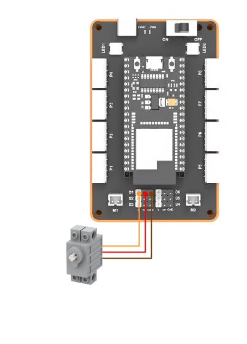

### 3.2.4 Test Demo

Once the program has been downloaded and is running, the block servo first rotates to 135° for 2 seconds, then to 0° for 2 seconds, then to 270° for 2 seconds, and finally stops.

### 3.2.5 Program Screenshot

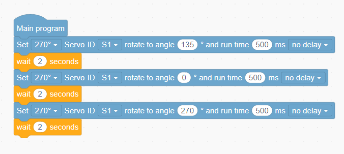

## 3.3 Button Sensor

### 3.3.1 Sensor Overview

This is a common button module with a white button cap. It is widely used in DIY projects such as environmental monitoring, electronic scales, smart cars, and robots.

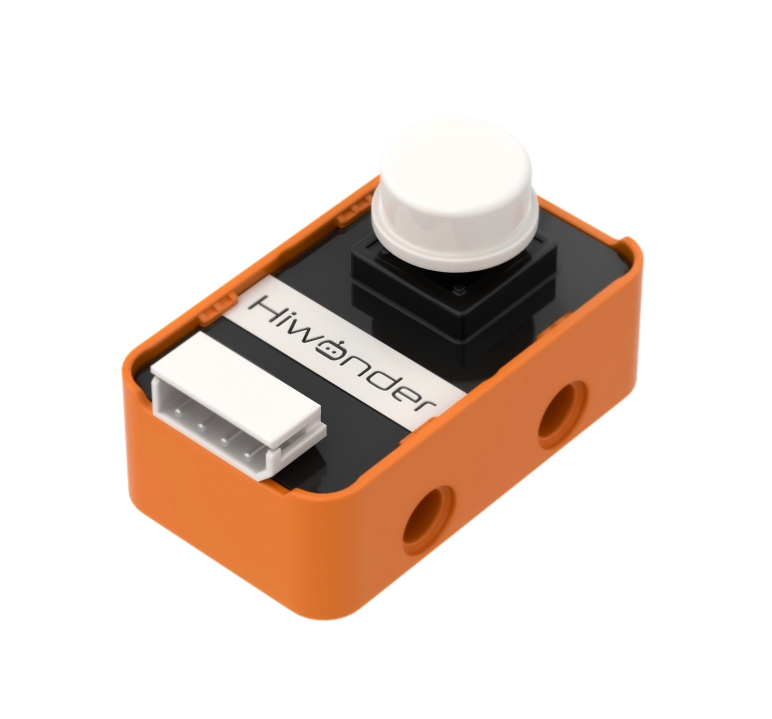

### 3.3.2 Specifications

| Item | Specification |
| :-: | :-: |
| Operating voltage | DC 5 V |
| Operating current | 5 mA |
| Connector type | 5264-4AW |
| Dimensions | 39.5 x 23.5 x 24 mm |

### 3.3.3 Wiring Diagram

### 3.3.4 Test Demo

Once the program has been downloaded and is running, the button sensor state is tested through the onboard buzzer. When the button is not pressed, the buzzer remains silent. When the button is pressed, the buzzer sounds.

### 3.3.5 Program Screenshot

- The program uses the **wait 0.2 seconds** block because when a physical button is pressed or released, its metal contacts briefly bounce. This causes the signal level to switch back and forth repeatedly in a short time, so the program may interpret a single press as multiple presses. Waiting 0.2 seconds allows the button's mechanical bounce to settle, ensuring that the program detects one stable button-press signal and preventing the tone from being played repeatedly by mistake.

## 3.4 Touch Sensor

### 3.4.1 Sensor Overview

This is a touch sensor based on capacitive sensing. It can be used for switch control in devices, such as controlling lights or touch-enabled doorbells. The sensor features LEGO-compatible mounting holes, making it suitable for more creative DIY projects.

### 3.4.2 Specifications

| Item | Specification |
| :-: | :-: |
| Operating voltage | DC 5 V |
| Operating current | 5 mA |
| Connector type | 5264-4AW |
| Dimensions | 39.5 x 23.5 x 24 mm |

### 3.4.3 Wiring Diagram

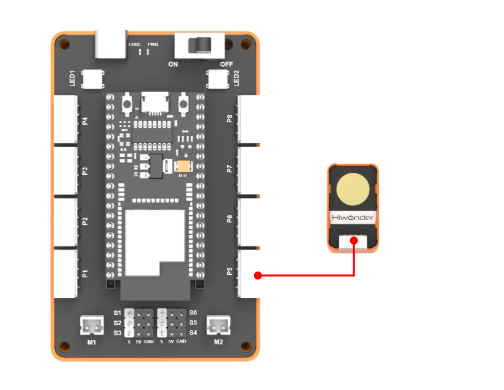

### 3.4.4 Test Demo

Once the program has been downloaded and is running, the touch sensor state is tested with the onboard RGB light. When the sensor is not touched, the RGB light remains off. When the sensor is touched, the RGB light turns red.

### 3.4.5 Program Screenshot

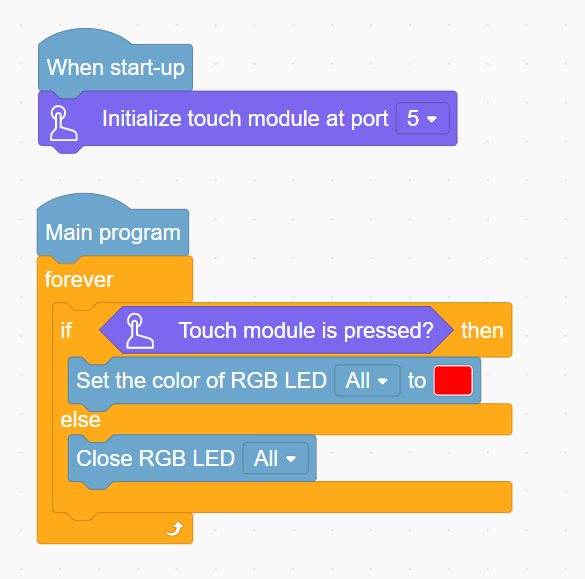

- To use the touch sensor, the interface must be initialized at startup. It can be connected to any of P5, P6, P7, or P8.

## 3.5 Sound Sensor

### 3.5.1 Sensor Overview

This is a sensor for detecting the intensity of external sound. It is widely used in projects such as sound-controlled robots, sound-activated switches, and sound alarms. The sensor features LEGO-compatible mounting holes, making it suitable for more creative DIY projects.

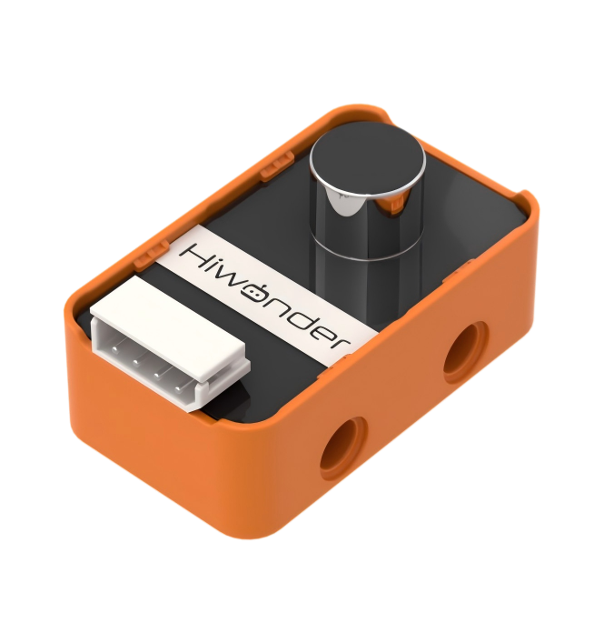

### 3.5.2 Specifications

| Item | Specification |
| :-: | :-: |
| Operating voltage | DC 5 V |
| Operating current | 5 mA |
| Microphone type | Electret condenser |
| Connector type | 5264-4AW |
| Dimensions | 39.5 x 23.5 x 24 mm |

### 3.5.3 Wiring Diagram

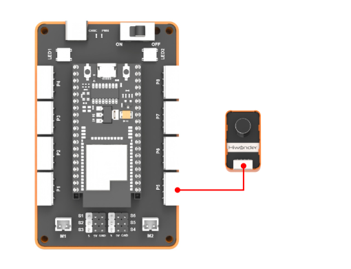

### 3.5.4 Test Demo

Once the program has been downloaded and is running, the sound sensor is tested through the onboard buzzer. When the sound sensor detects a sound level greater than 30, the buzzer sounds for 1 second and then stops. The detection state is refreshed every 0.05 seconds to keep the response timely.

### 3.5.5 Program Screenshot

## 3.6 Ultrasonic Sensor

### 3.6.1 Sensor Overview

This is a glowy ultrasonic sensor that uses an industrial-grade ultrasonic ranging chip. The chip integrates the ultrasonic transmitting circuit, ultrasonic receiving circuit, digital processing circuit, and more. The module uses an I2C communication interface, allowing the measured distance to be read through I2C communication. The module features LEGO-compatible mounting holes, making it suitable for more creative DIY projects.

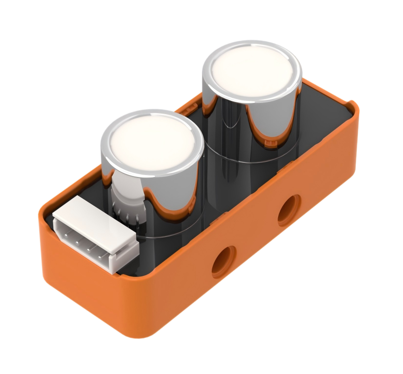

### 3.6.2 Specifications

| Item | Specification |
| :-: | :-: |
| Operating voltage | DC 5 V |
| Operating current | 2 mA |
| Operating frequency | 40 kHz |
| Effective ranging distance | 2 cm-400 cm |
| Communication method | I2C |
| Connector type | 5264-4AW |
| Dimensions | 55.5 x 23.5 x 23.8 mm |

### 3.6.3 Wiring Diagram

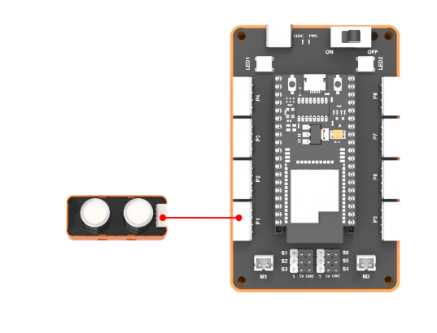

### 3.6.4 Test Demo

Once the program has been downloaded and is running, if the ultrasonic sensor detects an obstacle within 15 cm, both indicator lights on the ultrasonic sensor turn red at the same time. When the distance is greater than 15 cm, both lights turn off. The detection state is refreshed every 0.1 seconds to keep the response timely.

### 3.6.5 Program Screenshot

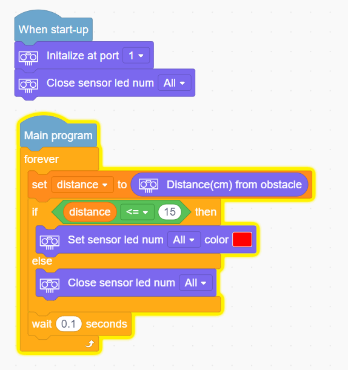

- To use the ultrasonic sensor, the interface must be initialized at startup. It can be connected to any of P1, P2, P3, or P4. The program in the figure uses the **Turn off all lights on the Glowy Ultrasonic Sensor** block because the ultrasonic sensor lights up blue when powered on.

## 3.7 IMU Sensor

### 3.7.1 Sensor Overview

This is a common IMU acceleration sensor. It is widely used in applications such as handheld gaming devices, 3D controllers, and portable navigation devices. The sensor features LEGO-compatible mounting holes, making it suitable for more creative DIY projects.

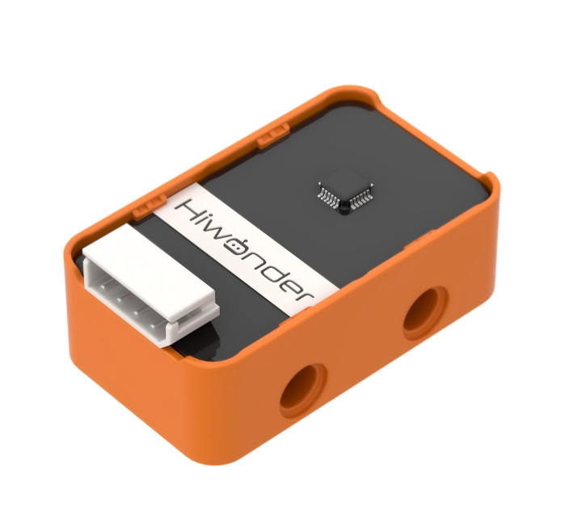

### 3.7.2 Specifications

| Item | Specification |
| :-: | :-: |
| Operating voltage | DC 5 V |
| Data interface | I2C bus, with a maximum clock frequency of 400 kHz |
| Connector type | 5264-4AW |
| Dimensions | 39.5 x 23.5 x 24 mm |

### 3.7.3 Wiring Diagram

### 3.7.4 Test Demo

Once the program has been downloaded and is running, the X-axis and Y-axis values of the IMU sensor are displayed through the serial port.

### 3.7.5 Program Screenshot

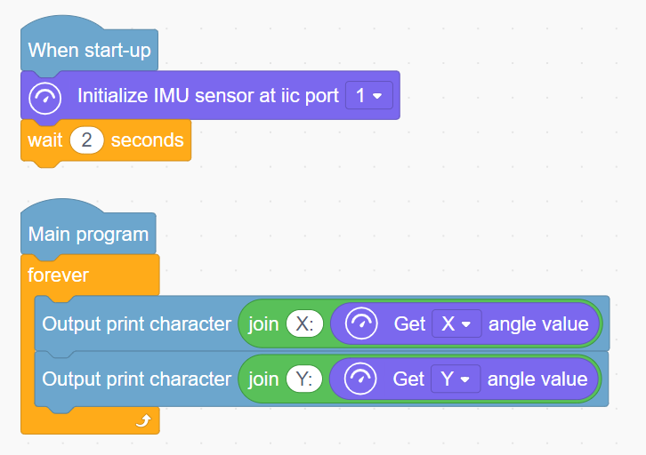

- To use the IMU sensor, the interface must be initialized at startup. It can be connected to any of P1, P2, P3, or P4. The program in the figure uses the **Wait 2 seconds** block because the IMU sensor requires calibration.

## 3.8 Infrared Obstacle Avoidance Sensor

### 3.8.1 Sensor Overview

This is a sensor used to detect whether an obstacle is present in front of it. It includes an infrared transmitter and an infrared receiver. When the sensor encounters an obstacle, the infrared light is reflected back and received by the receiver. The sensor is widely used and features LEGO-compatible mounting holes, making it suitable for more creative DIY projects.

### 3.8.2 Specifications

| Item | Specification |
| :-: | :-: |
| Operating voltage | DC 5 V |
| Operating current | 40 mA |
| Effective detection range | 2-25 cm |
| Detection range adjustment | Micro potentiometer adjustment |
| Connector type | 5264-4AW |
| Dimensions | 39.5 x 23.5 x 10 mm |

### 3.8.3 Wiring Diagram

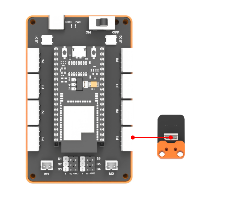

### 3.8.4 Test Demo

Once the program has been downloaded and is running, the infrared sensor is tested using the onboard buzzer. When no obstacle is detected, the buzzer remains silent. When an obstacle is detected, the buzzer sounds.

### 3.8.5 Program Screenshot

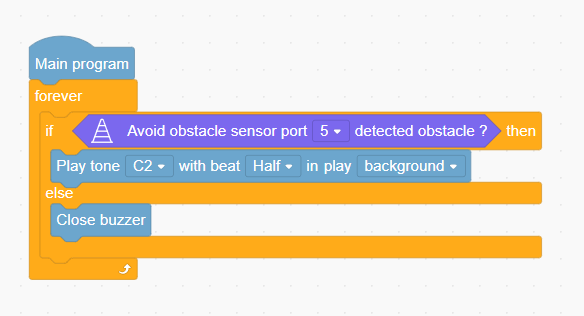

## 3.9 Light Sensor

### 3.9.1 Sensor Overview

This is a sensor for detecting ambient light intensity. It is commonly used in interactive projects that respond to changes in light intensity, such as automatic roadside lighting systems and environmental monitoring systems. The sensor features LEGO-compatible mounting holes, making it suitable for more creative DIY projects.

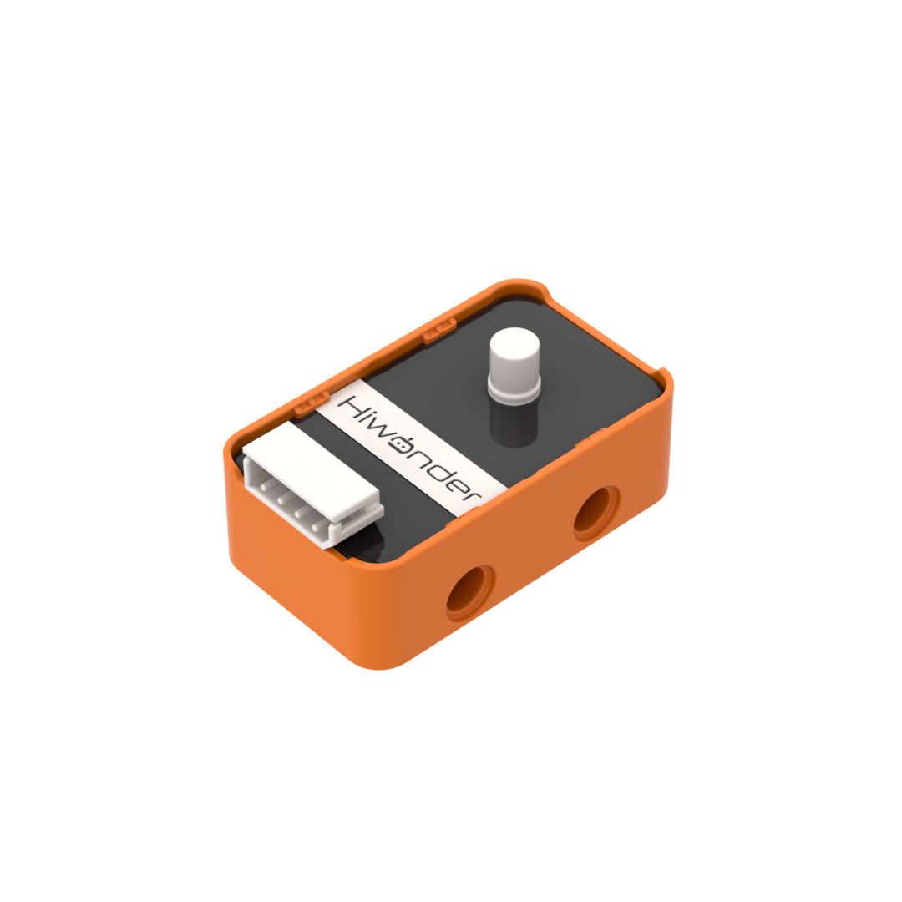

### 3.9.2 Specifications

| Item | Specification |
| :-: | :-: |
| Operating voltage | DC 5 V |
| Operating current | 5 mA |
| Connector type | 5264-4AW |
| Dimensions | 39.5 x 23.5 x 17.3 mm |

### 3.9.3 Wiring Diagram

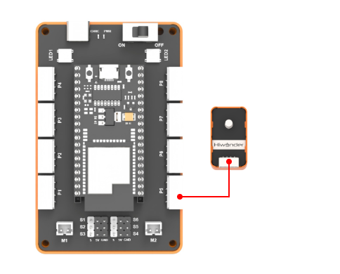

### 3.9.4 Test Demo

Once the program has been downloaded and is running, the light intensity value detected by the light sensor is displayed through the serial port.

### 3.9.5 Program Screenshot

## 3.10 4-Channel Line Follower Sensor

### 3.10.1 Sensor Overview

The 4-channel line follower sensor can be used for line tracking. It features LEGO-compatible mounting holes, making it suitable for more creative DIY projects.

### 3.10.2 Specifications

| Item | Specification |
| :-: | :-: |
| Operating voltage | DC 5 V |
| Effective range | 8-16 mm |
| Interface type | I2C |
| Connector type | 5264-4AW |
| Dimensions | 71.7 x 31.2 x 9 mm |

### 3.10.3 Wiring Diagram

### 3.10.4 Learning Mode

The 4-channel line follower module can learn both the map background and the black line to be followed by pressing the button on the sensor. Follow the steps below to complete the learning process:

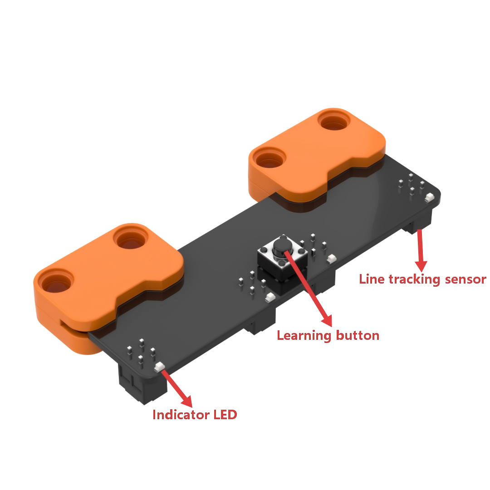

① Point the sensor probes at the background area of the map and press and hold the learning button. When the indicator lights for sensors 1-4 flash at the same time, the background learning process is complete.
② Point the sensor probes at the line that will be followed and press the learning button once briefly. When the indicator lights for sensors 1-4 flash at the same time, line learning is complete.
③ When the middle two indicator lights on the 4-channel line follower sensor flash, the learning process is complete.

> [!NOTE]
> **During use, keep the sensor probes 8 mm to 16 mm above the ground. After learning is completed successfully, the middle two sensor probes flash. When the sensor probes detect the track, the corresponding indicator light turns on.**

### 3.10.5 Test Demo

Once the program has been downloaded and is running, the 4-channel line follower module tests each sensor probe separately. When a black line is detected, the corresponding sensor number is output.

### 3.10.6 Program Screenshot

- To use the 4-channel line follower sensor, the interface must be initialized at startup. It can be connected to any of P1, P2, P3, or P4.

## 3.11 Dot Matrix Module

### 3.11.1 Module Overview

This is an LED dot matrix display module with high brightness, flicker-free display, and convenient wiring. It can display numbers, text, patterns, and more. The module also features LEGO-compatible mounting holes, making it suitable for more creative DIY projects.

### 3.11.2 Specifications

| Item | Specification |
| :-: | :-: |
| Operating voltage | DC 5 V |
| Operating current | 45 mA |
| Matrix pixels | 8 x 16 dot matrix |
| Matrix brightness | 8 adjustable brightness levels |
| Connector type | 5264-4AW |
| Dimensions | 55.5 x 23.5 x 18.1 mm |

### 3.11.3 Wiring Diagram

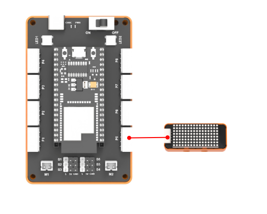

### 3.11.4 Test Demo

Once the program has been downloaded and is running, the dot matrix display switches among "Hi", "123", and "❤".

### 3.11.5 Program Screenshot

- To use the dot matrix module, the interface must be initialized at startup. It can be connected to any of P5, P6, P7, or P8.

