# 4. Standard Kit Creative Builds

## 4.1 Smart Gesture-Controlled Light

### 4.1.1 Project Overview

This is a smart gesture-controlled light that changes color with a wave. Each time the ultrasonic sensor detects a waving motion, the light switches to the next color. It cycles through four states: red, green, blue, and off, like a little light magician that responds to simple gestures.

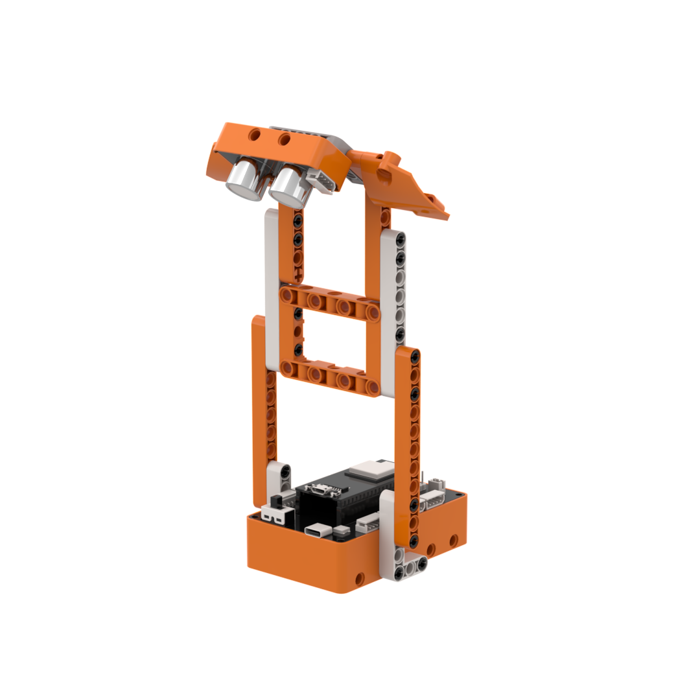

### 4.1.2 Learning Objectives

1. Practice the basic detection function of the ultrasonic sensor in this project, and understand the logic between gesture triggering and color switching.
2. Master the mechanical assembly of the smart gesture-controlled light.
3. Learn how to write a program for ultrasonic detection and color switching, and understand the principle of state switching.
4. Strengthen hands-on skills and interaction-design ability, and experience the appeal of gesture-controlled technology.

### 4.1.3 Materials Needed

1. **Materials**: controller, ultrasonic sensor, module cable, and building block parts.
2. **Module Overview**:

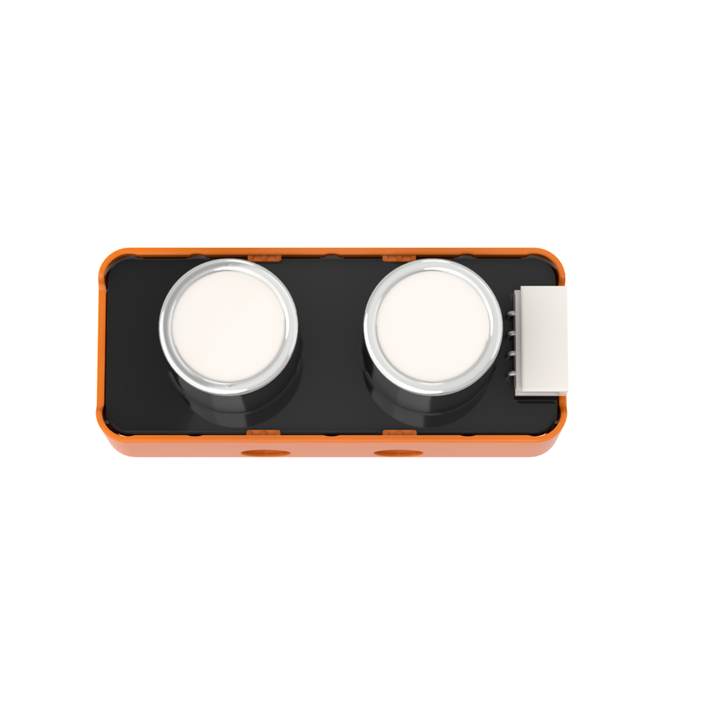

**Ultrasonic Sensor**

| Item | Description 1 | Description 2 |
| --- | --- | --- |
| Function | Detects waving gestures and triggers color switching for the light. | Outputs red, green, and blue light. |
| Application Position | Mounted on the frame of the smart gesture-controlled light. | Mounted on the frame of the smart gesture-controlled light. |
| Result | Each detected wave sends one color-switch command to the controller. | After receiving the command, the light cycles through red, green, blue, and off. |

### 4.1.4 Assembly Guide

<iframe
    src="../_static/pdf/01_Smart_Gesture_Controlled_Light.pdf#view=FitH"
    title="Assembly Guide PDF"
    width="100%"
    height="850"
    style="border: 1px solid #ddd;"
    loading="lazy">
 </iframe>

### 4.1.5 Coding Steps

1. **Open the software**: Start the programming software and create a new project.

2. **Add the extension**

- Click the icon in the lower-left corner of the software to enter the extension interface.

- In the interface **Choose an Extension**, choose **Controller**, and add **K12 ESP32**.

- In the interface **Choose an Extension**, choose **Sensor**, and add **Glowy ultrasonic sensor**.

3. **Reference Program**

- At startup, initialize the glowy ultrasonic sensor on P1, turn off all ultrasonic indicator lights, define the variables `distance` and `color`, and initialize both variables to 0.

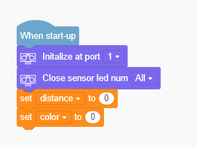

- In the main program, detect the obstacle distance in real time through the ultrasonic sensor and store the result in the `distance` variable. When the detected distance is less than 15 cm, increase the `color` variable by 1 to switch colors.

- In the lighting control logic, `color` determines the color of the ultrasonic light. A value of 1 shows red, 2 shows green, 3 shows blue, and 4 turns the light off. When the value reaches 5, reset it to 0 to start the color cycle again. Wait 0.5 seconds after each color change, and refresh the main loop every 0.1 seconds.

### 4.1.6 Program Upload Steps

1. **Connect the device**: Use a data cable to connect the controller to a USB port on the computer.

2. **Select the port**: In the programming software, select the COM port corresponding to the controller. Multiple COM ports may be listed, so make sure the correct one is selected.

3. **Upload**: Click the icon to upload the completed program to the controller.

4. **Power on**: Turn on the controller, initialize the device, and test the execution of the uploaded code.

### 4.1.7 Demo

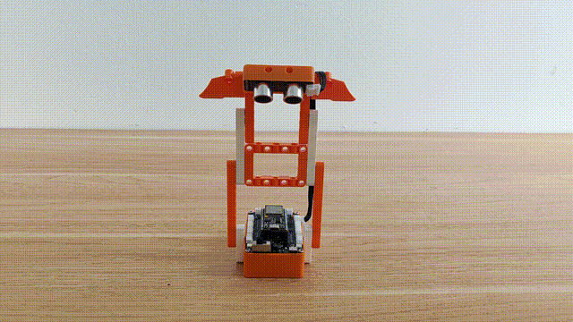

## 4.2 Motorized Windmill

### 4.2.1 Project Overview

This is a motorized windmill that rotates automatically once powered on. Once powered on, the motor continuously drives the windmill blades, recreating the lively motion of a small windmill turning in the breeze.

### 4.2.2 Learning Objectives

1. Practice the basic control function of the motor and understand the logic of power-on startup and continuous rotation.
2. Master the mechanical assembly of the motorized windmill.
3. Learn how to write a program for automatic startup and continuous rotation, and understand the basic control principle of the motor.
4. Strengthen hands-on skills and understanding of mechanical structures, and experience the fun of simple power-driven devices.

### 4.2.3 Materials Needed

1. **Materials**: controller, motor, module cable, and building block parts.
2. **Module Overview**:

**Motor**

| Item | Description |
| :-: | :-: |
| Function | Provides the driving force for windmill rotation. |
| Application Position | Mounted on the axle of the motorized windmill. |
| Result | After receiving the controller signal, the motor keeps the blades rotating continuously. |

### 4.2.4 Assembly Guide

<iframe
    src="../_static/pdf/02_Motorized_Windmill.pdf#view=FitH"
    title="Assembly Guide PDF"
    width="100%"
    height="850"
    style="border: 1px solid #ddd;"
    loading="lazy">
 </iframe>

### 4.2.5 Coding Steps

1. **Open the software**: Start the programming software and create a new project.

2. **Add the extension**

- Click the icon in the lower-left corner of the software to enter the extension interface.

- In the interface **Choose an Extension**, choose **Controller**, and add **K12 ESP32**.

3. **Reference Program**

- In the main program, control motor S1 to rotate the windmill continuously at a speed of 60. Refresh the control command every 0.1 seconds to keep the motor running steadily.

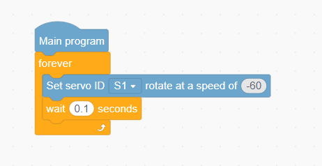

### 4.2.6 Program Upload Steps

1. **Connect the device**: Use a data cable to connect the controller to a USB port on the computer.

2. **Select the port**: In the programming software, select the COM port corresponding to the controller. Multiple COM ports may be listed, so make sure the correct one is selected.

3. **Upload**: Click the icon to upload the completed program to the controller.

4. **Power on**: Turn on the controller, initialize the device, and test the execution of the uploaded code.

### 4.2.7 Demo

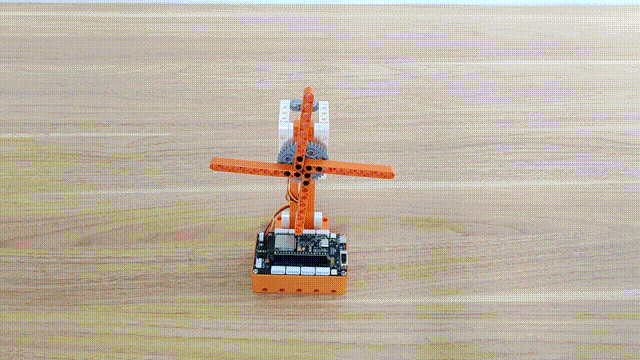

## 4.3 Sound-Activated Ferris Wheel

### 4.3.1 Project Overview

This is a sound-activated Ferris wheel that changes speed according to the number of sounds detected by the sound sensor. While it rotates, the controller RGB light keeps flashing, creating the lively atmosphere of an amusement park ride.

### 4.3.2 Learning Objectives

1. Practice the basic functions of the motor, sound sensor, and controller RGB light, and understand the linked logic of sound detection, speed control, and light flashing.
2. Master the mechanical assembly of the sound-activated Ferris wheel.
3. Learn how to write a program for sound counting, speed switching, and light flashing, and understand how multiple devices work together.
4. Strengthen hands-on skills and interaction-design ability, and experience the fun of sound-controlled interaction.

### 4.3.3 Materials Needed

1. **Materials**: controller, motor, sound sensor, module cable, and building block parts.
2. **Module Overview**:

**Sound Sensor**

| Item | Description |
| --- | --- |
| Function | Detects sound events and triggers speed changes or stopping for the Ferris wheel. |
| Application Position | Mounted on the side of the base of the sound-activated Ferris wheel. |
| Result | Each detected sound increases the count by 1 and sends a speed-switching command to the controller. |

**Motor**

| Item | Description |
| --- | --- |
| Function | Provides the driving force for the Ferris wheel. |
| Application Position | Mounted on the axle of the sound-activated Ferris wheel. |
| Result | After receiving the controller command, the motor switches among different rotation speeds based on the number of detected sounds. |

### 4.3.4 Assembly Guide

<iframe
    src="../_static/pdf/03_Sound_Activated_Ferris_Wheel.pdf#view=FitH"
    title="Assembly Guide PDF"
    width="100%"
    height="850"
    style="border: 1px solid #ddd;"
    loading="lazy">
 </iframe>

### 4.3.5 Coding Steps

1. **Open the software**: Start the programming software and create a new project.

2. **Add the extension**

- Click the icon in the lower-left corner of the software to enter the extension interface.

- In the interface **Choose an Extension**, choose **Controller**, and add **K12 ESP32**.

- In the interface **Choose an Extension**, choose **Sensor**, and add **Glowy ultrasonic sensor**.

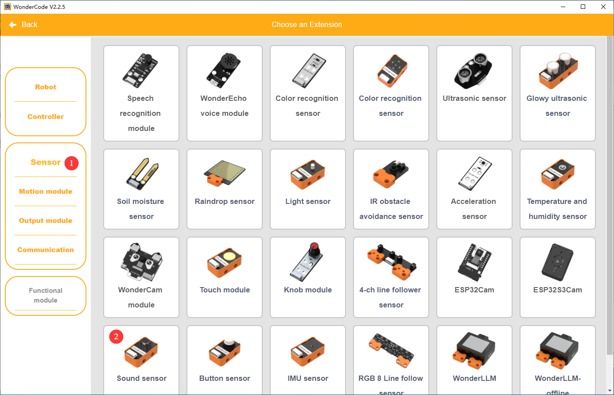

3. **Reference Program**

- At startup, define the variables `sound_count` and `status`, initialize `sounds_count` to 0 and `status` to 1, and enter the sound-detection waiting stage.

- In the main program, when `status = 1` and the sound sensor on P5 detects a volume value greater than 35, increase `sound_count` by 1, record the current system time in the `time` variable, and wait 0.1 seconds for debouncing. After a 3000 ms collection window, set `status` to 0 and move to the motor-control stage, that is, the Ferris wheel rotation stage.

- In the main program, when `status = 0`, control the motor based on `sound_count`. If `sound_count = 1`, motor S1 runs the Ferris wheel at speed 20 for 5 seconds and then stops. If `sound_count = 2`, motor S1 runs at speed 35 for 5 seconds and then stops. If `sound_count >= 3`, motor S1 runs at speed 50 for 5 seconds and then stops. During each run, the controller RGB light cycles through different colors in a breathing-light effect to simulate amusement-park lighting. After the action is complete, set the `status` back to 1, reset `sound_count` to 0, record the system time again, wait for the next sound trigger, and refresh the control loop every 0.01 seconds so the system can respond promptly.

### 4.3.6 Program Upload Steps

1. **Connect the device**: Use a data cable to connect the controller to a USB port on the computer.

2. **Select the port**: In the programming software, select the COM port corresponding to the controller. Multiple COM ports may be listed, so make sure the correct one is selected.

3. **Upload**: Click the icon to upload the completed program to the controller.

4. **Power on**: Turn on the controller, initialize the device, and test the execution of the uploaded code.

### 4.3.7 Demo

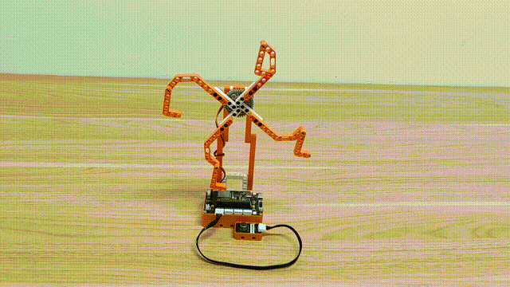

## 4.4 Rotating Swing Ride

### 4.4.1 Project Overview

This is a rotating swing ride that starts and stops with a button press. Press once to start the spinning motion, and press again to stop, recreating the fun of an amusement-park swing ride with simple control.

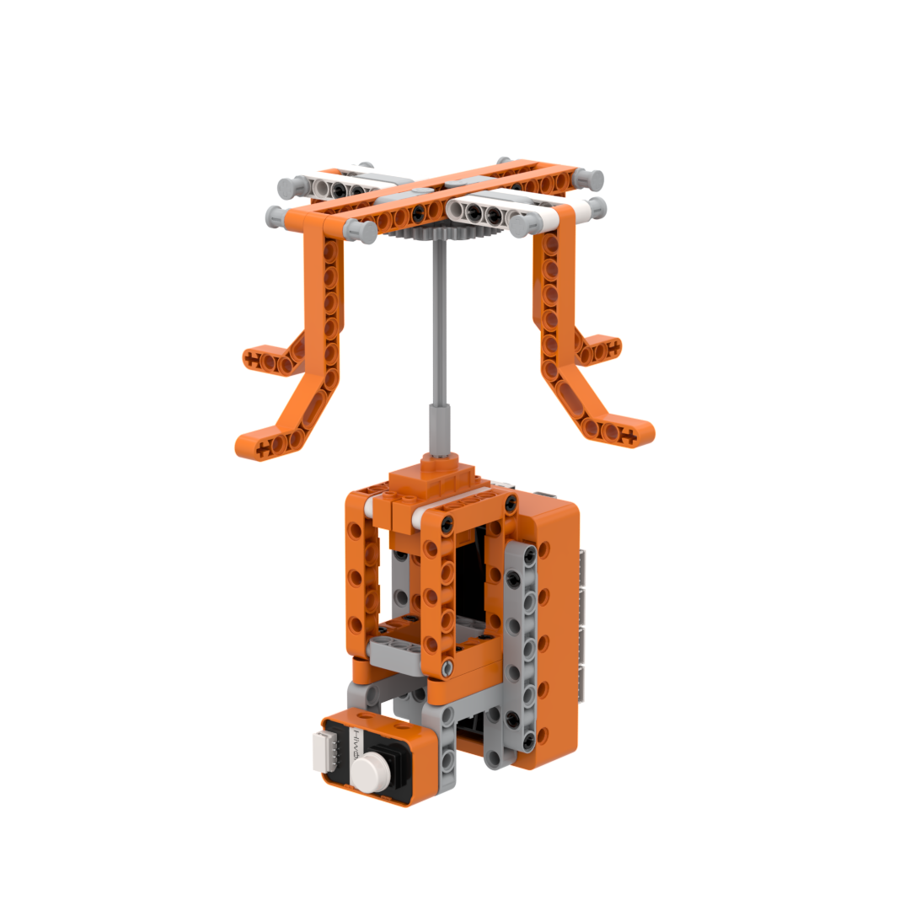

### 4.4.2 Learning Objectives

1. Practice the basic functions of the motor and button sensor, and understand the logic of button triggering and start-stop control.
2. Master the mechanical assembly of the rotating swing ride.
3. Learn how to write a program for button triggering and motor start-stop control, and understand the principle of state switching.
4. Strengthen hands-on skills and interaction-design ability, and experience the fun of button-controlled programming.

### 4.4.3 Materials Needed

1. **Materials**: controller, motor, button sensor, module cable, and building block parts.
2. **Module Overview**:

**Button Sensor**

| Item | Description |
| --- | --- |
| Function | Detects button presses and triggers the start or stop action. |
| Application Position | Mounted next to the base of the rotating swing ride. |
| Result | Each detected press sends a state-switching command to the controller. |

**Motor**

| Item | Description |
| --- | --- |
| Function | Provides the power for rotation. |
| Application Position | Mounted on the axle of the rotating swing ride. |
| Result | After receiving the controller command, the ride starts or stops rotating. |

### 4.4.4 Assembly Guide

<iframe
    src="../_static/pdf/04_Rotating_Swing_Ride.pdf#view=FitH"
    title="Assembly Guide PDF"
    width="100%"
    height="850"
    style="border: 1px solid #ddd;"
    loading="lazy">
 </iframe>

### 4.4.5 Coding Steps

1. **Open the software**: Start the programming software and create a new project.

2. **Add the extension**

- Click the icon in the lower-left corner of the software to enter the extension interface.

- In the interface **Choose an Extension**, choose **Controller**, and add **K12 ESP32**.

- In the interface **Choose an Extension**, choose **Sensor**, and add **Button sensor**.

3. **Reference Program**

- At startup, define the variable `run_status` and initialize it to -1, where -1 means stopped and 1 means running.

- In the main program, when the button on P5 is pressed, set `run_status` to `run_status` to flip the state, then wait 0.5 seconds for debouncing. When `run_status = 1`, run motor S1 at speed 50. Otherwise, stop the motor.

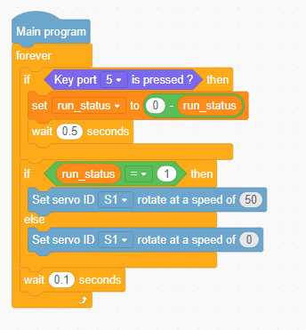

### 4.4.6 Program Upload Steps

1. **Connect the device**: Use a data cable to connect the controller to a USB port on the computer.

2. **Select the port**: In the programming software, select the COM port corresponding to the controller. Multiple COM ports may be listed, so make sure the correct one is selected.

3. **Upload**: Click the icon to upload the completed program to the controller.

4. **Power on**: Turn on the controller, initialize the device, and test the execution of the uploaded code.

### 4.4.7 Demo

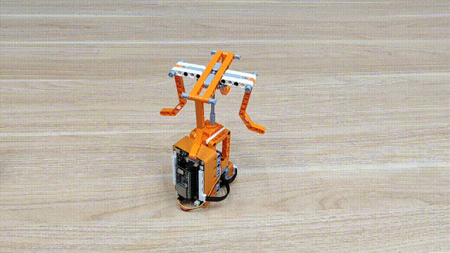

## 4.5 Rotary Cutter

### 4.5.1 Project Overview

This is a touch-controlled rotary cutter. When the touch sensor detects contact, the motor starts and drives the blade to rotate. When the touch stops, the motor stops immediately, like a safety-minded cutting tool that runs only during operation.

### 4.5.2 Learning Objectives

1. Practice the basic functions of the motor and touch sensor, and understand the logic of touch detection and start-stop control.
2. Master the mechanical assembly of the rotary cutter.
3. Learn how to write a program for touch triggering and motor start-stop control, and understand the principle of safety control.
4. Strengthen hands-on skills and safety-design awareness, and experience the intelligent safety features of industrial tools.

### 4.5.3 Materials Needed

1. **Materials**: controller, motor, touch sensor, module cable, and building block parts.
2. **Module Overview**:

**Touch Sensor**

| Item | Description |
| --- | --- |
| Function | Detects touch and triggers the cutter to start or stop. |
| Application Position | Mounted next to the handle of the rotary cutter. |
| Result | When touch is detected, the controller starts the cutter. When touch ends, the cutter stops immediately. |

**Motor**

| Item | Description |
| --- | --- |
| Function | Provides the driving force for the cutter blade. |
| Application Position | Mounted on the blade axle of the rotary cutter. |
| Result | After receiving the controller command, the cutter starts or stops rotating. |

### 4.5.4 Assembly Guide

<iframe
    src="../_static/pdf/05_Rotary_Cutter.pdf#view=FitH"
    title="Assembly Guide PDF"
    width="100%"
    height="850"
    style="border: 1px solid #ddd;"
    loading="lazy">
 </iframe>

### 4.5.5 Coding Steps

1. **Open the software**: Start the programming software and create a new project.

2. **Add the extension**

- Click the icon in the lower-left corner of the software to enter the extension interface.

- In the interface **Choose an Extension**, choose **Controller**, and add **K12 ESP32**.

- In the interface **Choose an Extension**, choose **Sensor**, and add **Touch sensor**.

3. **Reference Program**

- At startup, initialize the touch sensor on P5.

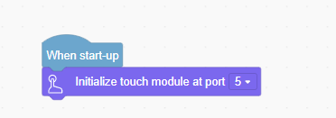

- In the main program, when the touch sensor detects contact, run motor S1 continuously at speed 50 to simulate the cutting motion. When touch is released, stop the motor.

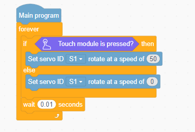

### 4.5.6 Program Upload Steps

1. **Connect the device**: Use a data cable to connect the controller to a USB port on the computer.

2. **Select the port**: In the programming software, select the COM port corresponding to the controller. Multiple COM ports may be listed, so make sure the correct one is selected.

3. **Upload**: Click the icon to upload the completed program to the controller.

4. **Power on**: Turn on the controller, initialize the device, and test the execution of the uploaded code.

### 4.5.7 Demo

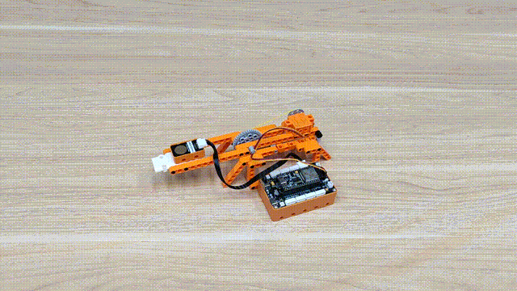

## 4.6 Dual-Control Fishing Rod

### 4.6.1 Project Overview

This is a dual-control fishing rod. The button releases the bait, and the touch sensor reels it back in. With two simple controls, the build demonstrates the fun of letting out bait and reeling it back in.

### 4.6.2 Learning Objectives

1. Practice the basic functions of the motor, button sensor, and touch sensor, and understand the logic of dual-control operation and bait release and retrieval.
2. Master the mechanical assembly of the dual-control fishing rod.
3. Learn how to write a program for button-controlled release and touch-controlled retrieval, and understand coordinated multi-command control.
4. Strengthen hands-on skills and interaction-design ability, and experience the fun of dual-control programming.

### 4.6.3 Materials Needed

1. **Materials**: controller, motor, button sensor, touch sensor, module cable, and building block parts.
2. **Module Overview**:

**Button Sensor**

| Item | Description |
| --- | --- |
| Function | Detects button presses and triggers bait release. |
| Application Position | Mounted on the support of the dual-control fishing rod. |
| Result | When a press is detected, the controller receives the bait-release command. |

**Touch Sensor**

| Item | Description |
| --- | --- |
| Function | Detects touch input and triggers bait retrieval. |
| Application Position | Mounted on the support of the dual-control fishing rod. |
| Result | When touch is detected, the controller receives the bait-retrieval command. |

**Motor**

| Item | Description |
| --- | --- |
| Function | Provides the winding force for the fishing reel. |
| Application Position | Mounted on the axle of the fishing line reel. |
| Result | After receiving the controller command, the reel rotates forward or in reverse to release or retrieve the bait. |

### 4.6.4 Assembly Guide

<iframe
    src="../_static/pdf/06_Dual_Control_Fishing_Rod.pdf#view=FitH"
    title="Assembly Guide PDF"
    width="100%"
    height="850"
    style="border: 1px solid #ddd;"
    loading="lazy">
 </iframe>

### 4.6.5 Coding Steps

1. **Open the software**: Start the programming software and create a new project.

2. **Add the extension**

- Click the icon in the lower-left corner of the software to enter the extension interface.

- In the interface **Choose an Extension**, choose **Controller**, and add **K12 ESP32**.

- In the interface **Choose an Extension**, choose **Sensor**, and add **Button sensor** and **Touch sensor**.

3. **Reference Program**

- At startup, initialize the touch sensor on P6.

- In the main program, if the button on P5 is pressed, run motor S1 at speed 80 to release the bait. If the touch sensor is activated, run motor S1 in the opposite direction at speed 80 to retrieve the bait. If neither input is active, stop the motor. Refresh the detection and control state every 0.1 seconds.

### 4.6.6 Program Upload Steps

1. **Connect the device**: Use a data cable to connect the controller to a USB port on the computer.

2. **Select the port**: In the programming software, select the COM port corresponding to the controller. Multiple COM ports may be listed, so make sure the correct one is selected.

3. **Upload**: Click the icon to upload the completed program to the controller.

4. **Power on**: Turn on the controller, initialize the device, and test the execution of the uploaded code.

### 4.6.7 Demo

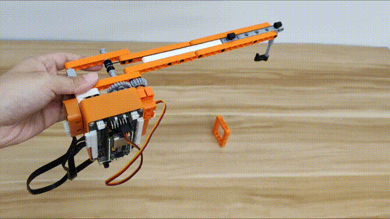

## 4.7 Sentinel Radar

### 4.7.1 Project Overview

This is a sentinel radar with automatic alert mode. Once powered on, the radar begins rotating automatically. When the ultrasonic sensor detects an object, the rotation stops immediately, the red light flashes, and an alarm sounds, like a vigilant guard protecting the area at all times.

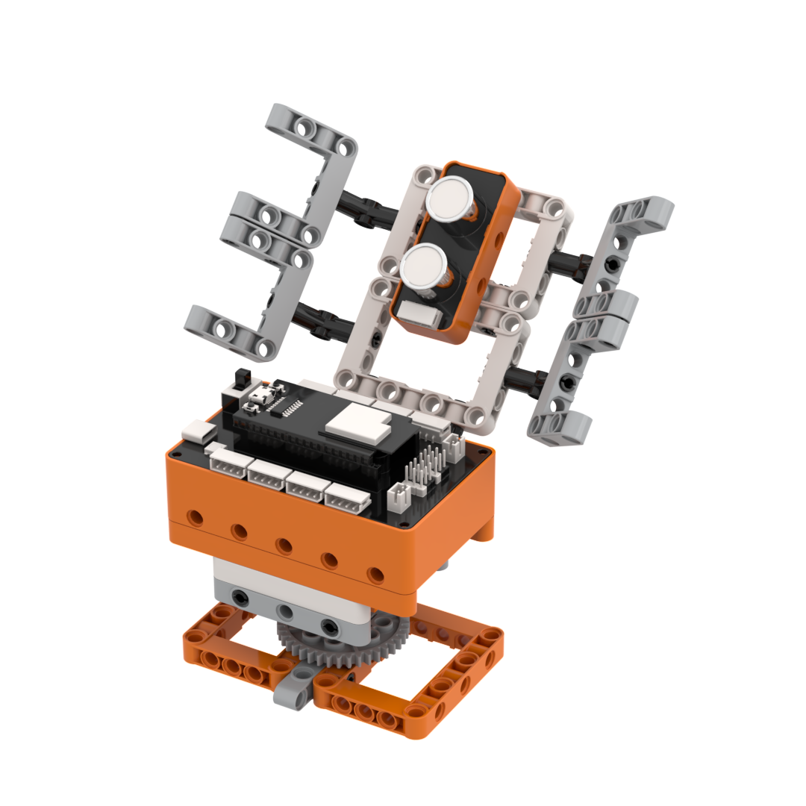

### 4.7.2 Learning Objectives

1. Practice the basic functions of the motor and ultrasonic sensor in this project, and understand the linked logic of rotation, detection, and alarm.
2. Master the mechanical assembly of the sentinel radar.
3. Learn how to write a program for rotation + detection + stop + alarm, and understand how multiple devices work together.
4. Strengthen hands-on skills and safety-monitoring design awareness, and experience the appeal of intelligent alert systems.

### 4.7.3 Materials Needed

1. **Materials**: controller, motor, ultrasonic sensor, module cable, and building block parts.

2. **Module Overview**:

**Ultrasonic Sensor**

| Item | Description 1 | Description 2 |
| --- | --- | --- |
| Function | Measures the distance to objects ahead and triggers the alert signal. | Outputs red light alerts. |
| Application Position | Mounted at the front of the sentinel radar. | Mounted at the front of the sentinel radar. |
| Result | Whenever an object is detected within 15 cm, a stop and alarm command is sent to the controller. | After receiving the controller command, the RGB light flashes red three times. |

**Motor**

| Item | Description |
| --- | --- |
| Function | Provides the driving force for radar rotation. |
| Application Position | Mounted on the rotating axle of the sentinel radar. |
| Result | It rotates continuously once powered on and stops after receiving a command from the controller. |

### 4.7.4 Assembly Guide

<iframe
    src="../_static/pdf/07_Sentinel_Radar.pdf#view=FitH"
    title="Assembly Guide PDF"
    width="100%"
    height="850"
    style="border: 1px solid #ddd;"
    loading="lazy">
 </iframe>

### 4.7.5 Coding Steps

1. **Open the software**: Start the programming software and create a new project.

2. **Add the extension**

- Click the icon in the lower-left corner of the software to enter the extension interface.

- In the interface **Choose an Extension**, choose **Controller**, and add **K12 ESP32**.

- In the interface **Choose an Extension**, choose **Sensor**, and add **Glowy ultrasonic sensor**.

3. **Reference Program**

- At startup, initialize the ultrasonic sensor on P1, turn off all RGB lights, define the variable `distance`, and set it to 0.

- In the main program, perform distance detection, motor control, and sound-and-light alerts. Use the ultrasonic sensor to measure the obstacle distance in real time and store the result in `distance`. If the distance is less than 15 cm, stop motor S1, flash the red light and sound the alarm three times, wait 0.2 seconds, then run motor S1 at speed 15 to resume radar rotation. Refresh the detection and control state every 0.1 seconds.

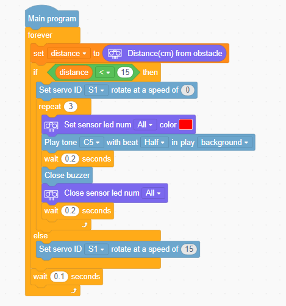

### 4.7.6 Program Upload Steps

1. **Connect the device**: Use a data cable to connect the controller to a USB port on the computer.

2. **Select the port**: In the programming software, select the COM port corresponding to the controller. Multiple COM ports may be listed, so make sure the correct one is selected.

3. **Upload**: Click the icon to upload the completed program to the controller.

4. **Power on**: Turn on the controller, initialize the device, and test the execution of the uploaded code.

### 4.7.7 Demo

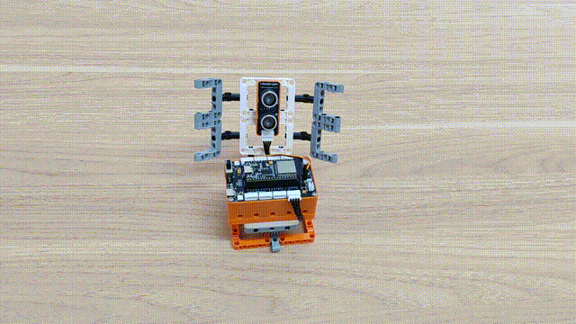

## 4.8 Vintage Waterwheel

### 4.8.1 Project Overview

This is a vintage waterwheel with three-speed switching. The button cycles through three speed levels, and the fourth press stops the rotation. It works like a traditional countryside waterwheel, gradually bringing the mechanism to life with a classic feel.

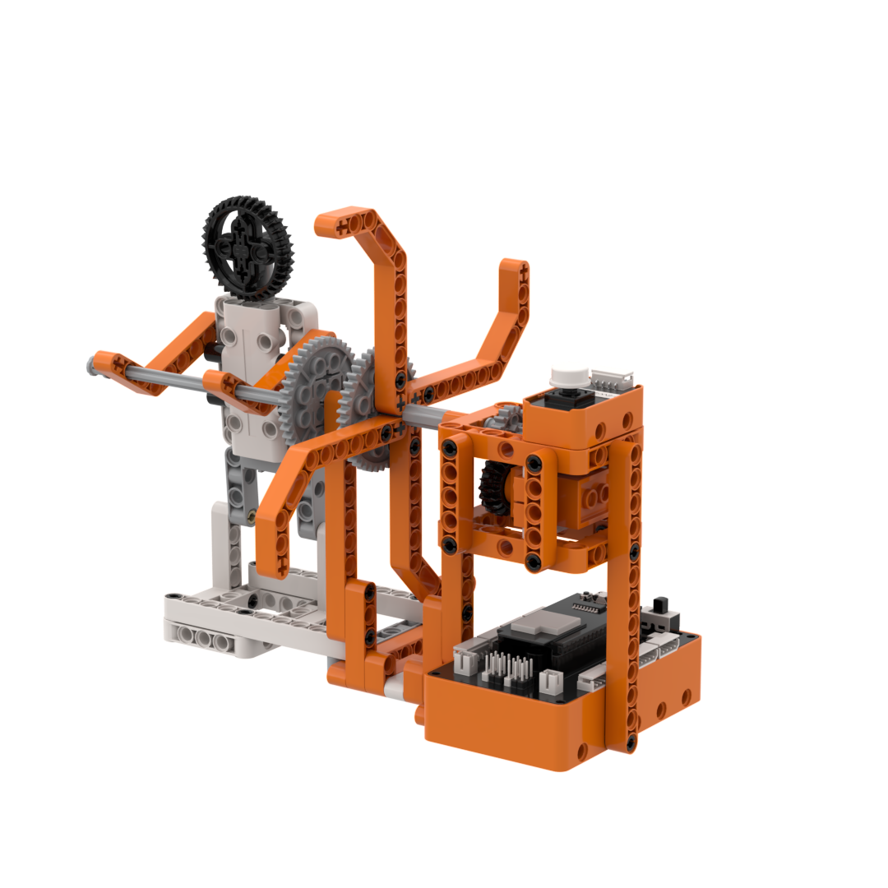

### 4.8.2 Learning Objectives

1. Practice the basic functions of the motor and button in this project, and understand the logic of button-triggered multi-speed control.
2. Master the mechanical assembly of the three-speed vintage waterwheel.
3. Learn how to write a program for button trigger + speed switching + stop, and understand state switching and motor speed control.
4. Strengthen hands-on skills and logical thinking, and experience the fun of giving traditional tools a technology upgrade.

### 4.8.3 Materials Needed

1. **Materials**: controller, motor, button sensor, module cable, and building block parts.

2. **Module Overview**:

**Button Sensor**

| Item | Description |
| --- | --- |
| Function | Detects button presses and triggers waterwheel speed changes and stop control. |
| Application Position | Mounted on the support of the vintage waterwheel. |
| Result | Each detected press increases the count by 1 and sends a speed-switching command to the controller. The fourth press stops the rotation. |

**Motor**

| Item | Description |
| --- | --- |
| Function | Provides the driving force for the waterwheel blades. |
| Application Position | Mounted on the rotating axle of the vintage waterwheel. |
| Result | After receiving the controller command, it switches the waterwheel between speeds 30, 60, 90, and stop. |

### 4.8.4 Assembly Guide

<iframe
    src="../_static/pdf/08_Vintage_Waterwheel.pdf#view=FitH"
    title="Assembly Guide PDF"
    width="100%"
    height="850"
    style="border: 1px solid #ddd;"
    loading="lazy">
 </iframe>

### 4.8.5 Coding Steps

1. **Open the software**: Start the programming software and create a new project.

2. **Add the extension**

- Click the icon in the lower-left corner of the software to enter the extension interface.

- In the interface **Choose an Extension**, choose **Controller**, and add **K12 ESP32**.

- In the interface **Choose an Extension**, choose **Sensor**, and add **Button sensor**.

3. **Reference Program**

- At startup, define the variable `key_count` and initialize it to 0.

- In the main program, detect button input and control the motor. When the button on P8 is pressed, wait 0.1 seconds for debouncing, confirm that the button is still pressed, then increase `key_count` by 1 and wait until the button is released. When `key_count` reaches 4, reset it to 0. Finally, set motor S1 speed to `30 x key_count`, which produces speeds of 30, 60, or 90, so the number of button presses controls the waterwheel speed.

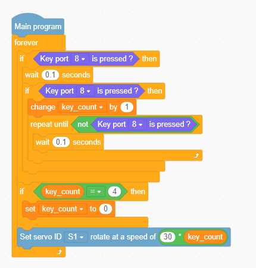

### 4.8.6 Program Upload Steps

1. **Connect the device**: Use a data cable to connect the controller to a USB port on the computer.

2. **Select the port**: In the programming software, select the COM port corresponding to the controller. Multiple COM ports may be listed, so make sure the correct one is selected.

3. **Upload**: Click the icon to upload the completed program to the controller.

4. **Power on**: Turn on the controller, initialize the device, and test the execution of the uploaded code.

### 4.8.7 Demo

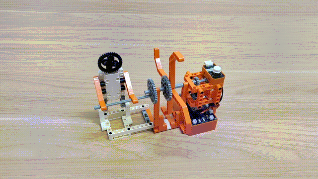

## 4.9 Unicycle Rider

### 4.9.1 Project Overview

This is a unicycle rider with button-controlled motion. A button starts and stops the rider, creating the feeling of a brave unicyclist in action with simple interactive control.

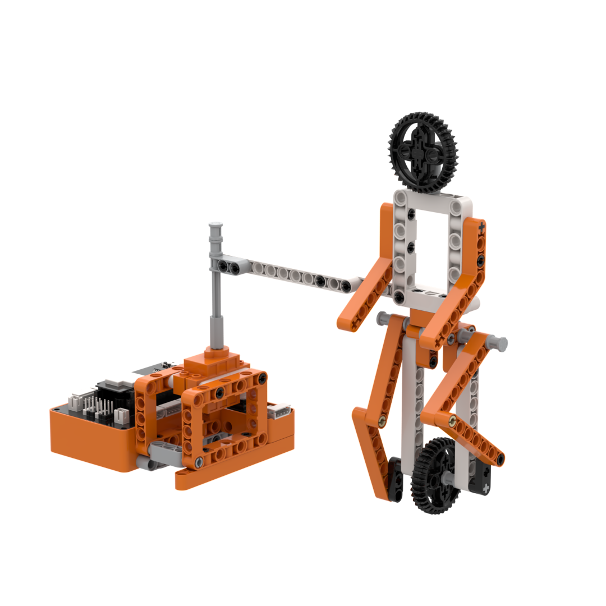

### 4.9.2 Learning Objectives

1. Practice the basic functions of the motor and button in this project, and understand the logic of button-triggered riding start and stop.
2. Master the mechanical assembly of the unicycle rider.
3. Learn how to write a program for button trigger + motor start/stop, and understand the principle of state switching.
4. Strengthen hands-on skills and interactive design awareness, and experience the fun of biomimetic riding control.

### 4.9.3 Materials Needed

1. **Materials**: controller, motor, button sensor, module cable, and building block parts.

2. **Module Overview**:

**Button Sensor**

| Item | Description |
| --- | --- |
| Function | Detects button presses and triggers the riding action to start or stop. |
| Application Position | Mounted on the base of the unicycle rider. |
| Result | Each detected press sends a state-switching command to the controller. |

**Motor**

| Item | Description |
| --- | --- |
| Function | Provides the driving force for the riding mechanism. |
| Application Position | Mounted on the rotating axle of the unicycle rider. |
| Result | After receiving the controller command, it starts or stops the riding motion. |

### 4.9.4 Assembly Guide

<iframe
    src="../_static/pdf/09_Unicycle_Rider.pdf#view=FitH"
    title="Assembly Guide PDF"
    width="100%"
    height="850"
    style="border: 1px solid #ddd;"
    loading="lazy">
 </iframe>

### 4.9.5 Coding Steps

1. **Open the software**: Start the programming software and create a new project.

2. **Add the extension**

- Click the icon in the lower-left corner of the software to enter the extension interface.

- In the interface **Choose an Extension**, choose **Controller**, and add **K12 ESP32**.

- In the interface **Choose an Extension**, choose **Sensor**, and add **Button sensor**.

3. **Reference Program**

- At startup, define the variable `run_status` and initialize it to -1. A value of -1 means not riding, and a value of 1 means riding.

- In the main program, detect the button and control the motor. When the button on P5 is pressed, set `run_status` to `0 - run_status` to invert the state, then wait 0.5 seconds for debouncing. If `run_status` is 1, run motor S1 at speed 50 to drive the rider. Otherwise, stop the motion.

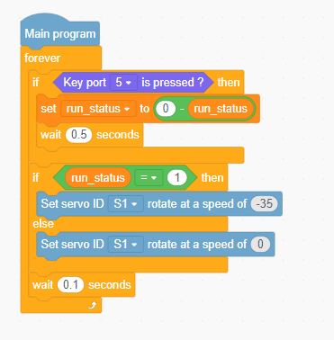

### 4.9.6 Program Upload Steps

1. **Connect the device**: Use a data cable to connect the controller to a USB port on the computer.

2. **Select the port**: In the programming software, select the COM port corresponding to the controller. Multiple COM ports may be listed, so make sure the correct one is selected.

3. **Upload**: Click the icon to upload the completed program to the controller.

4. **Power on**: Turn on the controller, initialize the device, and test the execution of the uploaded code.

### 4.9.7 Demo

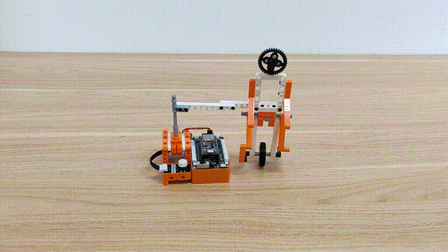

## 4.10 Twist Dancer

### 4.10.1 Project Overview

This is a twist dancer with sound-controlled motion. Once the sound sensor detects a sound, the figure starts twisting, like a party dancer moving to the rhythm with lively energy.

### 4.10.2 Learning Objectives

1. Practice the basic functions of the motor and sound sensor in this project, and understand the logic of sound detection and motion control.
2. Master the mechanical assembly of the twist dancer.
3. Learn how to write a program for sound trigger + twisting motion, and understand state switching and motor speed control.
4. Strengthen hands-on skills and creative expression, and experience the fun of sound-controlled interaction.

### 4.10.3 Materials Needed

1. **Materials**: controller, motor, sound sensor, module cable, and building block parts.

2. **Module Overview**:

**Sound Sensor**

| Item | Description |
| --- | --- |
| Function | Detects sound signals and triggers the twisting motion. |
| Application Position | Mounted on the support of the twist dancer. |
| Result | When a sound value greater than 40 is detected, a twisting command is sent to the controller. |

**Motor**

| Item | Description |
| --- | --- |
| Function | Provides the driving force for the twisting motion. |
| Application Position | Mounted on the rotating wheel of the twist dancer. |
| Result | After receiving the controller command, it drives the twist dancer to move. |

### 4.10.4 Assembly Guide

<iframe
    src="../_static/pdf/10_Twist_Dancer.pdf#view=FitH"
    title="Assembly Guide PDF"
    width="100%"
    height="850"
    style="border: 1px solid #ddd;"
    loading="lazy">
 </iframe>

### 4.10.5 Coding Steps

1. **Open the software**: Start the programming software and create a new project.

2. **Add the extension**

- Click the icon in the lower-left corner of the software to enter the extension interface.

- In the interface **Choose an Extension**, choose **Controller**, and add **K12 ESP32**.

- In the interface **Choose an Extension**, choose **Sensor** and add **Sound Sensor**.

3. **Reference Program**

- At startup, define the variable `run_status` and initialize it to 0. A value of 0 means not twisting, and a value of 1 means twisting.

- In the main program loop, detect sound and control the motor. When the sound sensor on P5 detects a volume value greater than 40, toggle `run_status` and wait 0.2 seconds for debouncing to avoid repeated triggers. If `run_status` is 1, run motor S1 at speed 50 to drive the twisting motion. Otherwise, stop the motor.

### 4.10.6 Program Upload Steps

1. **Connect the device**: Use a data cable to connect the controller to a USB port on the computer.

2. **Select the port**: In the programming software, select the COM port corresponding to the controller. Multiple COM ports may be listed, so make sure the correct one is selected.

3. **Upload**: Click the icon to upload the completed program to the controller.

4. **Power on**: Turn on the controller, initialize the device, and test the execution of the uploaded code.

### 4.10.7 Demo

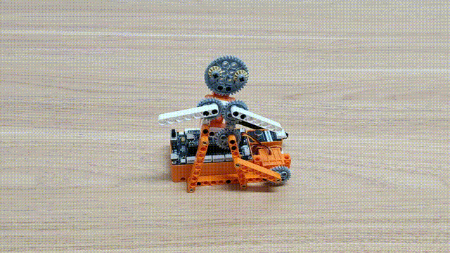

## 4.11 Parkour Runner

### 4.11.1 Project Overview

This is a parkour runner with button-controlled motion. A button starts and stops the figure's running action, creating the feel of a brave parkour athlete in motion through simple control.

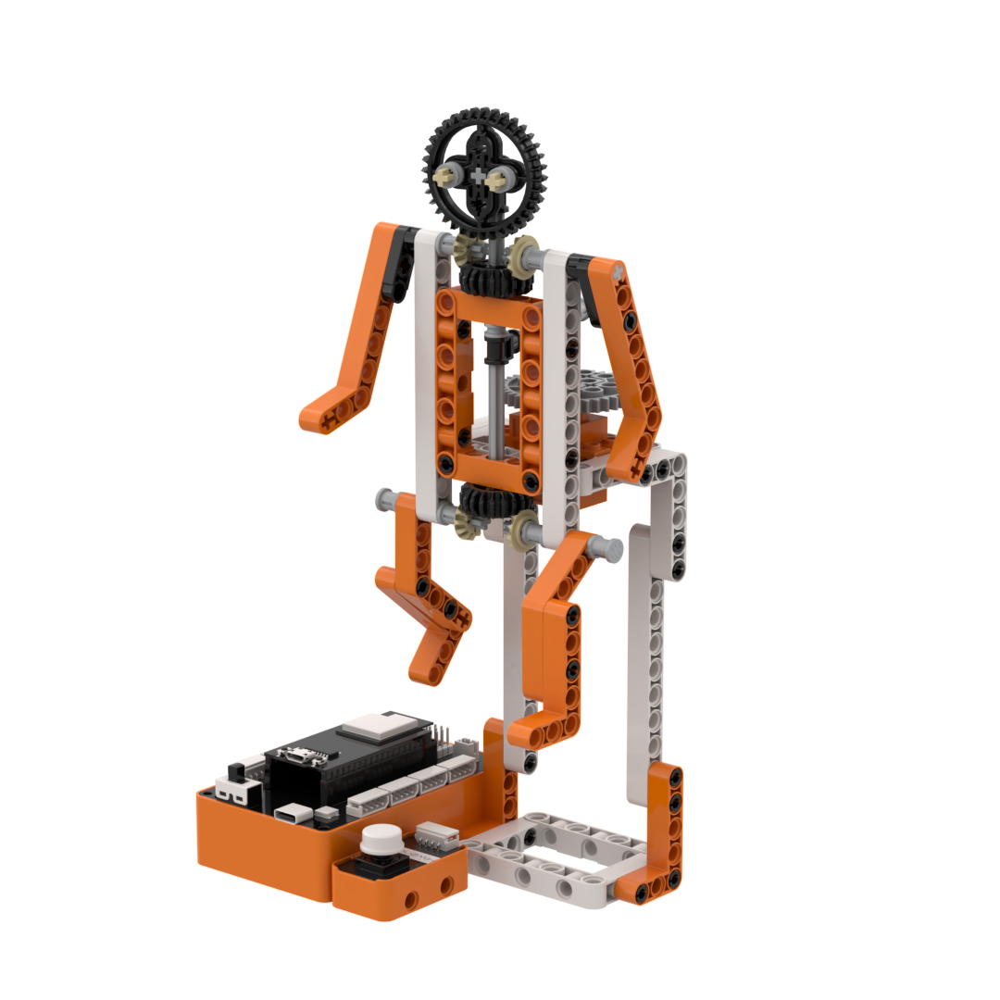

### 4.11.2 Learning Objectives

1. Practice the basic functions of the motor and button in this project, and understand the logic of button-triggered running start and stop.
2. Master the mechanical assembly of the parkour runner.
3. Learn how to write a program for button trigger + motor start/stop, and understand the principle of state switching.
4. Strengthen hands-on skills and understanding of biomimetic structures, and experience the fun of programming running motion.

### 4.11.3 Materials Needed

1. **Materials**: controller, motor, button sensor, module cable, and building block parts.

2. **Module Overview**:

**Button Sensor**

| Item | Description |
| --- | --- |
| Function | Detects button presses and triggers the running action to start or stop. |
| Application Position | Mounted on the base of the parkour runner. |
| Result | Each detected press sends a state-switching command to the controller. |

**Motor**

| Item | Description |
| --- | --- |
| Function | Provides the driving force for running motion. |
| Application Position | Mounted on the rotating wheel of the parkour runner. |
| Result | After receiving the controller command, it starts or stops the running action. |

### 4.11.4 Assembly Guide

<iframe
    src="../_static/pdf/11_Parkour_Runner.pdf#view=FitH"
    title="Assembly Guide PDF"
    width="100%"
    height="850"
    style="border: 1px solid #ddd;"
    loading="lazy">
 </iframe>

### 4.11.5 Coding Steps

1. **Open the software**: Start the programming software and create a new project.

2. **Add the extension**

- Click the icon in the lower-left corner of the software to enter the extension interface.

- In the interface **Choose an Extension**, choose **Controllers** and add **K12 ESP32**.

- In the interface **Choose an Extension**, choose **Sensor**, and add **Button sensor**.

3. **Reference Program**

- At startup, define the variable `run_status` and initialize it to -1. A value of -1 means not running, and a value of 1 means running.

- In the main program, detect the button and control the motor. When the button on P5 is pressed, set `run_status` to `0 - run_status` to invert the state, then wait 0.5 seconds for debouncing. If `run_status` is 1, run motor S1 at speed 30 to drive the runner. Otherwise, stop the motion.

### 4.11.6 Program Upload Steps

1. **Connect the device**: Use a data cable to connect the controller to a USB port on the computer.

2. **Select the port**: In the programming software, select the COM port corresponding to the controller. Multiple COM ports may be listed, so make sure the correct one is selected.

3. **Upload**: Click the icon to upload the completed program to the controller.

4. **Power on**: Turn on the controller, initialize the device, and test the execution of the uploaded code.

### 4.11.7 Demo

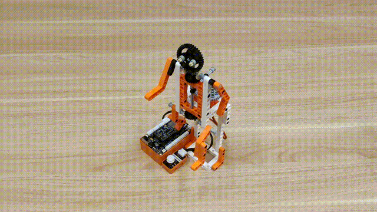

## 4.12 Dual-Control Crossbow

### 4.12.1 Project Overview

This is a dual-control crossbow with separate launch and reset controls. The button triggers the launch, and the touch sensor resets the mechanism, creating a simple interactive experience similar to operating a precision launcher.

### 4.12.2 Learning Objectives

1. Practice the basic functions of the motor, button sensor, and touch sensor in this project, and understand the logic of dual-control operation for launch and reset.
2. Master the mechanical assembly of the dual-control crossbow.
3. Learn how to write a program for button launch + touch reset, and understand how multiple commands work together in one control flow.
4. Strengthen hands-on skills and safety-design awareness, and experience the fun of programming a mechanical launcher.

### 4.12.3 Materials Needed

1. **Materials**: controller, motor, button sensor, touch sensor, module cable, and building block parts.

2. **Module Overview**:

**Button Sensor**

| Item | Description |
| --- | --- |
| Function | Detects button presses and triggers the launch action. |
| Application Position | Mounted on the base of the dual-control crossbow. |
| Result | Each detected press sends a launch command to the controller. |

**Touch Sensor**

| Item | Description |
| --- | --- |
| Function | Detects touch input and triggers the crossbow reset action. |
| Application Position | Mounted on the base of the dual-control crossbow. |
| Result | When touch is detected, a crossbow reset command is sent to the controller. |

**Motor**

| Item | Description |
| --- | --- |
| Function | Provides the driving force for crossbow launch and reset. |
| Application Position | Mounted on the rotating wheel of the dual-control crossbow. |
| Result | After receiving the controller command, it controls the crossbow launch and reset. |

### 4.12.4 Assembly Guide

<iframe
    src="../_static/pdf/12_Dual_Control_Crossbow.pdf#view=FitH"
    title="Assembly Guide PDF"
    width="100%"
    height="850"
    style="border: 1px solid #ddd;"
    loading="lazy">
 </iframe>

### 4.12.5 Coding Steps

1. **Open the software**: Start the programming software and create a new project.

2. **Add the extension**

- Click the icon in the lower-left corner of the software to enter the extension interface.

- In the interface **Choose an Extension**, choose **Controller**, and add **K12 ESP32**.

- In the interface **Choose an Extension**, choose **Sensor** and add **Keys** and **Touch module**.

3. **Reference Program**

- At startup, initialize the touch sensor on P6.

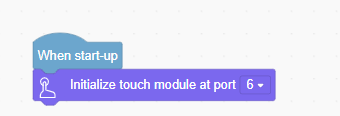

- In the main program, detect the button and control the motor. If the button on P5 is pressed, run motor S1 at speed 50 to launch the crossbow. If the touch sensor is activated, run motor S1 at speed 50 to reset the crossbow. If neither input is active, stop the motor. Refresh the detection and control state every 0.1 seconds to keep the response timely.

### 4.12.6 Program Upload Steps

1. **Connect the device**: Use a data cable to connect the controller to a USB port on the computer.

2. **Select the port**: In the programming software, select the COM port corresponding to the controller. Multiple COM ports may be listed, so make sure the correct one is selected.

3. **Upload**: Click the icon to upload the completed program to the controller.

4. **Power on**: Turn on the controller, initialize the device, and test the execution of the uploaded code.

### 4.12.7 Demo

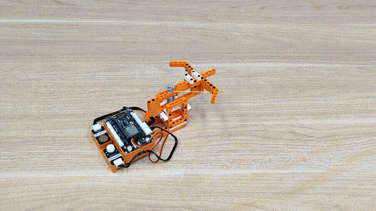

