# 2. Quick Start Guide

## 2.1 Hardware Preparation

### 2.1.1 Powering On

1. Make sure the controller power switch is set to **OFF**. Install the battery in the battery compartment of the controller.

> [!NOTE]
> **Make sure the positive and negative terminals are not reversed.**

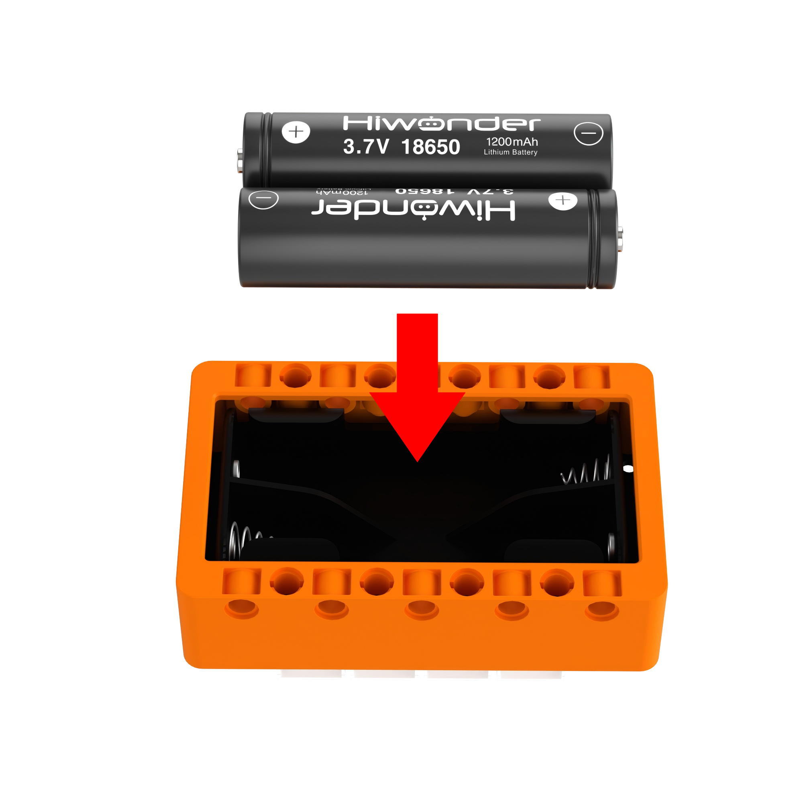

2. Turn on the power switch. The power indicator LED on the controller lights red, indicating a successful power-on.

### 2.1.2 Charging

1. Make sure the controller power switch is set to **OFF**. Install the battery in the battery compartment of the controller.

> [!NOTE]
>
> * **Make sure the positive and negative terminals are not reversed.**
>
> * **When powering on for the first time, follow the steps in "2.1.2 Charging" to charge at the charging port for about 5 seconds to activate the built-in battery protection chip. Once activated, reactivation is not required unless the battery is unplugged.**

2. Connect a USB data cable to the charging port on the controller, and connect the other end to a charger.

3. While charging, the controller LED lights up blue. When charging is complete, the LED turns off. Disconnect the power cable promptly after charging to avoid overcharging.

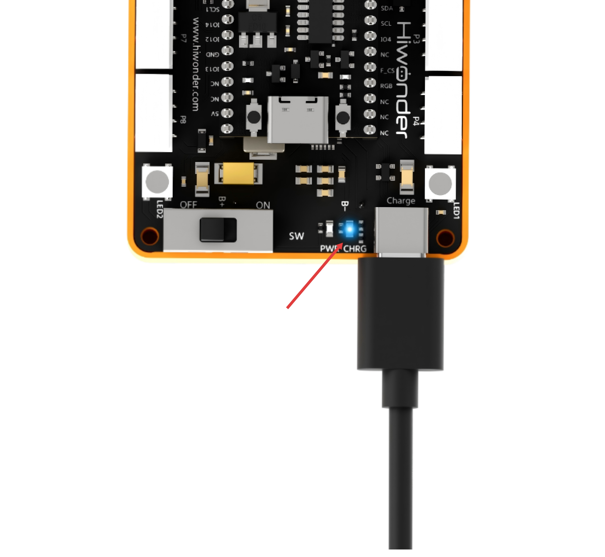

## 2.2 WonderCode Installation

1. Open **[WonderCode setup.exe](https://www.hiwonder.net/pc-programming-software)**.

2. Select the installation language, then click **OK**.

3. Select the installation location, then click **Next**.

4. Click **Next**.

5. Click **Install**.

6. After the installation is complete, click **Finish**.

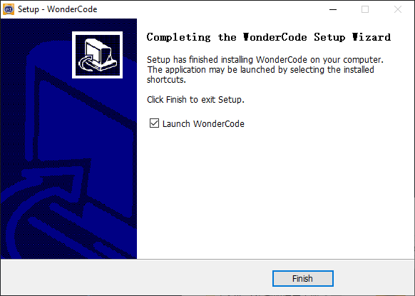

## 2.3 Starter Project 1: Blinking Onboard RGB Lights

### 2.3.1 Programming Steps

1. **Open the software**: Start the programming software and create a new project.

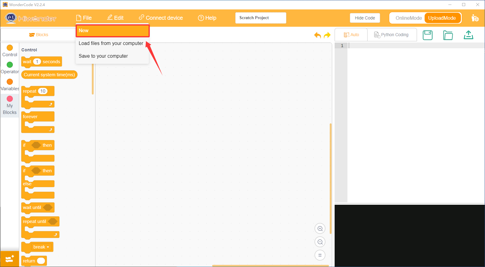

2. **Add the extension**

- Open the **Choose an Extension** interface by clicking the icon in the lower-left corner of the software.

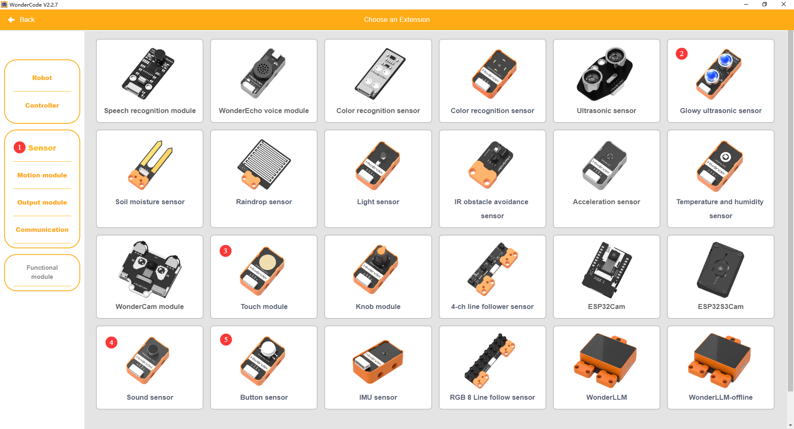

- In **Choose an Extension**, choose **Controller** and add **K12 ESP32**.

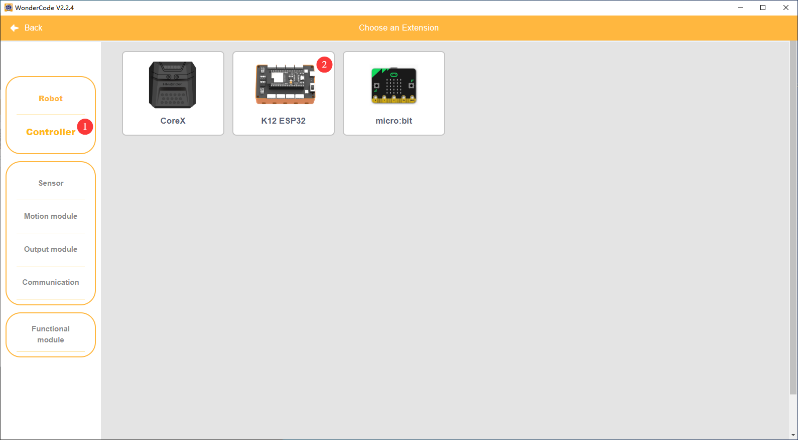

- After the extension is added successfully, the added package appears in the WonderCode interface.

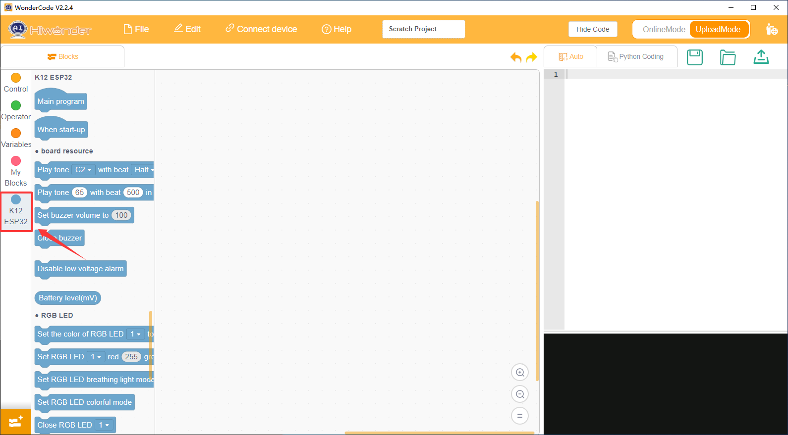

3. **Write the program**: Drag the required blocks from the command area into the script area to create the program. After the program is completed, the converted Python code appears in the code display and upload area.

### 2.3.2 Program Download Steps

1. Set the controller power switch to **ON**, then connect a USB data cable to the program download port on the controller.

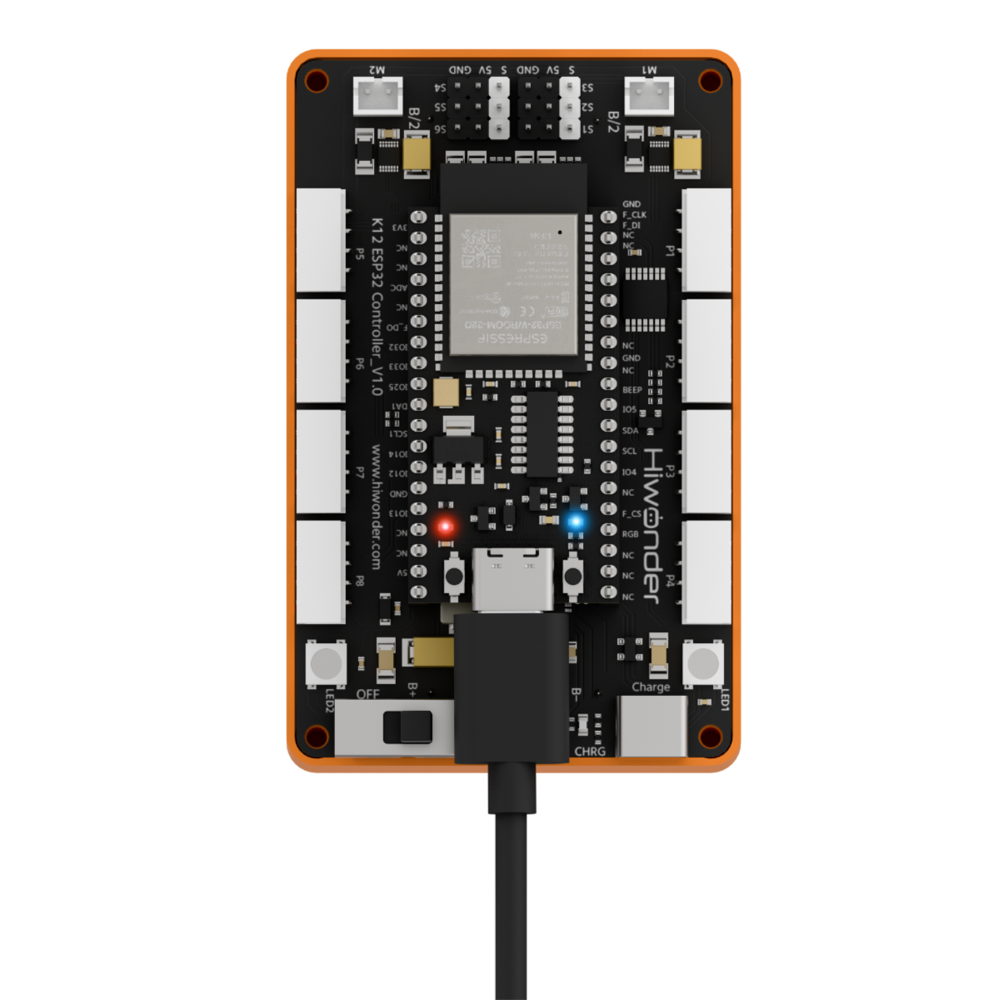

2. Plug the other end of the cable into a USB port on the computer.

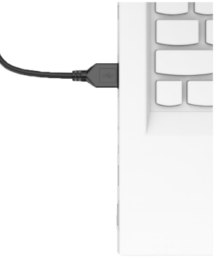

3. Click **Connect** and select the corresponding port.

> [!NOTE]
> **The port number is not fixed. The example in this section uses COM3, but COM1 should not be selected because it is usually reserved for system communication. If multiple COM ports are shown and the correct one is unclear, right-click This PC, select Properties > Device Manager, and check the port assigned to the controller. The correct port typically includes the CH340 identifier.**

### 2.3.3 Downloading the Program

1. Click **Connect** and select the corresponding port.
   
2. Click the **Download** button in the upper-right corner to download the program to the controller.

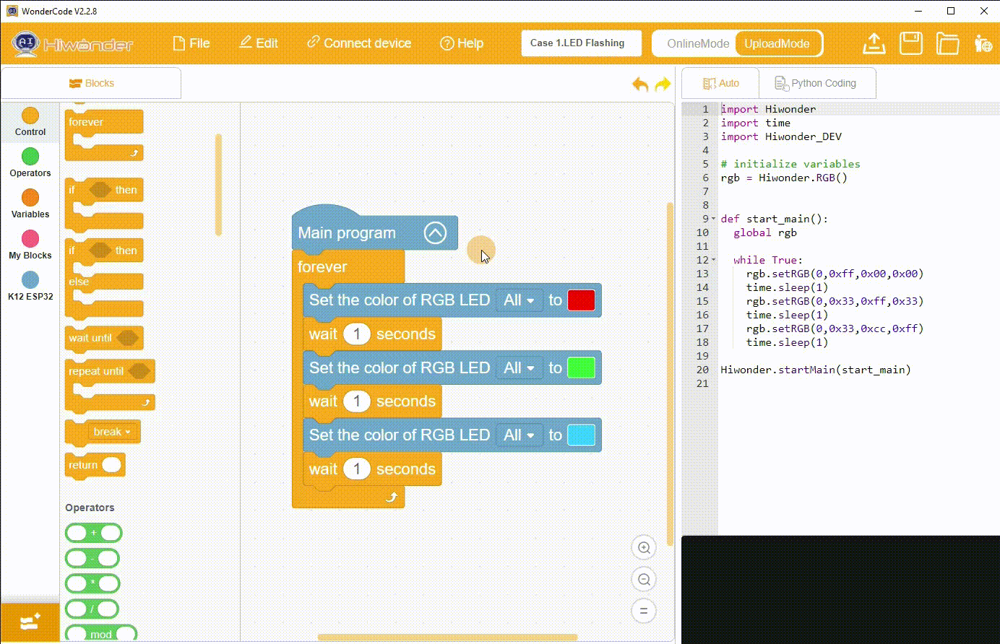

> [!NOTE]
> **If no COM port appears after the controller is connected, check whether the USB cable is a data cable, or try another USB data port on the computer.**

## 2.4 Starter Project 2: Multi-Electronic Module Control

### 2.4.1 Learning Objectives

1. Understand the touch sensor, button module, sound sensor, 360° block servo, and glowy ultrasonic sensor module, and master the basic wiring and initialization operations of each module.
2. Master the programming logic of using buttons to control the start and stop of the 360° block servo via the ESP32 controller, and understand using conditional statements to control servo rotation speed.
3. Master the sound sensor volume threshold judgment programming to trigger the glowy ultrasonic sensor RGB lights to display a fixed single color when the volume exceeds the threshold.
4. Master the control logic of the touch sensor triggering the glowy ultrasonic sensor RGB lights into dazzling color mode, and understand the execution order of multi-layer nested conditional programs.

### 2.4.2 Wiring Diagram

Connect the glowy ultrasonic sensor cable to port P1 of the ESP32 controller;

Connect the touch sensor cable to port P5 of the ESP32 controller;

Connect the button module cable to port P6 of the ESP32 controller;

Connect the sound sensor module cable to port P7 of the ESP32 controller;

Connect the 360° continuous rotation block servo cable to port S1 of the ESP32 controller, inserting the orange signal wire of the servo into the white signal pin of S1.

As shown in the diagram:

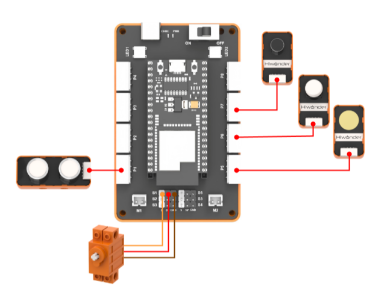

### 2.4.3 Programming

#### (1) Add Extension Libraries

Select **Sensor** in the **Choose an Extension** interface to add **Glowy ultrasonic sensor**, **Touch sensor**, **Sound sensor**, and **Button module**.

#### (2) Complete Program

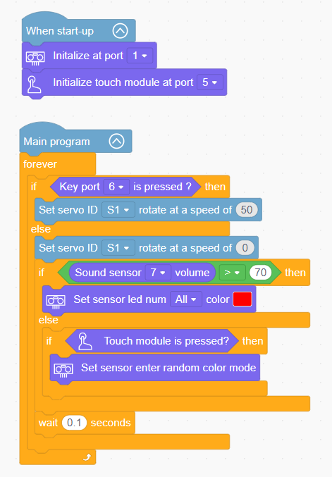

### 2.4.4 Downloading the Program

1. Click **Connect** and select the corresponding port.

2. Click the **Download** button in the upper-right corner to download the program to the controller.

### 2.4.5 Program Outcome

Once the program starts running, initialize the glowy ultrasonic sensor port and touch sensor port. Then, execute the loop: when detecting that the button module at port 6 is pressed, the 360° block servo at port S1 rotates at a speed of 50 and stops when released. Detect the volume of the sound sensor at port 7: when the volume is greater than 70, all RGB lights of the glowy ultrasonic sensor light up red. When the volume is less than or equal to 70, pressing the touch sensor switches the RGB lights of the glowy ultrasonic sensor to dazzling color mode, with a 0.1-second interval for each loop.

