# 6. Ultimate Kit Creative Builds

## 6.1 Self-Balancing Scale

### 6.1.1 Project Overview

This is a self-balancing scale with automatic leveling. After an item is placed on the tray, the counterweight adjusts its position automatically to keep the scale beam level at all times, like a precise balancing master holding each load steady.

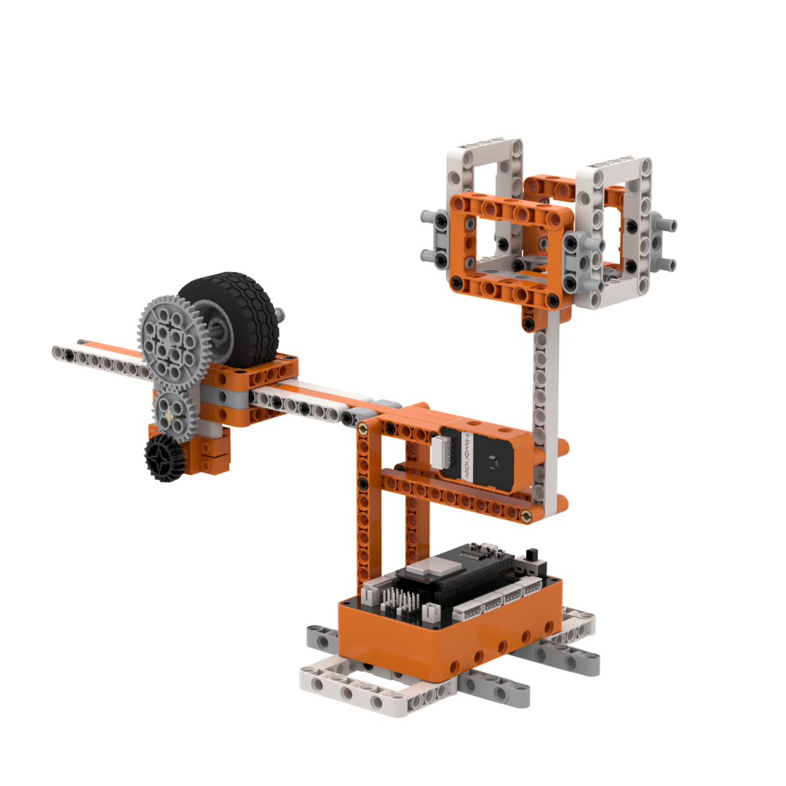

### 6.1.2 Learning Objectives

1. Practice the basic functions of the motor and IMU sensor in this project, and understand the linked logic of angle detection and balance adjustment.
2. Master the mechanical assembly of the self-balancing scale.
3. Learn how to write a program for IMU angle detection + motor balance adjustment, and understand the principle of closed-loop control.
4. Strengthen hands-on skills and the ability to combine programming with physical concepts, and experience the appeal of intelligent balancing.

### 6.1.3 Materials Needed

1. **Materials**: controller, motor, IMU sensor, module cable, and building block parts.

2. **Module Overview**:

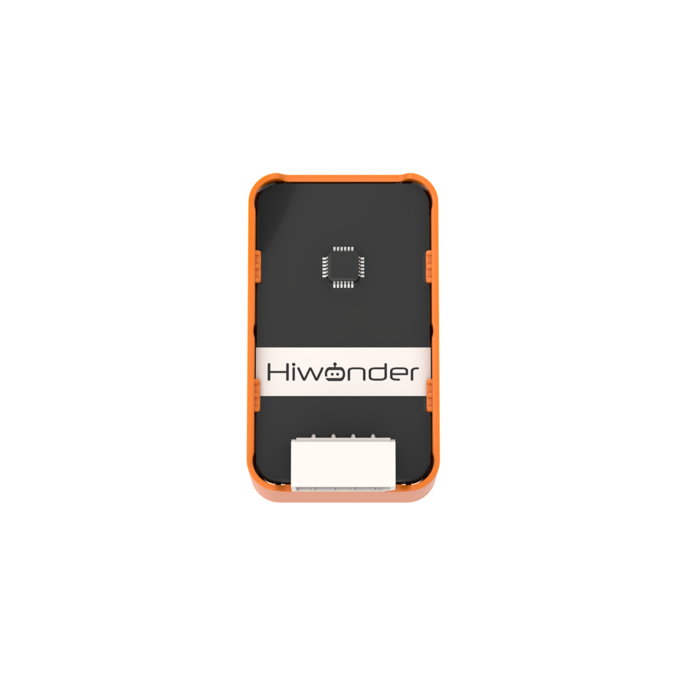

**IMU Sensor**

| Item | Description |
| --- | --- |
| Function | Detects the tilt angle of the scale beam. |
| Application Position | Mounted on the beam of the self-balancing scale. |
| Result | Detects the tilt angle of the beam, determines the balance state, and sends the status to the controller. |

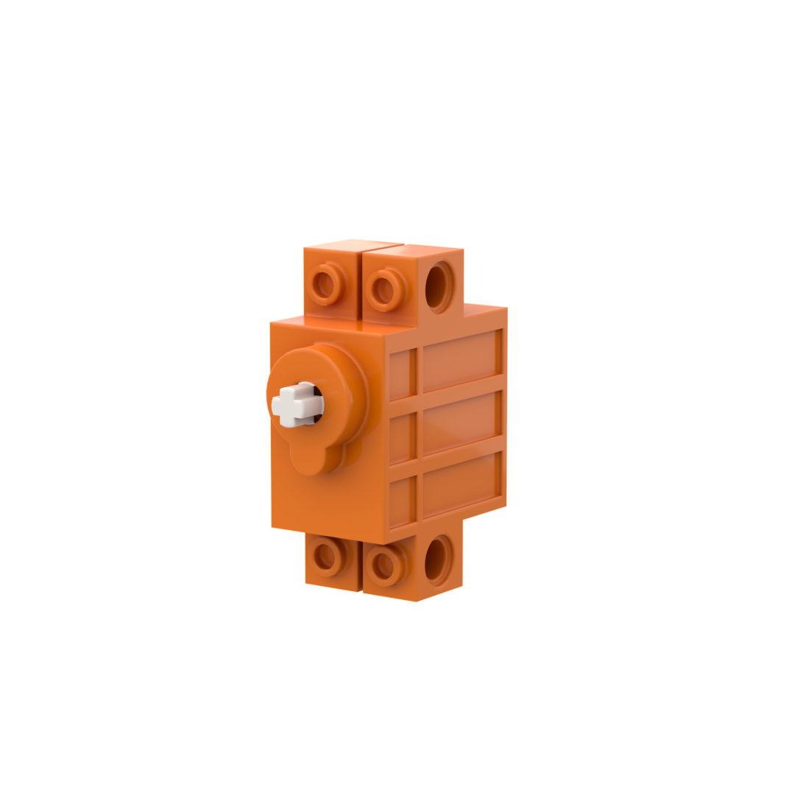

**Motor**

| Item | Description |
| --- | --- |
| Function | Provides the driving force for moving the counterweight. |
| Application Position | Mounted at the counterweight of the self-balancing scale. |
| Result | After receiving the controller command, it moves the counterweight left and right to adjust the beam balance. |

### 6.1.4 Assembly Guide

<iframe
    src="../_static/pdf/25_Self_Balancing_Scale.pdf#view=FitH"
    title="Assembly Guide PDF"
    width="100%"
    height="850"
    style="border: 1px solid #ddd;"
    loading="lazy">
 </iframe>

### 6.1.5 Coding Steps

1. **Open the software**: Start the programming software and create a new project.

2. **Add the extension**

- Click the icon in the lower-left corner of the software to enter the extension interface.

- In the interface **Choose an Extension**, select **Controller**, and add **K12 ESP32**.

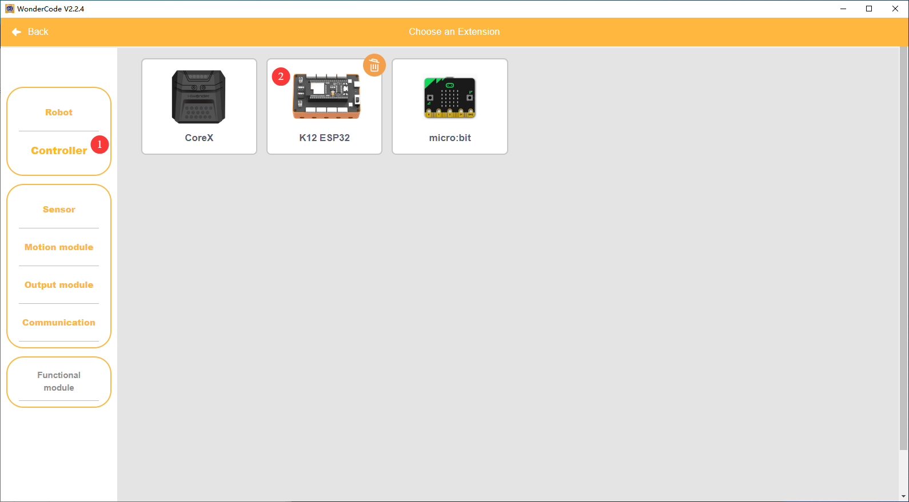

- In the interface **Choose an Extension**, select **Sensor**, and add **IMU sensor**.

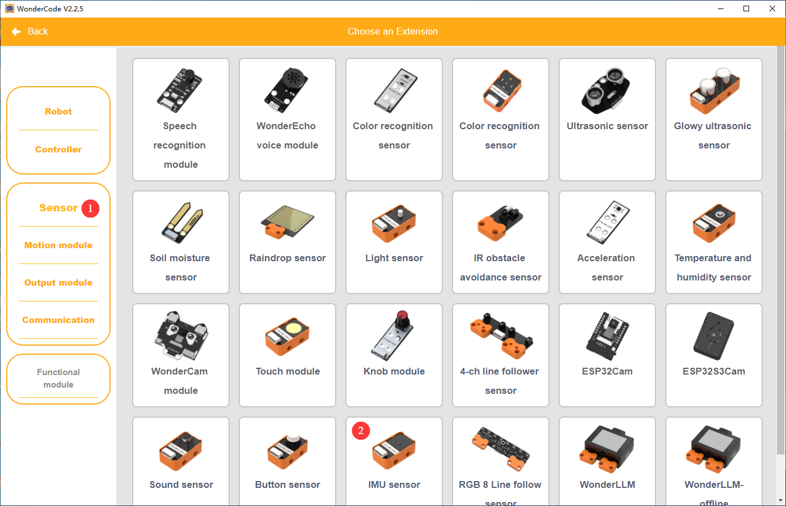

3. **Reference Program**

- At startup, initialize the IMU sensor on I2C port 2 and wait 2 seconds for sensor calibration to finish.

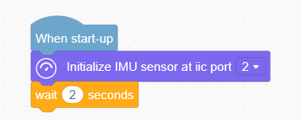

- In the main program, read the angle and control the motor. Use the IMU sensor to read the X-axis angle of the scale beam in real time, which represents the beam's tilt state, and store it in `current_angle`. When the beam tilts to the left and `current_angle` is greater than 30°, run motor S1 at speed 40 for 0.1 seconds to move the counterweight to the right, then stop for 0.2 seconds to allow the beam to respond.

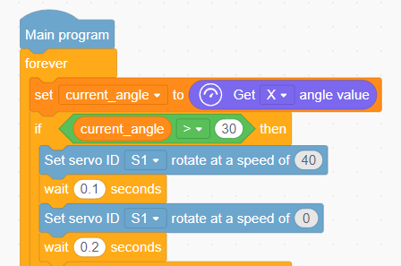

- When the beam tilts to the right and `current_angle` is less than -120°, run motor S1 at speed 40 for 0.1 seconds to move the counterweight to the left, then stop for 0.2 seconds to wait for the beam to level out. When the beam is already balanced, and `current_angle` is between -120° and 30°, keep the motor stopped and continue detection after waiting 0.1 seconds.

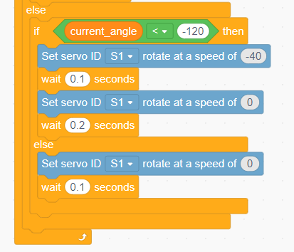

### 6.1.6 Program Download Steps

1. **Connect the device**: Use a data cable to connect the controller to a USB port on the computer.

2. **Select the port**: In the programming software, select the COM port corresponding to the controller. Multiple COM ports may be listed, so make sure the correct one is selected.

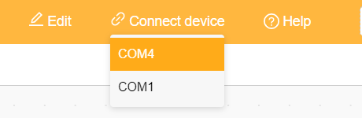

3. **Upload**: Click the icon to upload the completed program to the controller.

4. **Power on**: Turn on the controller, initialize the device, and test the execution of the uploaded code.

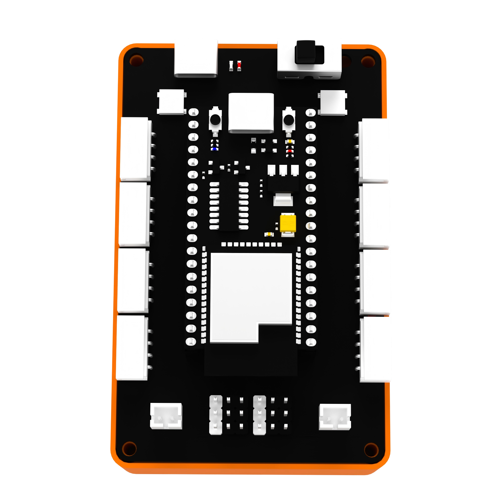

### 6.1.7 Demo

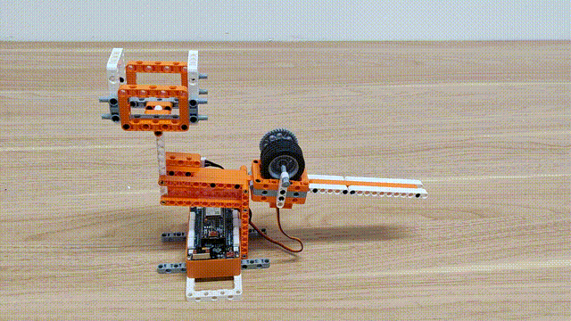

## 6.2 Crazy Bicycle

### 6.2.1 Project Overview

This is a crazy bicycle with flexible obstacle avoidance. Once powered on, it keeps moving forward. When the ultrasonic sensor detects an obstacle within 15 cm, it automatically turns about 35° to the right and continues forward, like an experienced rider skillfully steering around obstacles.

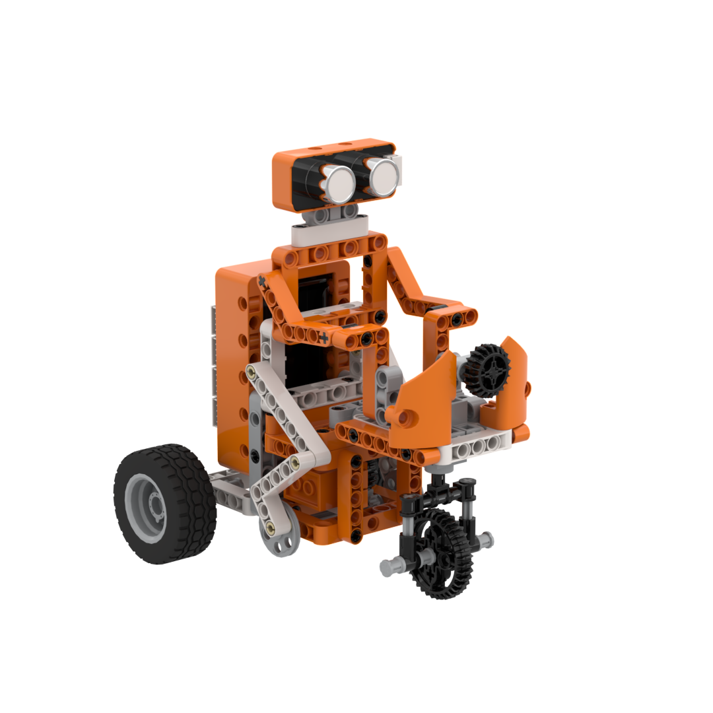

### 6.2.2 Learning Objectives

1. Practice the basic functions of the motor, servo, and ultrasonic sensor in this project, and understand the linked logic of obstacle detection and steering control.
2. Master the mechanical assembly of the crazy bicycle.
3. Learn how to write a program for ultrasonic obstacle avoidance + servo steering + forward movement, and understand how multiple devices work together.
4. Strengthen hands-on skills and intelligent transportation-design awareness, and experience the appeal of obstacle-avoidance driving.

### 6.2.3 Materials Needed

1. **Materials**: controller, motor, servo, ultrasonic sensor, module cable, and building block parts.

2. **Module Overview**:

**Ultrasonic Sensor**

| Item | Description |
| --- | --- |
| Function | Detects the distance to obstacles in front. |
| Application Position | Mounted on the head of the crazy bicycle as its eyes. |
| Result | When an obstacle within 15 cm is detected, it sends an obstacle-avoidance command to the controller. |

**Motor**

| Item | Description |
| --- | --- |
| Function | Provides the driving force for the bicycle to move forward. |
| Application Position | Mounted on the rear wheel of the crazy bicycle. |
| Result | After receiving the controller command, it drives the bicycle forward. |

**Servo**

| Item | Description |
| --- | --- |
| Function | Provides the driving force for steering around obstacles. |
| Application Position | Mounted on the front wheel of the crazy bicycle. |
| Result | After receiving the controller command, it steers the front wheel to avoid obstacles. |

### 6.2.4 Assembly Guide

<iframe
    src="../_static/pdf/26_Crazy_Bicycle.pdf#view=FitH"
    title="Assembly Guide PDF"
    width="100%"
    height="850"
    style="border: 1px solid #ddd;"
    loading="lazy">
 </iframe>

### 6.2.5 Coding Steps

1. **Open the software**: Start the programming software and create a new project.

2. **Add the extension**

- Click the icon in the lower-left corner of the software to enter the extension interface.

- In the interface **Choose an Extension**, select **Controller**, and add **K12 ESP32**.

- In the interface **Choose an Extension**, select **Sensor**, and add **Glowy ultrasonic sensor**.

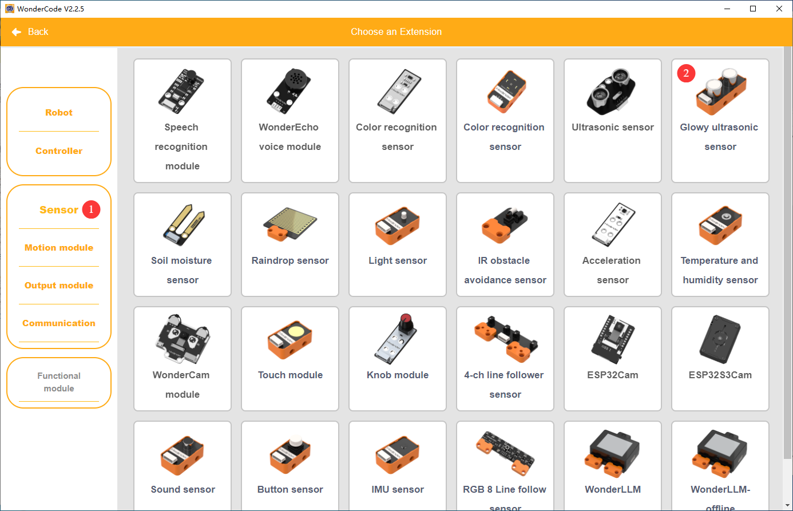

3. **Reference Program**

- At startup, initialize the ultrasonic sensor on P1 and set the 270° servo S1 to 140°. At this point, the front wheel is in its initial forward-driving position.

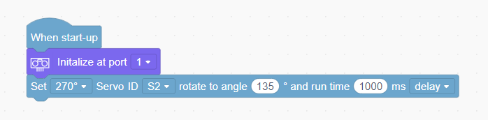

- In the main program, detect distance and control the motor and servo. Use the glowy ultrasonic sensor to detect obstacle distance in real time. When the distance is less than 15 cm, turn servo S1 to 100° to steer the front wheel. When the obstacle is removed, reset servo S1 to 135° to straighten the wheel and continue moving forward. Refresh the detection and control state every 0.5 seconds to keep the response timely.

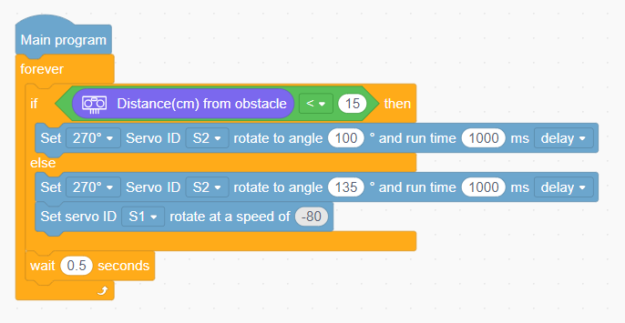

### 6.2.6 Program Download Steps

1. **Connect the device**: Use a data cable to connect the controller to a USB port on the computer.

2. **Select the port**: In the programming software, select the COM port corresponding to the controller. Multiple COM ports may be listed, so make sure the correct one is selected.

3. **Upload**: Click the icon to upload the completed program to the controller.

4. **Power on**: Turn on the controller, initialize the device, and test the execution of the uploaded code.

### 6.2.7 Demo

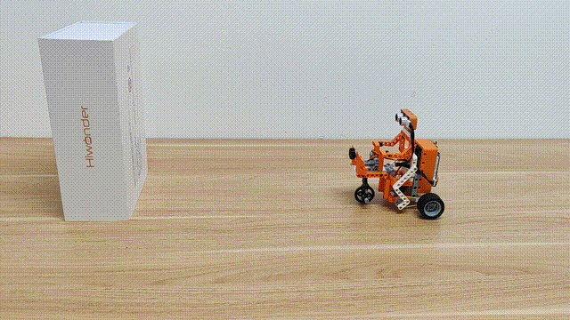

## 6.3 Vintage Carriage

### 6.3.1 Project Overview

This is a vintage carriage with button-controlled start and stop. Press the button once to make the carriage move forward, and press it again to stop, like a storybook messenger carriage traveling gently through time.

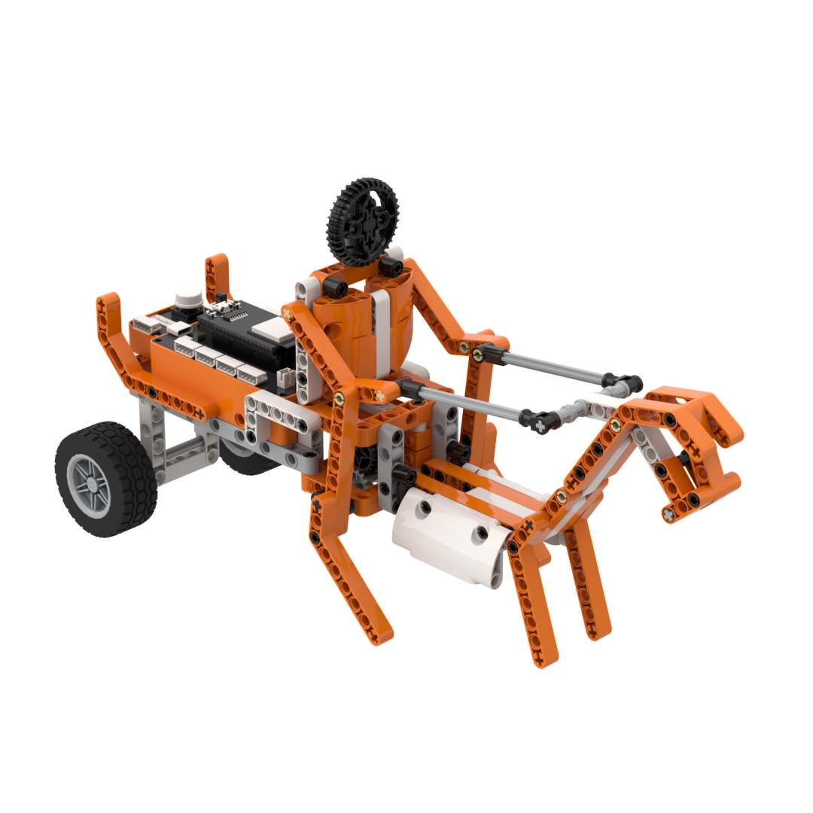

### 6.3.2 Learning Objectives

1. Practice the basic functions of the motor and button in this project, and understand the logic of button-triggered start and stop control.
2. Master the mechanical assembly of the vintage carriage.
3. Learn how to write a program for button trigger + carriage start/stop, and understand the principle of state switching.
4. Strengthen hands-on skills and creative expression, and experience the technology-inspired redesign of vintage transportation.

### 6.3.3 Materials Needed

1. **Materials**: controller, motor, button sensor, module cable, and building block parts.

2. **Module Overview**:

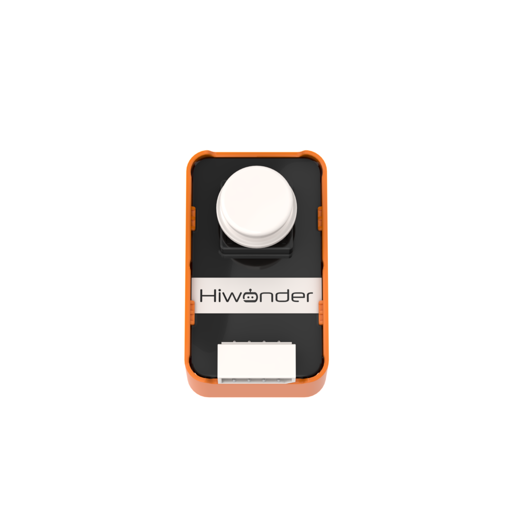

**Button Sensor**

| Item | Description |
| --- | --- |
| Function | Detects button presses and starts or stops the carriage. |
| Application Position | Mounted on the carriage body of the vintage carriage. |
| Result | Each detected press sends a state-switching command to the controller. |

**Motor**

| Item | Description |
| --- | --- |
| Function | Provides the driving force for forward movement. |
| Application Position | Mounted at the rear legs of the horse on the vintage carriage. |
| Result | After receiving the controller command, it starts and stops the carriage. While moving, the linkage also swings the horse's head back and forth to simulate carriage driving. |

### 6.3.4 Assembly Guide

<iframe
    src="../_static/pdf/27_Vintage_Carriage.pdf#view=FitH"
    title="Assembly Guide PDF"
    width="100%"
    height="850"
    style="border: 1px solid #ddd;"
    loading="lazy">
 </iframe>

### 6.3.5 Coding Steps

1. **Open the software**: Start the programming software and create a new project.

2. **Add the extension**

- Click the icon in the lower-left corner of the software to enter the extension interface.

- In the interface **Choose an Extension**, select **Controller**, and add **K12 ESP32**.

- In the interface **Choose an Extension**, select **Sensor**, and add **Button sensor**.

3. **Reference Program**

- At startup, define the variable `run_states` and initialize it to -1. A value of -1 means not moving forward, and a value of 1 means moving forward.

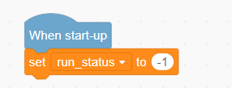

- In the main program, detect the button and control the motor. When the button on P5 is pressed, set `run_states` to `0 - running_states` to invert the state, then wait 0.5 seconds for debouncing. If `run_states` is 1, run motor S1 at speed 80 to move the carriage forward. Otherwise, stop the carriage.

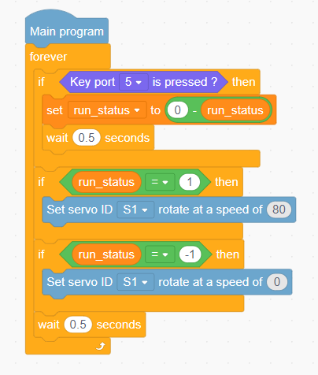

### 6.3.6 Program Download Steps

1. **Connect the device**: Use a data cable to connect the controller to a USB port on the computer.

2. **Select the port**: In the programming software, select the COM port corresponding to the controller. Multiple COM ports may be listed, so make sure the correct one is selected.

3. **Upload**: Click the icon to upload the completed program to the controller.

4. **Power on**: Turn on the controller, initialize the device, and test the execution of the uploaded code.

### 6.3.7 Demo

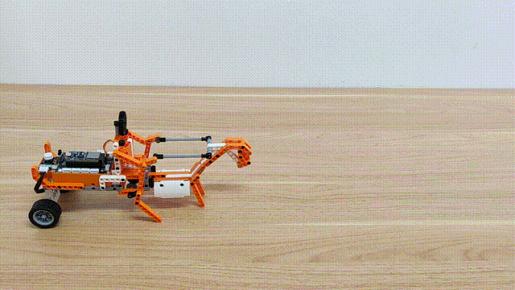

## 6.4 Smart Locomotive

### 6.4.1 Project Overview

This is a smart locomotive with obstacle-aware control. After a touch input is detected, it starts moving forward. When the infrared sensor detects an obstacle ahead, it stops immediately, and after the obstacle is removed, it continues moving, like an obedient steel train traveling safely and intelligently on the track.

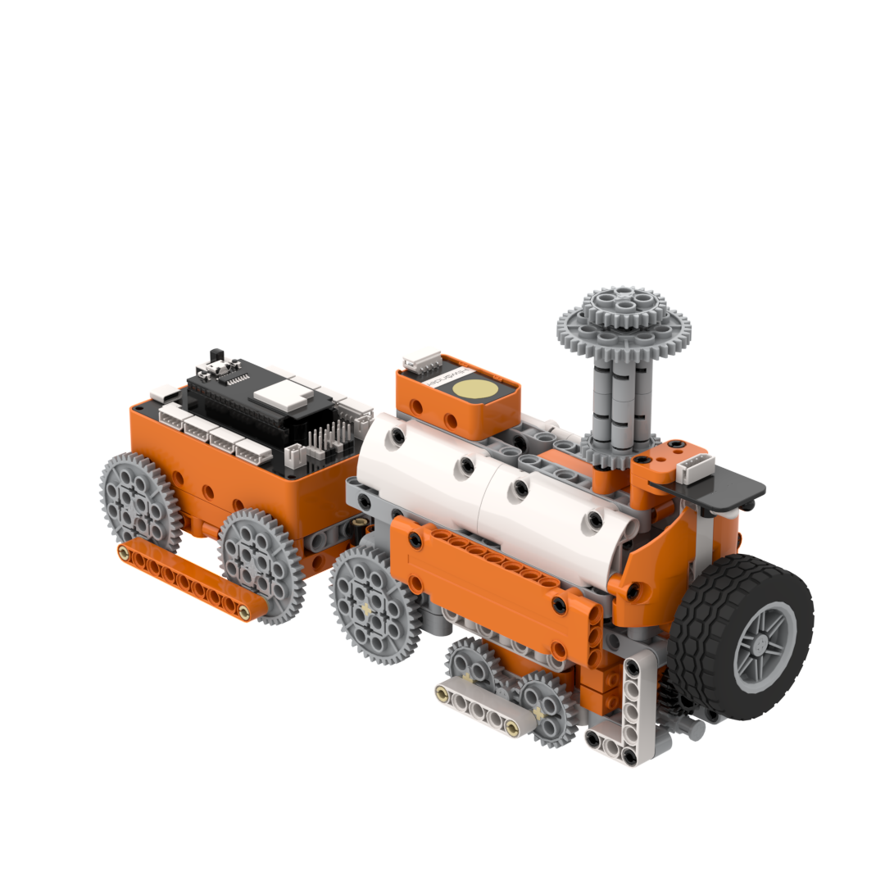

### 6.4.2 Learning Objectives

1. Practice the basic functions and linked logic of the touch sensor, infrared sensor, and motor module in this project.
2. Master the mechanical assembly of the smart locomotive.
3. Learn how to write a program for touch start + infrared obstacle avoidance, and understand how multiple sensors work together.
4. Strengthen hands-on skills and intelligent transportation-design awareness, and experience the technology-inspired redesign of rail transport.

### 6.4.3 Materials Needed

1. **Materials**: controller, motor, touch sensor, infrared obstacle avoidance sensor, module cable, and building block parts.

2. **Module Overview**:

**Touch Sensor**

| Item | Description |
| --- | --- |
| Function | Detects touch input and starts the train. |
| Application Position | Mounted on the front of the smart locomotive. |
| Result | When a touch signal is detected, it sends a forward-movement command to the controller. |

**Infrared Obstacle Avoidance Sensor**

| Item | Description |
| --- | --- |
| Function | Detects obstacles in front. |
| Application Position | Mounted directly at the front of the smart locomotive. |
| Result | When an obstacle is detected ahead, it sends a stop command to the controller. |

**Motor**

| Item | Description |
| --- | --- |
| Function | Provides the driving force for the train to move forward. |
| Application Position | Mounted between the bottom wheels of the smart locomotive. |
| Result | After receiving the controller command, it starts and stops the train. |

### 6.4.4 Assembly Guide

<iframe
    src="../_static/pdf/28_Smart_Locomotive.pdf#view=FitH"
    title="Assembly Guide PDF"
    width="100%"
    height="850"
    style="border: 1px solid #ddd;"
    loading="lazy">
 </iframe>

### 6.4.5 Coding Steps

1. **Open the software**: Start the programming software and create a new project.

2. **Add the extension**

- Click the icon in the lower-left corner of the software to enter the extension interface.

- In the interface **Choose an Extension**, select **Controller**, and add **K12 ESP32**.

- In the interface **Choose an Extension**, select **Sensor**, and add **Touch sensor** and **IR obstacle avoidance sensor**.

3. **Reference Program**

- At startup, initialize the touch sensor on P6, define the variable `run_stateus, and initialize it to -1. A value of -1 means not moving forward, and a value of 1 means moving forward.

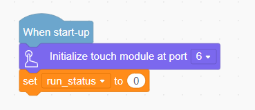

- In the main program, detect touch input, detect infrared input, and control the motor. When the touch sensor is pressed, set `run_status` to 1. When `run_status` is 1, run motor S1 at speed 60 to drive the train forward until the infrared sensor on P5 detects an obstacle, at which point the train stops. After the obstacle is removed, the train continues forward.

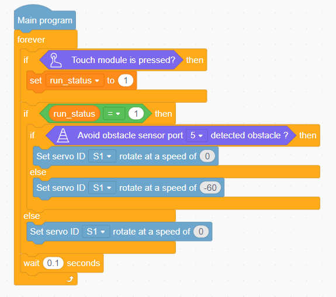

### 6.4.6 Program Download Steps

1. **Connect the device**: Use a data cable to connect the controller to a USB port on the computer.

2. **Select the port**: In the programming software, select the COM port corresponding to the controller. Multiple COM ports may be listed, so make sure the correct one is selected.

3. **Upload**: Click the icon to upload the completed program to the controller.

4. **Power on**: Turn on the controller, initialize the device, and test the execution of the uploaded code.

### 6.4.7 Demo

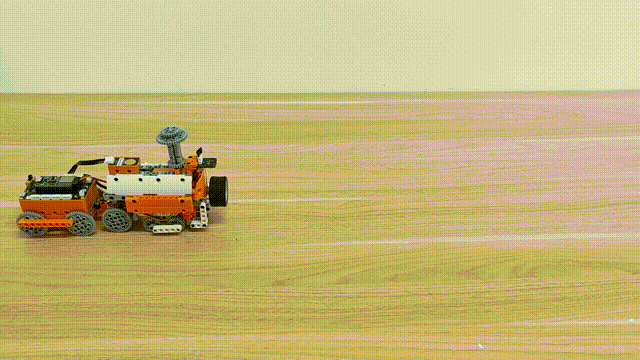

## 6.5 Little Weightlifting Hero

### 6.5.1 Project Overview

This is a little weightlifting hero with expression-based animation. After the button is pressed, the figure keeps lifting the dumbbell while the dot matrix display shows matching expressions. A strained face appears while lifting, and a happy face appears while lowering, creating the feel of an energetic little fitness hero.

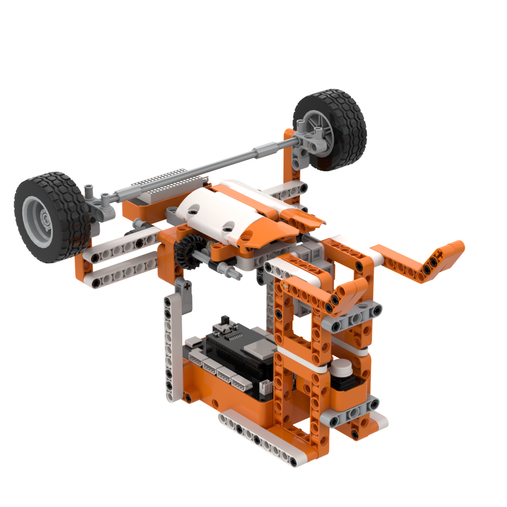

### 6.5.2 Learning Objectives

1. Practice the basic functions of the servo and dot matrix display in this project, and understand the linked logic of lifting motion and facial-expression display.
2. Master the mechanical assembly of the little weightlifting hero.
3. Learn how to write a program for button start + servo lifting + dot matrix expression, and understand how multiple devices work together.
4. Strengthen hands-on skills and creative expression, and experience the fun of interactive programming.

### 6.5.3 Materials Needed

1. **Materials**: controller, servo, button sensor, dot matrix module, module cable, and building block parts.

2. **Module Overview**:

**Button Sensor**

| Item | Description |
| --- | --- |
| Function | Detects button presses and triggers the weightlifting action. |
| Application Position | Mounted on the support of the little weightlifting hero. |
| Result | When a button press is detected, it sends a start-lifting command to the controller. |

**Dot Matrix Module**

| Item | Description |
| --- | --- |
| Function | Displays expression patterns. |
| Application Position | Mounted on the head of the little weightlifting hero. |
| Result | After receiving the controller command, it displays a strained expression while lifting and a happy expression while lowering. |

**Servo**

| Item | Description |
| --- | --- |
| Function | Provides the driving force for weightlifting motion. |
| Application Position | Mounted on the rotating axle of the little weightlifting hero. |
| Result | After receiving the controller command, it drives the arms up and down repeatedly to simulate weightlifting. |

### 6.5.4 Assembly Guide

<iframe
    src="../_static/pdf/29_Little_Weightlifting_Hero.pdf#view=FitH"
    title="Assembly Guide PDF"
    width="100%"
    height="850"
    style="border: 1px solid #ddd;"
    loading="lazy">
 </iframe>

### 6.5.5 Coding Steps

1. **Open the software**: Start the programming software and create a new project.

2. **Add the extension**

- Click the icon in the lower-left corner of the software to enter the extension interface.

- In the interface **Choose an Extension**, select **Controller**, and add **K12 ESP32**.

- In the interface **Choose an Extension**, select **Sensor**, and add **Button sensor**.

- In the interface **Choose an Extension**, select **Output module**, and add **Dot matrix module**.

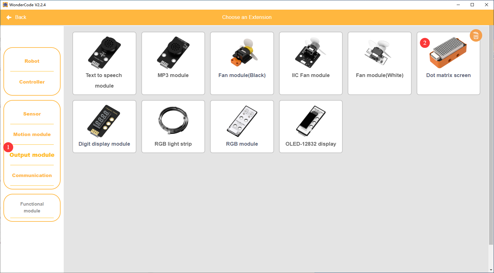

3. **Reference Program**

- At startup, initialize the dot matrix module on P6, set 270° servo S1 to 270°, and define the variable `fitness_status`, initializing it to -1. A value of -1 means not lifting, and a value of 1 means lifting. At this point, the arms are in the horizontal resting position.

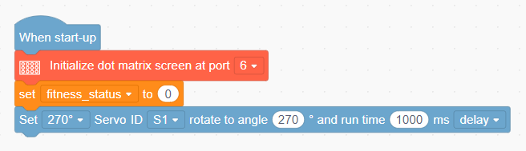

- In the main program, detect the button, control the servo, and update the dot matrix display. When the button on P5 is pressed, servo S1 first turns to 0° to lift the dumbbell upward, then after 1 second turns to 270° to lower it again. While lifting upward, the dot matrix displays >_<. While lowering, it displays ^v^. Refresh the detection state every 0.1 seconds.

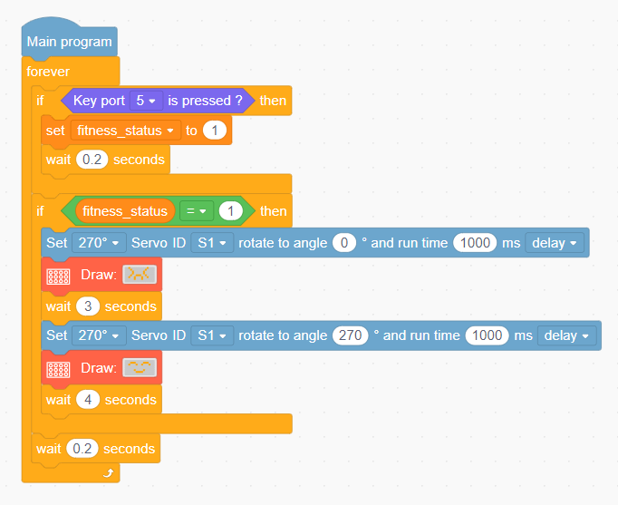

### 6.5.6 Program Download Steps

1. **Connect the device**: Use a data cable to connect the controller to a USB port on the computer.

2. **Select the port**: In the programming software, select the COM port corresponding to the controller. Multiple COM ports may be listed, so make sure the correct one is selected.

3. **Upload**: Click the icon to upload the completed program to the controller.

4. **Power on**: Turn on the controller, initialize the device, and test the execution of the uploaded code.

### 6.5.7 Demo

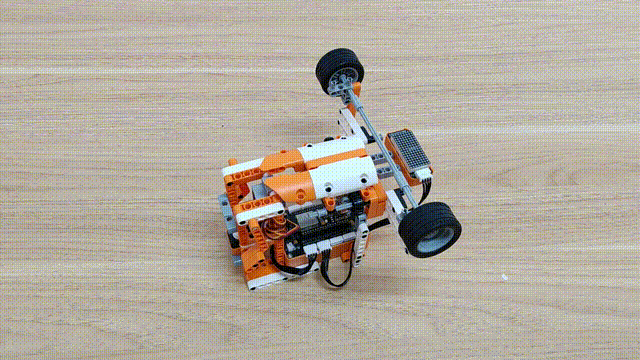

## 6.6 Spiral Helicopter

### 6.6.1 Project Overview

This is a spiral helicopter with automatic speed adjustment. The ultrasonic sensor points downward to detect ground height. The higher the altitude, the faster the propeller spins, like a skilled pilot adjusting power precisely according to height for stable flight.

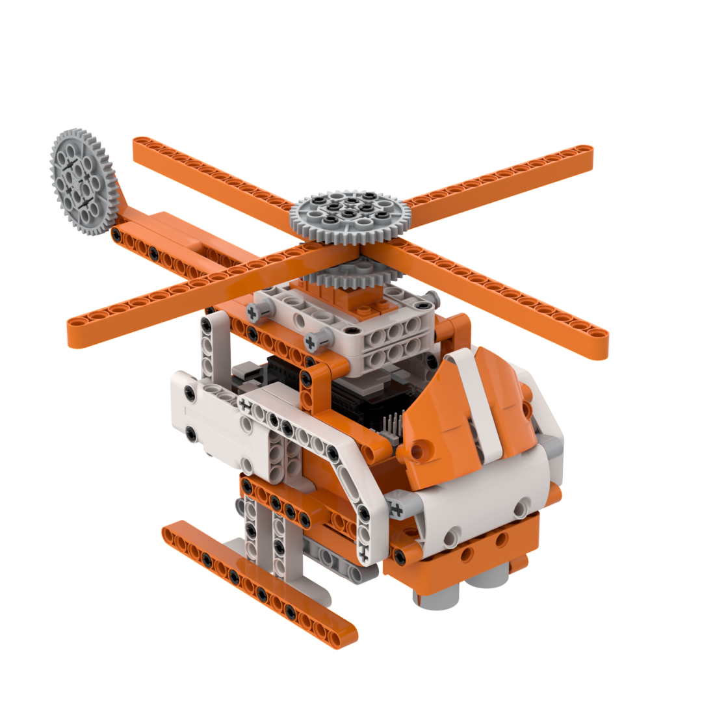

### 6.6.2 Learning Objectives

1. Practice the basic functions of the ultrasonic sensor and motor module in this project, and understand the linked logic between height and rotation speed.
2. Master the mechanical assembly of the spiral helicopter.
3. Learn how to write a program for height detection + speed adjustment, and understand the principle of feedback control.
4. Strengthen hands-on skills and flight-control awareness, and experience the appeal of aerospace programming.

### 6.6.3 Materials Needed

1. **Materials**: controller, motor, ultrasonic sensor, module cable, and building block parts.

2. **Module Overview**:

**Ultrasonic Sensor**

| Item | Description |
| --- | --- |
| Function | Detects the distance between the helicopter and the ground. |
| Application Position | Mounted on the underside of the spiral helicopter. |
| Result | Measures the real-time distance to the ground and sends speed-adjustment commands to the controller. |

**Motor**

| Item | Description |
| --- | --- |
| Function | Provides the driving force for propeller rotation. |
| Application Position | Mounted beneath the propeller of the spiral helicopter. |
| Result | After receiving the controller command, it adjusts propeller speed according to height. The higher the altitude, the faster the propeller rotates. |

### 6.6.4 Assembly Guide

<iframe
    src="../_static/pdf/30_Spiral_Helicopter.pdf#view=FitH"
    title="Assembly Guide PDF"
    width="100%"
    height="850"
    style="border: 1px solid #ddd;"
    loading="lazy">
 </iframe>

### 6.6.5 Coding Steps

1. **Open the software**: Start the programming software and create a new project.

2. **Add the extension**

- Click the icon in the lower-left corner of the software to enter the extension interface.

- In the interface **Choose an Extension**, select **Controller**, and add **K12 ESP32**.

- In the interface **Choose an Extension**, select **Sensor**, and add **Glowy ultrasonic sensor**.

3. **Reference Program**

- At startup, initialize the glowy ultrasonic sensor on P1, define the variable `min_height` to simulate the lowest safe height of 5 cm, and define the variable `max_height` to simulate the highest safe height of 50 cm.

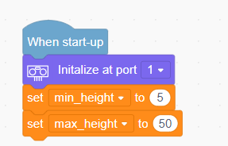

- In the main program, detect distance and control the motor. Use the ultrasonic sensor to measure the distance to the ground in real time and store the result in `current_height`. Compare it with `min_height` and `max_height`. If `current_height` is less than the minimum, update `min_height`. If `current_height` is greater than the maximum, update `max_height`. Finally, map the 5-50 cm height range to a motor speed range of 0-100, and use motor S1 to drive the propeller.

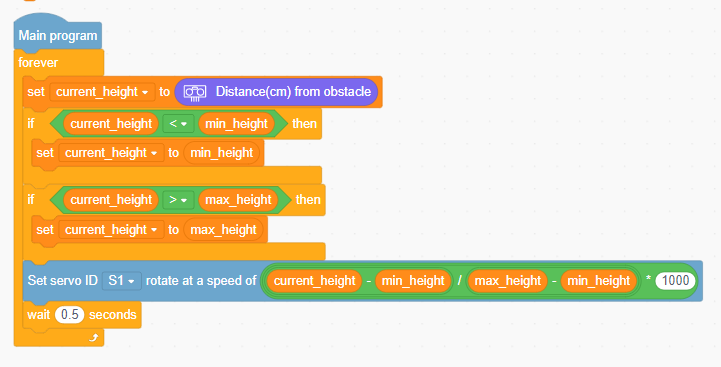

### 6.6.6 Program Download Steps

1. **Connect the device**: Use a data cable to connect the controller to a USB port on the computer.

2. **Select the port**: In the programming software, select the COM port corresponding to the controller. Multiple COM ports may be listed, so make sure the correct one is selected.

3. **Upload**: Click the icon to upload the completed program to the controller.

4. **Power on**: Turn on the controller, initialize the device, and test the execution of the uploaded code.

### 6.6.7 Demo

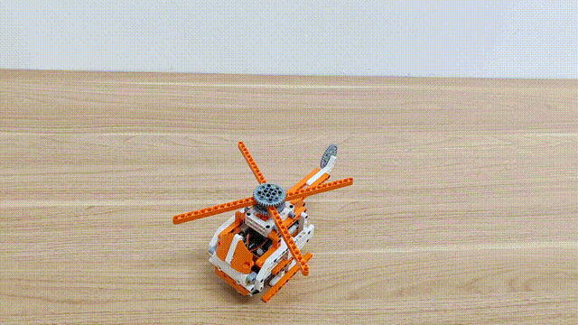

## 6.7 Line-Tracking Car

### 6.7.1 Project Overview

This is a line-tracking car with automatic path following. Once powered on, it automatically drives around the course by following the black track line, like a focused courier accurately completing a delivery route.

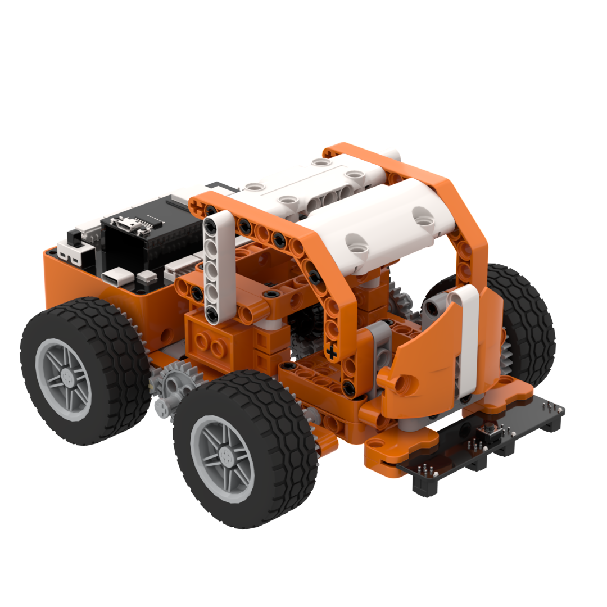

### 6.7.2 Learning Objectives

1. Practice the basic functions of the dual motors and 4-channel line follower sensor in this project, and understand the logic of line detection and vehicle control.
2. Master the mechanical assembly of the line-tracking car.
3. Learn how to write a program for line-tracking driving, and understand the principles of sensor detection and motor speed control.
4. Strengthen hands-on skills and intelligent transportation-design awareness, and experience the appeal of automatic path following.

### 6.7.3 Materials Needed

1. **Materials**: controller, motor, 4-channel line follower sensor, module cable, and building block parts.

2. **Module Overview**:

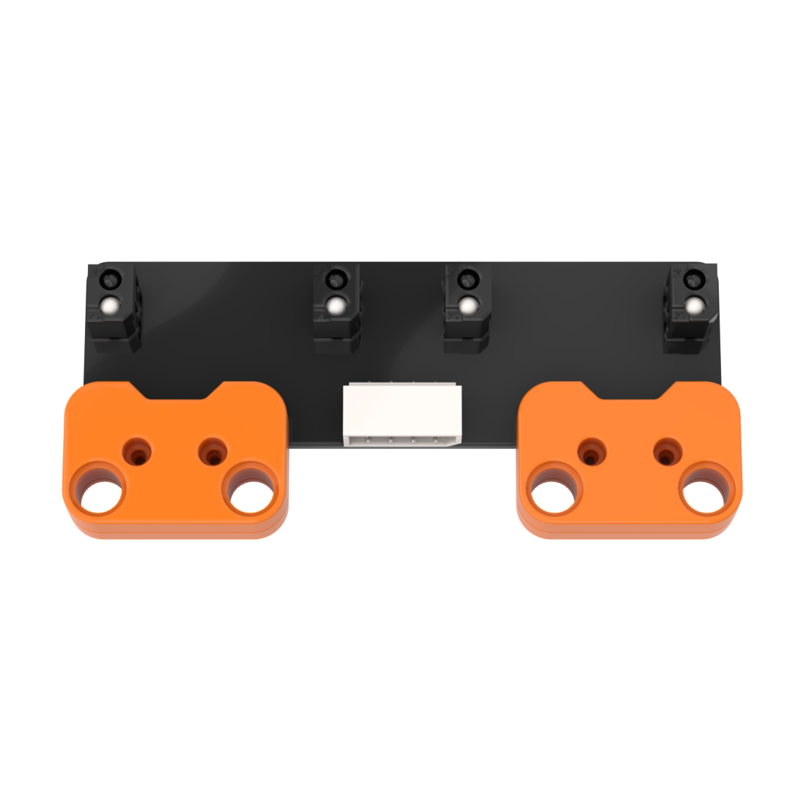

**4-Channel Line Follower Sensor**

| Item | Description |
| --- | --- |
| Function | Detects the line-tracking signal on the ground. |
| Application Position | Mounted on the underside of the line-tracking car. |
| Result | Recognizes the black track line and outputs line-status signals to the controller. |

**Motor**

| Item | Description |
| --- | --- |
| Function | Provides the driving force for movement. |
| Application Position | Mounted on the wheels of the line-tracking car. |
| Result | After receiving signals from the controller, it adjusts the left and right wheel speeds according to the line-tracking state to keep the car on the path. |

### 6.7.4 Assembly Guide

<iframe
    src="../_static/pdf/31_Line_Tracking_Car.pdf#view=FitH"
    title="Assembly Guide PDF"
    width="100%"
    height="850"
    style="border: 1px solid #ddd;"
    loading="lazy">
 </iframe>

### 6.7.5 Coding Steps

1. **Open the software**: Start the programming software and create a new project.

2. **Add the extension**

- Click the icon in the lower-left corner of the software to enter the extension interface.

- In the interface **Choose an Extension**, select **Controller**, and add **K12 ESP32**.

- In the interface **Choose an Extension**, select **Sensor**, and add **4-ch line follower sensor**.

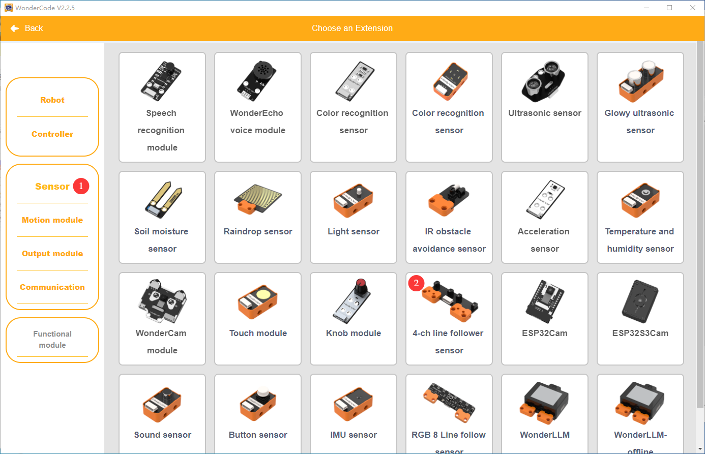

3. **Reference Program**

- At startup, initialize the 4-channel line follower sensor on P1.

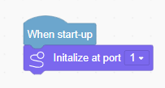

- In the main program, use the different channels detected by the 4-channel line follower sensor, that is, the detected black line position, to control motors S1 and S2 with different speed combinations. This allows the car to adjust left, right, or straight movement and keep the line-following car moving along the line. Refresh the control command every 0.1 seconds.

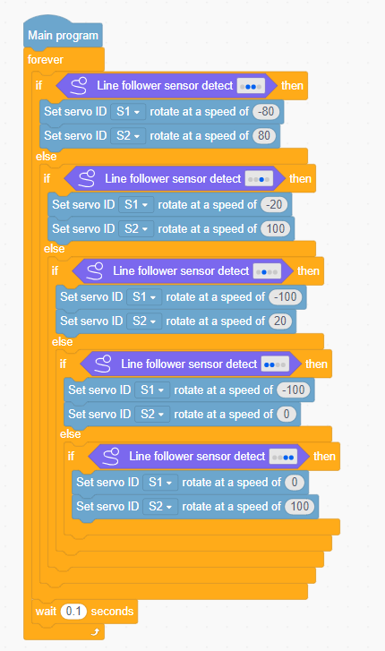

### 6.7.6 Program Download Steps

1. **Connect the device**: Use a data cable to connect the controller to a USB port on the computer.

2. **Select the port**: In the programming software, select the COM port corresponding to the controller. Multiple COM ports may be listed, so make sure the correct one is selected.

3. **Upload**: Click the icon to upload the completed program to the controller.

4. **Power on**: Turn on the controller, initialize the device, and test the execution of the uploaded code.

### 6.7.7 Demo

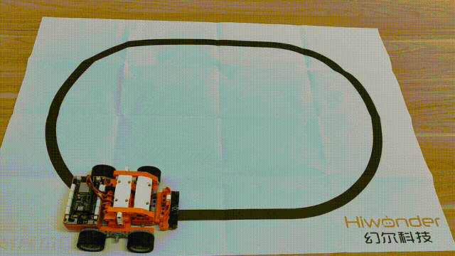

## 6.8 Patrol Sailboat

### 6.8.1 Project Overview

This is a patrol sailboat that responds to sail status. Once powered on, it keeps moving forward. When the infrared sensor detects that the sail has been retracted, the boat slows and stops, like a cautious captain avoiding danger and sailing safely.

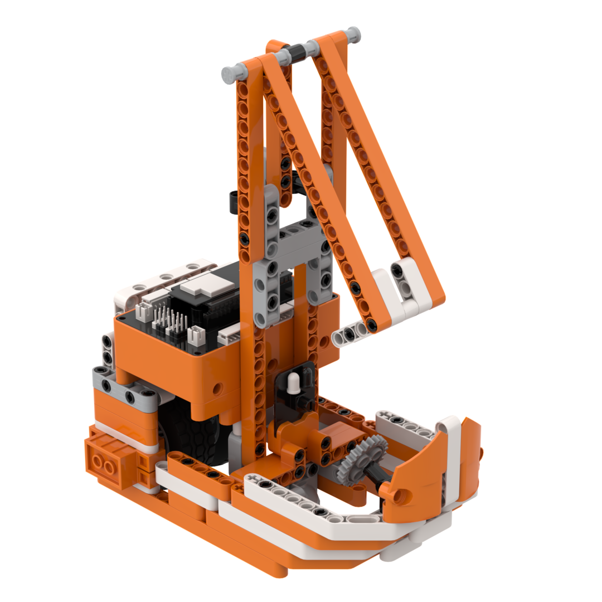

### 6.8.2 Learning Objectives

1. Practice the basic functions of the dual motors and infrared sensor in this project, and understand the linked logic of state detection and slow-stop control.
2. Master the mechanical assembly and circuit connections of the patrol sailboat.
3. Learn how to write a program for infrared detection -> slow stop, and understand the principle of safety control.
4. Strengthen hands-on skills and navigation-simulation ability, and experience the appeal of intelligent sailing.

### 6.8.3 Materials Needed

1. **Materials**: controller, motor, infrared obstacle avoidance sensor, module cable, and building block parts.

2. **Module Overview**:

**Infrared Obstacle Avoidance Sensor**

| Item | Description |
| --- | --- |
| Function | Detects the sail status. |
| Application Position | Mounted beneath the sail of the patrol sailboat. |
| Result | When the sail-retracted signal is detected, it sends a slow-stop command to the controller. |

**Motor**

| Item | Description |
| --- | --- |
| Function | Provides the driving force for forward movement. |
| Application Position | Mounted at the wheels of the patrol sailboat. |
| Result | After receiving the controller command, it controls the sailboat to move forward and stop gradually. |

### 6.8.4 Assembly Guide

<iframe
    src="../_static/pdf/32_Patrol_Sailboat.pdf#view=FitH"
    title="Assembly Guide PDF"
    width="100%"
    height="850"
    style="border: 1px solid #ddd;"
    loading="lazy">
 </iframe>

### 6.8.5 Coding Steps

1. **Open the software**: Start the programming software and create a new project.

2. **Add the extension**

- Click the icon in the lower-left corner of the software to enter the extension interface.

- In the interface **Choose an Extension**, select **Controller**, and add **K12 ESP32**.

- In the interface **Choose an Extension**, select **Sensor**, and add **IR obstacle avoidance sensor**.

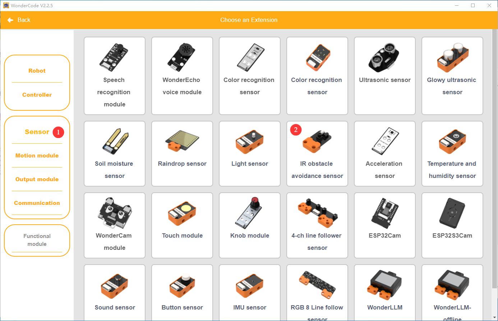

3. **Reference Program**

- In the main program, detect the infrared signal and control the motor. Use the infrared sensor on P6 to detect whether the sail has retracted. If it has not retracted, run motors S1 and S2 forward at speed 50 for 0.8 seconds and then stop, simulating forward motion under inertia before stopping.

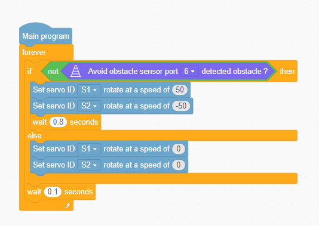

### 6.8.6 Program Download Steps

1. **Connect the device**: Use a data cable to connect the controller to a USB port on the computer.

2. **Select the port**: In the programming software, select the COM port corresponding to the controller. Multiple COM ports may be listed, so make sure the correct one is selected.

3. **Upload**: Click the icon to upload the completed program to the controller.

4. **Power on**: Turn on the controller, initialize the device, and test the execution of the uploaded code.

### 6.8.7 Demo

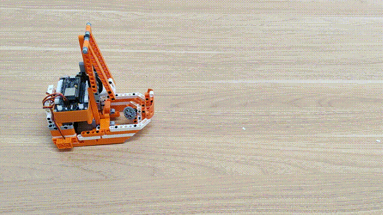

## 6.9 Hexapod Robot

### 6.9.1 Project Overview

This is a hexapod robot with obstacle-aware forward movement. Once powered on, it keeps moving forward. When the ultrasonic sensor detects an obstacle within 12 cm, it stops immediately, like an alert little insect constantly sensing changes in its surroundings.

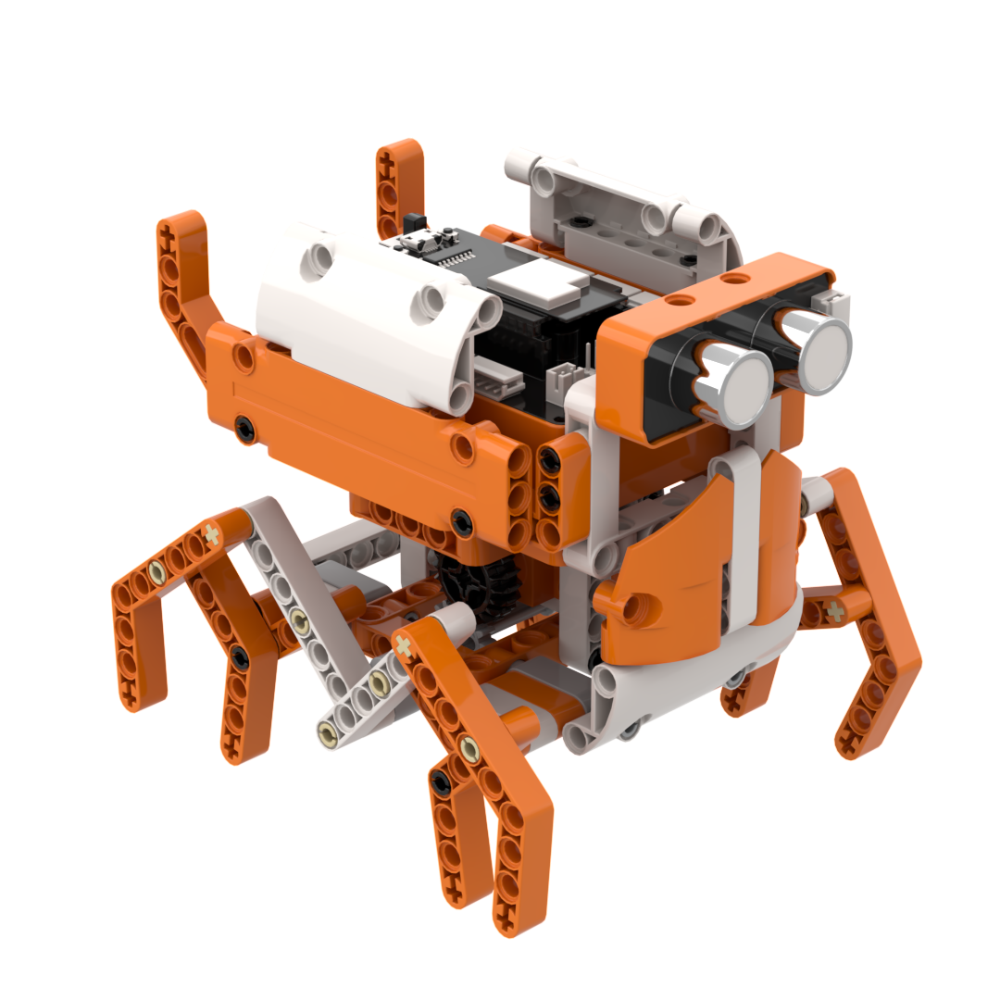

### 6.9.2 Learning Objectives

1. Practice the basic functions of the dual motors and ultrasonic sensor in this project, and understand the logic of obstacle detection and stop control.
2. Master the mechanical assembly of the hexapod robot.
3. Learn how to write a program for ultrasonic detection + forward start/stop, and understand the principle of safety control.
4. Strengthen hands-on skills and understanding of biomimetic structures, and experience the appeal of multi-legged locomotion.

### 6.9.3 Materials Needed

1. **Materials**: controller, motor, ultrasonic sensor, module cable, and building block parts.

2. **Module Overview**:

**Ultrasonic Sensor**

| Item | Description |
| --- | --- |
| Function | Detects the distance to obstacles ahead and triggers the hexapod robot to stop. |
| Application Position | Mounted on the head of the hexapod robot. |
| Result | When an obstacle within 12 cm is detected, it sends a stop command to the controller. |

**Motor**

| Item | Description |
| --- | --- |
| Function | Provides the driving force for forward movement. |
| Application Position | Mounted on the legs of the hexapod robot. |
| Result | After receiving the controller command, it starts and stops the hexapod robot. |

### 6.9.4 Assembly Guide

<iframe
    src="../_static/pdf/33_Hexapod_Robot.pdf#view=FitH"
    title="Assembly Guide PDF"
    width="100%"
    height="850"
    style="border: 1px solid #ddd;"
    loading="lazy">
 </iframe>

### 6.9.5 Coding Steps

1. **Open the software**: Start the programming software and create a new project.

2. **Add the extension**

- Click the icon in the lower-left corner of the software to enter the extension interface.

- In the interface **Choose an Extension**, select **Controller**, and add **K12 ESP32**.

- In the interface **Choose an Extension**, select **Sensor**, and add **Glowy ultrasonic sensor**.

3. **Reference Program**

- At startup, initialize the ultrasonic sensor on P1, define the variable `distance`, and initialize it to 0.

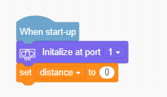

- In the main program, detect the distance and control the motor. Use the ultrasonic sensor to measure obstacle distance in real time and store the result in the `distance`. When the `distance` is less than 12, stop moving forward. Otherwise, keep moving forward.

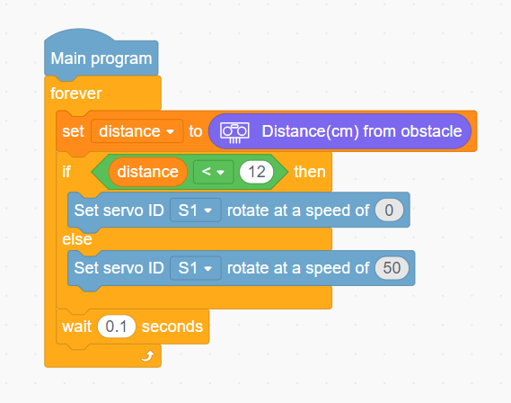

### 6.9.6 Program Download Steps

1. **Connect the device**: Use a data cable to connect the controller to a USB port on the computer.

2. **Select the port**: In the programming software, select the COM port corresponding to the controller. Multiple COM ports may be listed, so make sure the correct one is selected.

3. **Upload**: Click the icon to upload the completed program to the controller.

4. **Power on**: Turn on the controller, initialize the device, and test the execution of the uploaded code.

### 6.9.7 Demo

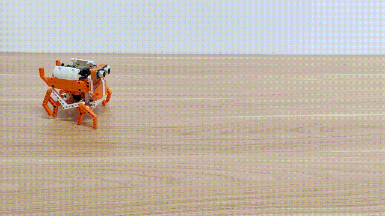

## 6.10 Side-Stepping Crab

### 6.10.1 Project Overview

This is a side-stepping crab with sound-controlled movement. A clap or other sound makes it change direction according to the number of detected sounds, like a little beach warrior responding to commands with precise and playful movement.

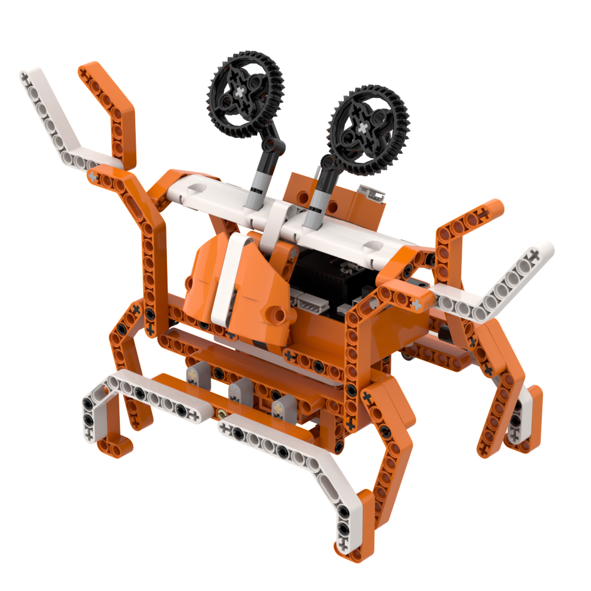

### 6.10.2 Learning Objectives

1. Practice the basic functions of the sound sensor and motor module in this project, and understand the logic of sound-triggered multi-direction movement control.
2. Master the mechanical assembly of the side-stepping crab.
3. Learn how to write a program for sound counting + direction switching, and understand the principles of state switching and motor control.
4. Strengthen hands-on skills and logical thinking, and experience the fun of sound-controlled biomimetic programming.

### 6.10.3 Materials Needed

1. **Materials**: controller, motor, sound sensor, module cable, and building block parts.

2. **Module Overview**:

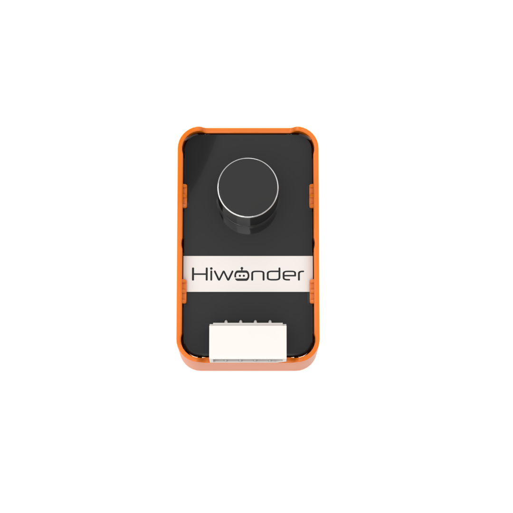

**Sound Sensor**

| Item | Description |
| --- | --- |
| Function | Detects sound signals in the environment and triggers movement-direction switching. |
| Application Position | Mounted on the back shell of the side-stepping crab. |
| Result | Each detected sound increases the count by 1 and sends a direction-switching command to the controller. |

**Motor**

| Item | Description |
| --- | --- |
| Function | Provides the driving force for left-right side-stepping. |
| Application Position | Mounted on the legs of the side-stepping crab. |
| Result | After receiving the controller command, it moves the crab left or right. |

### 6.10.4 Assembly Guide

<iframe
    src="../_static/pdf/34_Side_Stepping_Crab.pdf#view=FitH"
    title="Assembly Guide PDF"
    width="100%"
    height="850"
    style="border: 1px solid #ddd;"
    loading="lazy">
 </iframe>

### 6.10.5 Coding Steps

1. **Open the software**: Start the programming software and create a new project.

2. **Add the extension**

- Click the icon in the lower-left corner of the software to enter the extension interface.

- In the interface **Choose an Extension**, select **Controller**, and add **K12 ESP32**.

- In the interface **Choose an Extension**, select **Sensor**, and add **Sound sensor**.

3. **Reference Program**

- At startup, define the variables `start` and `sound_count`, and initialize both to 0 to prepare the program for operation.

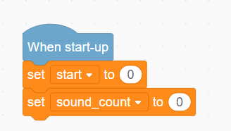

- In the main program, detect sound and switch states. When `sound_count` is 0 and the sound sensor on P5 detects a volume value greater than 40, the program increases `sound_count` by 1, waits 0.3 seconds, and then enters a rapid detection loop for 150 cycles. In that loop, if another sound greater than 40 is detected, `sound_count` is increased again and the loop exits. The program then sets `start` to 1 to trigger the crab's sideways movement.

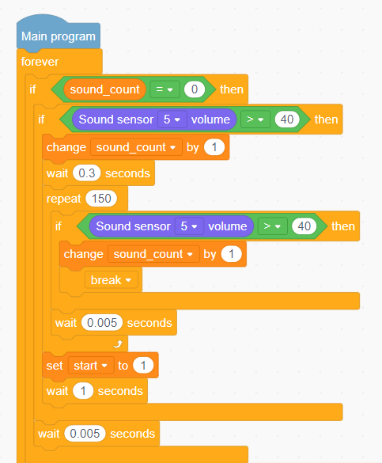

- When `sound_count` is 1 or 2, the program is in the running stage, which means the crab is moving. If a sound greater than 40 is detected again, reset `sound_count` to 0, set `start` to 0, stop the motor, and stop the movement.

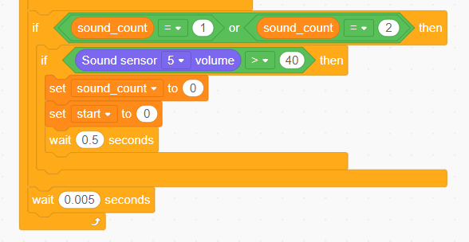

- In the main program, control left and right side-stepping. When `start` is 1, use the value of `sound_count` to control motor S1. If `sound_count` is 1, run motor S1 at speed 50 to move the crab to the left. If `sound_count` is 2, run motor S1 at speed 50 to move the crab to the right. When `start` is 0, stop motor S1. Refresh the control state every 0.1 seconds.

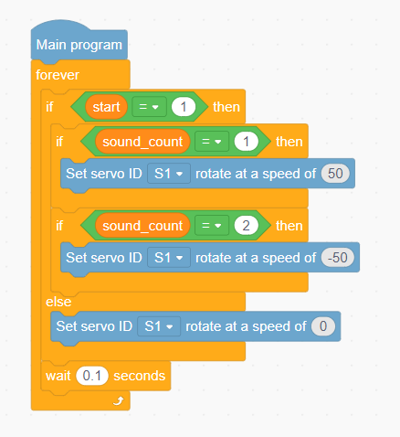

### 6.10.6 Program Download Steps

1. **Connect the device**: Use a data cable to connect the controller to a USB port on the computer.

2. **Select the port**: In the programming software, select the COM port corresponding to the controller. Multiple COM ports may be listed, so make sure the correct one is selected.

3. **Upload**: Click the icon to upload the completed program to the controller.

4. **Power on**: Turn on the controller, initialize the device, and test the execution of the uploaded code.

### 6.10.7 Demo

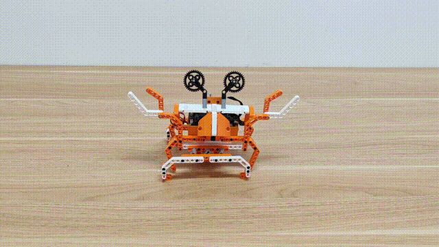

## 6.11 Elevating Robotic Arm

### 6.11.1 Project Overview

This is an elevating robotic arm with automatic grabbing. Once powered on, the robotic-arm vehicle keeps moving forward. When the ultrasonic sensor detects an object within 5 cm, the arm lowers to grab it, then turns right to place it, like a flexible logistics assistant completing transport tasks accurately.

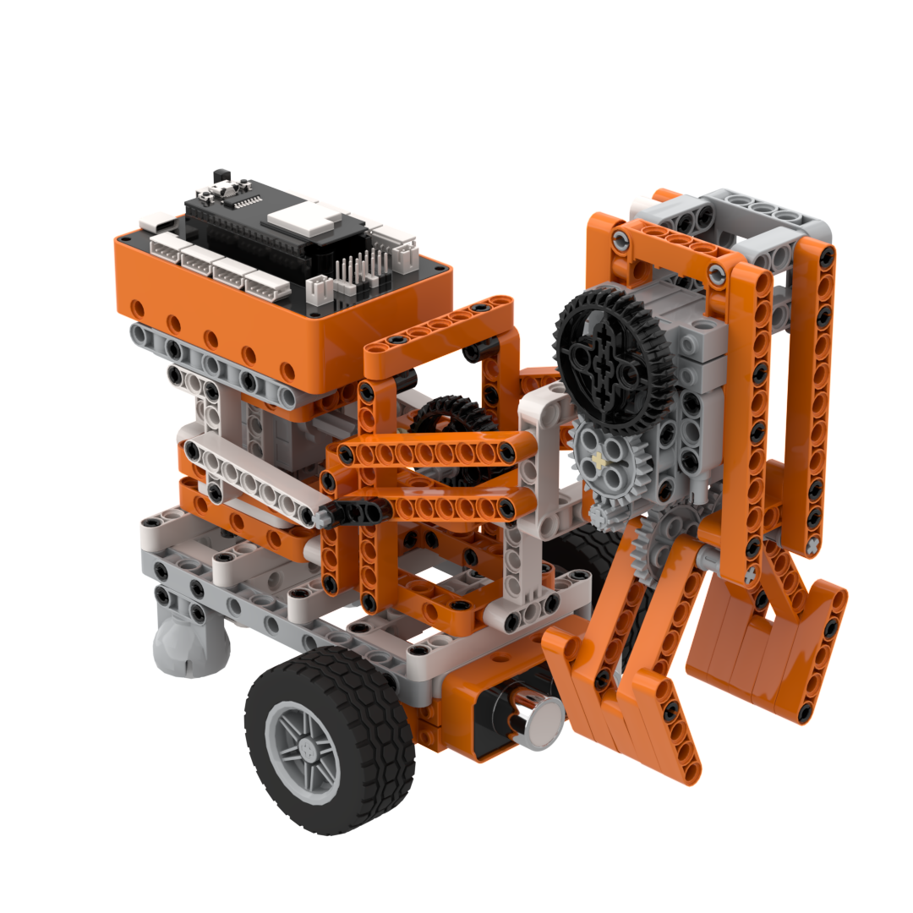

### 6.11.2 Learning Objectives

1. Practice the basic functions of dual servos, dual motors, and the ultrasonic sensor in this project, and understand the linked logic of obstacle detection, grabbing, and placement.
2. Master the mechanical assembly of the elevating robotic arm.
3. Learn how to write a program for ultrasonic obstacle detection + servo grabbing + motor turning and placement, and understand how multiple devices work together.
4. Strengthen hands-on skills and industrial-application awareness, and experience the appeal of intelligent robotic arms.

### 6.11.3 Materials Needed

1. **Materials**: controller, motor, servo, ultrasonic sensor, module cable, and building block parts.

2. **Module Overview**:

**Ultrasonic Sensor**

| Item | Description |
| --- | --- |
| Function | Detects the distance to objects ahead. |
| Application Position | Mounted directly at the front of the elevating robotic arm. |
| Result | When an object within 5 cm is detected, it sends a grab command to the controller. |

**Motor**

| Item | Description |
| --- | --- |
| Function | Provides the driving force for vehicle movement. |
| Application Position | Mounted on the rear wheels of the elevating robotic arm. |
| Result | After receiving the controller command, it moves the vehicle forward, backward, and during turns. |

**Servo**

| Item | Description 1 | Description 2 |
| --- | --- | --- |
| Function | Provides the driving force for the arm to move up and down. | Provides the driving force for gripper opening and closing. |
| Application Position | Mounted on the arm axle of the elevating robotic arm. | Mounted on the gripper axle of the elevating robotic arm. |
| Result | After receiving the controller command, it lifts and lowers the arm. | After receiving the controller command, it opens and closes the gripper to grab and place objects. |

### 6.11.4 Assembly Guide

<iframe
    src="../_static/pdf/35_Elevating_Robotic_Arm.pdf#view=FitH"
    title="Assembly Guide PDF"
    width="100%"
    height="850"
    style="border: 1px solid #ddd;"
    loading="lazy">
 </iframe>

### 6.11.5 Coding Steps

1. **Open the software**: Start the programming software and create a new project.

2. **Add the extension**

- Click the icon in the lower-left corner of the software to enter the extension interface.

- In the interface **Choose an Extension**, select **Controller**, and add **K12 ESP32**.

- In the interface **Choose an Extension**, select **Sensor**, and add **Glowy ultrasonic sensor**.

3. **Reference Program**

- At startup, initialize the ultrasonic sensor on P1. Set the 270° servo S1 to 0°, which keeps the gripper closed, and set the 270° servo S2 to 0°, which keeps the arm raised.

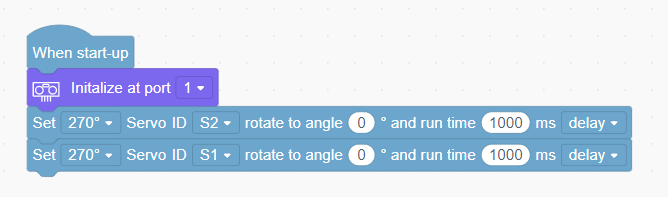

- Create a custom function for grab-and-place actions. When the parameter `grab1_place2` is 1, first turn servo S1 to 270° to open the gripper, then turn servo S2 to 165° to lower the arm, then turn servo S1 to 0° to close the gripper, and finally turn servo S2 back to 0° to raise the arm, completing one grab action. When the parameter `grab1_place2` is 2, first turn servo S2 to 165° to lower the arm, then turn servo S1 to 270° to open the gripper, then turn servo S2 back to 0° to raise the arm, and finally turn servo S1 to 0° to close the gripper, completing one placement action.

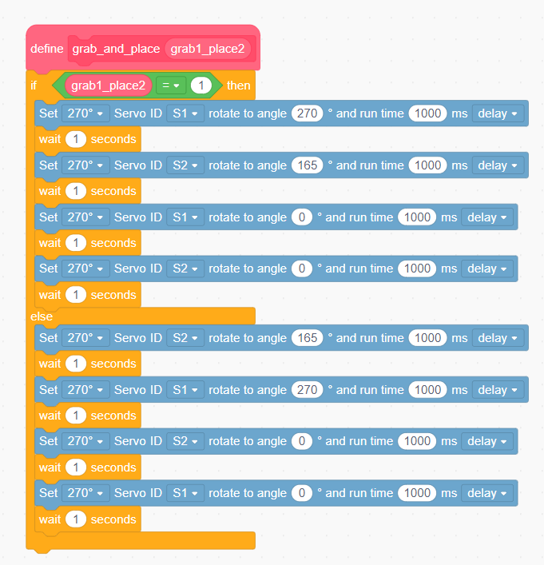

- In the main program, detect distance and control the motors and servos. Use the ultrasonic sensor to measure object distance in real time and store the result in `object_distance`. When the value is greater than 5 cm, keep the vehicle moving forward. Otherwise, stop the vehicle, grab the object, turn right for 1 second, place the object down, and then turn left to return to the original direction.

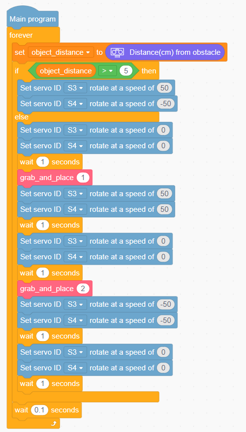

### 6.11.6 Program Download Steps

1. **Connect the device**: Use a data cable to connect the controller to a USB port on the computer.

2. **Select the port**: In the programming software, select the COM port corresponding to the controller. Multiple COM ports may be listed, so make sure the correct one is selected.

3. **Upload**: Click the icon to upload the completed program to the controller.

4. **Power on**: Turn on the controller, initialize the device, and test the execution of the uploaded code.

### 6.11.7 Demo

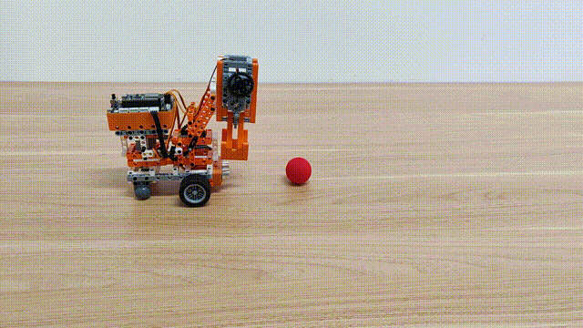

## 6.12 Rapid-Fire Blaster

### 6.12.1 Project Overview

This is a rapid-fire blaster with button-controlled shooting. Holding the button starts continuous firing, and releasing the button stops it, creating a realistic firing simulation.

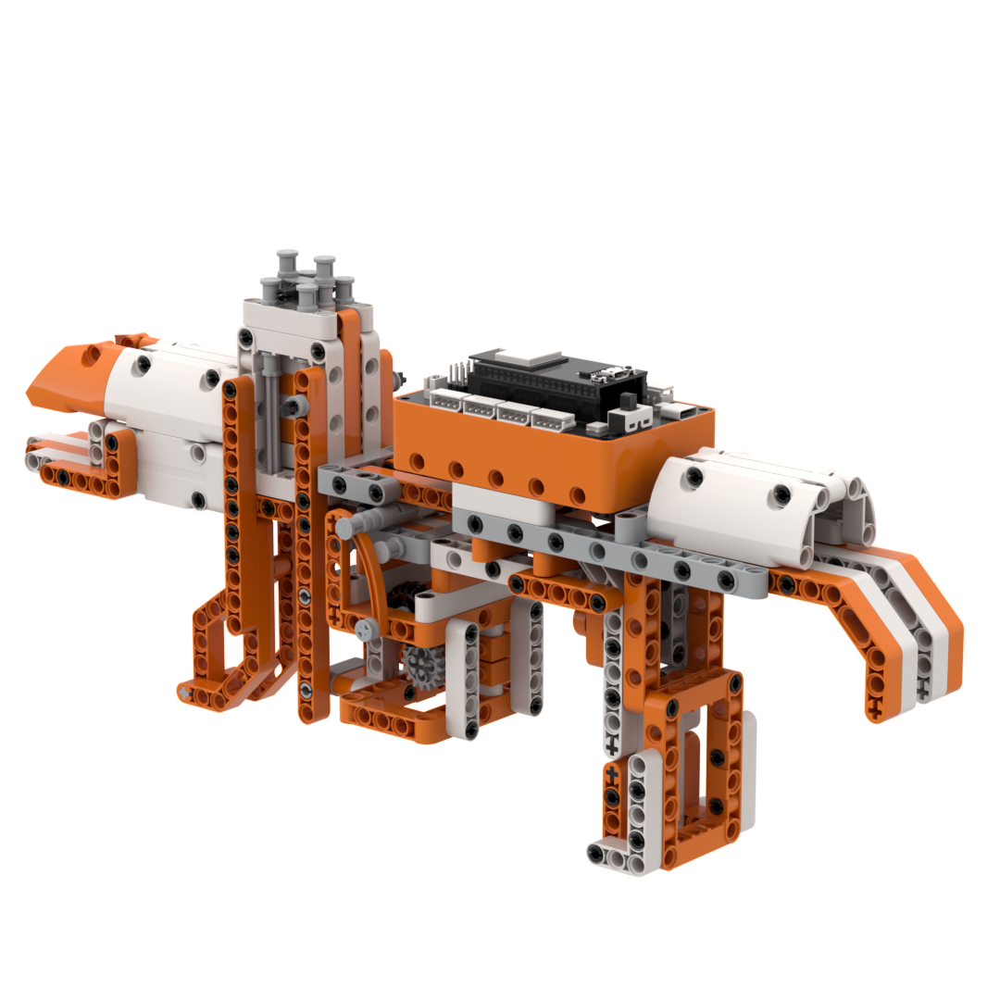

### 6.12.2 Learning Objectives

1. Practice the basic functions of the motor and button sensor in this project, and understand the logic of long-press triggering and continuous firing simulation.
2. Master the mechanical assembly of the rapid-fire blaster.
3. Learn how to write a program for long-press trigger + continuous firing + release to stop, and understand the principle of button-state detection.
4. Strengthen hands-on skills and safety-design awareness, and experience the fun of simulated firing programming.

### 6.12.3 Materials Needed

1. **Materials**: controller, motor, button sensor, module cable, and building block parts.

2. **Module Overview**:

**Button Sensor**

| Item | Description |
| --- | --- |
| Function | Detects button presses and triggers the firing action. |
| Application Position | Mounted near the trigger of the rapid-fire blaster. |
| Result | When a press signal is detected, it sends a start-firing command to the controller. |

**Motor**

| Item | Description |
| --- | --- |
| Function | Provides the driving force for firing. |
| Application Position | Mounted on the body of the rapid-fire blaster. |
| Result | After receiving the controller command, it drives the motor to simulate the reciprocating motion of the firing mechanism and create the effect of launching projectiles. |

### 6.12.4 Assembly Guide

<iframe
    src="../_static/pdf/36_Rapid_Fire_Blaster.pdf#view=FitH"
    title="Assembly Guide PDF"
    width="100%"
    height="850"
    style="border: 1px solid #ddd;"
    loading="lazy">
 </iframe>

### 6.12.5 Coding Steps

1. **Open the software**: Start the programming software and create a new project.

2. **Add the extension**

- Click the icon in the lower-left corner of the software to enter the extension interface.

- In the interface **Choose an Extension**, select **Controllers** and add **K12 ESP32**.

- In the interface **Choose an Extension**, select **Sensor**, and add **Button sensor**.

3. **Reference Program**

- In the main program, detect the button and control the motor. When the button on P5 is pressed, run motor S1 at speed 100 to fire. When the button is not pressed, stop motor S1. Refresh the detection and control state every 0.01 seconds to achieve button-controlled motor start and stop.

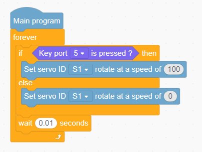

### 6.12.6 Program Download Steps

1. **Connect the device**: Use a data cable to connect the controller to a USB port on the computer.

2. **Select the port**: In the programming software, select the COM port corresponding to the controller. Multiple COM ports may be listed, so make sure the correct one is selected.

3. **Upload**: Click the icon to upload the completed program to the controller.

4. **Power on**: Turn on the controller, initialize the device, and test the execution of the uploaded code.

### 6.12.7 Demo

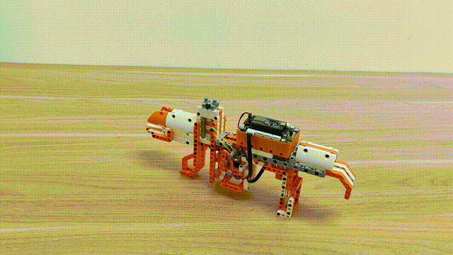

